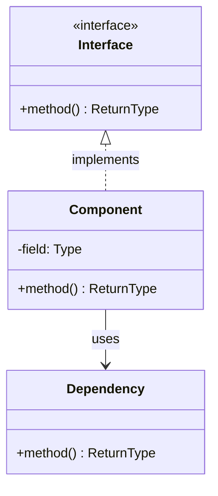

# Component: [Component/Module Name]

**Purpose**: Detailed structure and relationships within [component]  
**Gate**: Gate [X]  
**Generated**: [DATE]  
**Status**: [Draft/Approved/Implemented]

---

## Diagram

[Generate a Mermaid classDiagram or DOT diagram showing classes, interfaces, and dependency relationships. Include key methods and fields. Use DOT for >8 classes.]

---

## Components

[1-2 sentences per class/interface: responsibility and key relationships.]

- **[Name]**: [Type, responsibility, depends on / used by]
- **[Name]**: [Type, responsibility, depends on / used by]

---

**Document Version**: [MAJOR.MINOR.PATCH]  
**Last Updated**: [YYYY-MM-DD]  
**Versioning**: SemVer; bump on any change (minimum: PATCH).  
**Owner**: [git.user.name]  
**Reviewers**: [git.user.name]

### Change Log

| Version | Date         | Summary         | Author          |
|---------|--------------|-----------------|-----------------|
| 1.0.0   | [YYYY-MM-DD] | Initial version | [git.user.name] |
