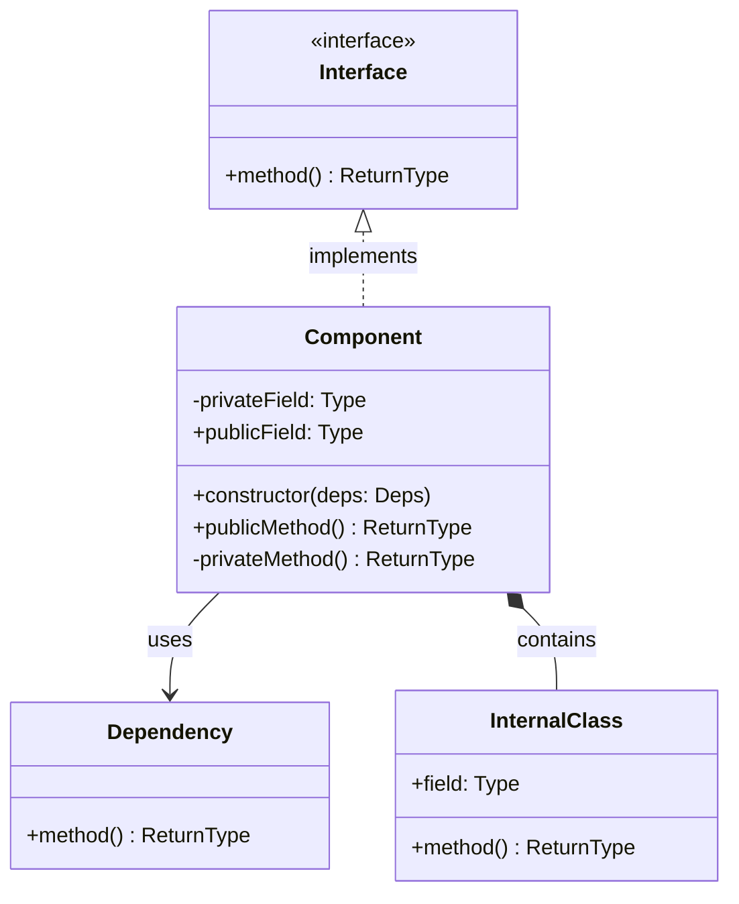

# Component Diagram: [Component/Module Name]

**Purpose**: Detailed component structure and relationships
**Gate**: Gate [X]
**Scope**: [Specific layer, module, or subsystem]

**Generated**: [DATE]  
**Status**: [Draft/Approved/Implemented]

---

## Diagram

[Generate a Mermaid class or component diagram showing classes, interfaces, and dependencies within this specific component. Show 5-10 key classes/interfaces with relationships.]



---

## Component Overview

[Describe the component in 2-3 paragraphs: what it does, why it exists, and its role in the system.]

---

## Components

[List 5-10 key classes, interfaces, or sub-components with descriptions.]

### [Component Name]
- **Type**: [Class/Interface/Abstract Class/Module]
- **Responsibility**: [Single responsibility this component handles]
- **Key Methods**: 
  - `method(params): ReturnType` - [What it does]
  - `method(params): ReturnType` - [What it does]
- **Dependencies**: [What it depends on]
- **Used By**: [What depends on it]

### [Component Name]
- **Type**: [Class/Interface/Abstract Class/Module]
- **Responsibility**: [Single responsibility]
- **Key Methods**:
  - `method(params): ReturnType` - [What it does]
- **Dependencies**: [What it depends on]
- **Used By**: [What depends on it]

---

## Interfaces & Contracts

[List public interfaces this component exposes or implements.]

### [Interface Name]
```typescript
interface InterfaceName {
  method(param: Type): ReturnType;
  method(param: Type): ReturnType;
}
```
[Describe the contract and when/why it's used]

---

## Design Patterns

[List design patterns used in this component.]

### [Pattern Name]
- **Purpose**: [Why this pattern is used]
- **Implementation**: [How it's implemented]
- **Benefits**: [What it provides]

---

## Dependency Injection

[Describe how dependencies are injected and managed.]

- **Constructor Injection**: [What dependencies are injected]
- **Configuration**: [How the component is configured]
- **Lifecycle**: [Singleton/Transient/Scoped]

---

## State Management

[If applicable, describe how this component manages state.]

- **State Fields**: [What state is maintained]
- **State Transitions**: [How state changes]
- **Concurrency**: [Thread-safety or async considerations]

---

## Error Handling

[Describe error handling strategy within this component.]

- **Exception Types**: [What exceptions are thrown]
- **Error Recovery**: [How errors are handled]
- **Logging**: [What's logged and at what level]

---

## Extension Points

[Describe how this component can be extended or customized.]

- **Abstract Methods**: [Methods meant to be overridden]
- **Hooks/Events**: [Extension mechanisms]
- **Plugin Interface**: [If supports plugins]

---

## Usage Examples

[Provide 2-3 code examples showing how to use this component.]

### Example 1: [Basic Usage]
```typescript
const component = new Component(dependencies);
const result = component.method(params);
```

### Example 2: [Advanced Usage]
```typescript
const component = ComponentBuilder
  .create()
  .withConfig(config)
  .build();
```

---

## Testing Strategy

[Describe how this component should be tested.]

- **Unit Tests**: [What to test in isolation]
- **Mocks**: [What dependencies to mock]
- **Integration Tests**: [What to test with real dependencies]
- **Edge Cases**: [Critical edge cases to cover]

---

## Performance Considerations

[List performance characteristics and optimization notes.]

- **Time Complexity**: [Big O for key operations]
- **Space Complexity**: [Memory usage characteristics]
- **Bottlenecks**: [Known performance bottlenecks]
- **Optimization**: [How to optimize if needed]

---

## Related Documentation

- **System Overview**: `.zeno/architecture/system-overview.md` - Overall architecture
- **Sequence Diagram**: `.zeno/architecture/sequence-[use-case].md` - Usage flows
- **Gate PRD**: `.zeno/gates/gate-[XX]-[name].md` - Requirements

---

**Source**: `.zeno/architecture/component-[name].mmd`  
**Generated by**: Zeno's Planner

