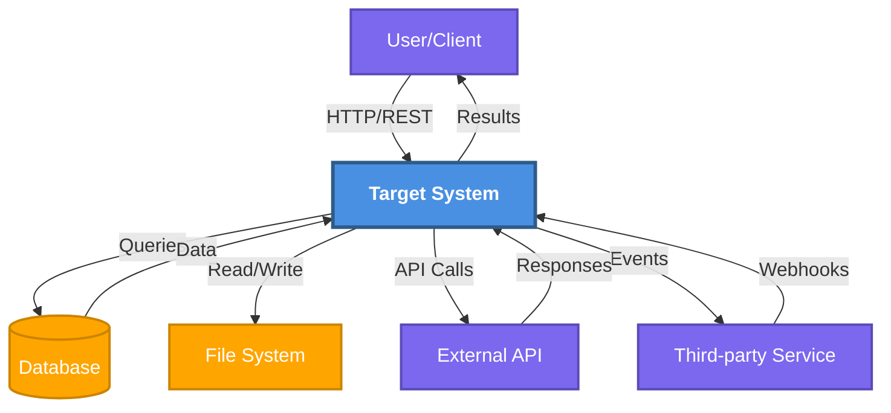

# Context Diagram

**Purpose**: System boundary and external interactions
**Scope**: Entire system

**Generated**: [DATE]  
**Status**: [Draft/Approved/Implemented]

---

## Diagram

[Generate a Mermaid diagram showing the target system as the central node with all external actors, systems, and services around it. Show data flow directions and protocols.]

---

## System Boundary

[Describe what is inside the system boundary vs. outside. Clarify what the system owns and controls vs. external dependencies.]

**Inside the System**:
- [Component or module that's part of the system]
- [Component or module that's part of the system]

**Outside the System**:
- [External dependency or actor]
- [External dependency or actor]

---

## External Actors

[List 3-7 external actors that interact with the system. For each, describe their role and interaction type.]

### [Actor Name]
- **Type**: [User/System/Service]
- **Role**: [What they do with the system]
- **Interactions**: [How they communicate: HTTP, CLI, API, etc.]
- **Data Exchanged**: [What information flows]

### [Actor Name]
- **Type**: [User/System/Service]
- **Role**: [What they do with the system]
- **Interactions**: [How they communicate]
- **Data Exchanged**: [What information flows]

---

## External Systems

[List 3-7 external systems or services the target system depends on.]

### [System Name]
- **Purpose**: [Why this dependency exists]
- **Protocol**: [How communication happens: REST, GraphQL, gRPC, etc.]
- **Data Flow**: [What data is sent/received]
- **Failure Handling**: [What happens if this system is unavailable]

### [System Name]
- **Purpose**: [Why this dependency exists]
- **Protocol**: [How communication happens]
- **Data Flow**: [What data is sent/received]
- **Failure Handling**: [What happens if this system is unavailable]

---

## Data Flows

[Describe major data flows across the system boundary.]

### Inbound Data
| Source | Data Type | Protocol | Purpose |
|--------|-----------|----------|---------|
| [Source] | [Type] | [Protocol] | [Why] |
| [Source] | [Type] | [Protocol] | [Why] |

### Outbound Data
| Destination | Data Type | Protocol | Purpose |
|-------------|-----------|----------|---------|
| [Destination] | [Type] | [Protocol] | [Why] |
| [Destination] | [Type] | [Protocol] | [Why] |

---

## Security Boundaries

[Describe authentication, authorization, and security concerns at the system boundary.]

- **Authentication**: [How external actors authenticate]
- **Authorization**: [Access control mechanisms]
- **Data Security**: [Encryption, sensitive data handling]
- **Network Security**: [Firewalls, VPNs, security groups]

---

## Integration Points

[List critical integration points where the system connects to external services.]

### [Integration Point Name]
- **External System**: [What system]
- **Direction**: [Inbound/Outbound/Bidirectional]
- **Frequency**: [Real-time/Batch/On-demand]
- **Error Recovery**: [How failures are handled]

---

## Assumptions & Constraints

[List assumptions about external systems and constraints on the system boundary.]

**Assumptions**:
- [Assumption about external system availability or behavior]
- [Assumption about external system availability or behavior]

**Constraints**:
- [Constraint on how the system can interact with externals]
- [Constraint on how the system can interact with externals]

---

## Related Documentation

- **System Overview**: `.zeno/architecture/system-overview.md` - Internal architecture
- **Data Flow**: `.zeno/architecture/data-flow.md` - Internal data flows
- **Deployment**: `.zeno/architecture/deployment.md` - Runtime environment
- **Network**: `.zeno/architecture/network.md` - Network topology (if applicable)

---

**Source**: `.zeno/architecture/context.mmd`  
**Generated by**: Zeno's Planner

