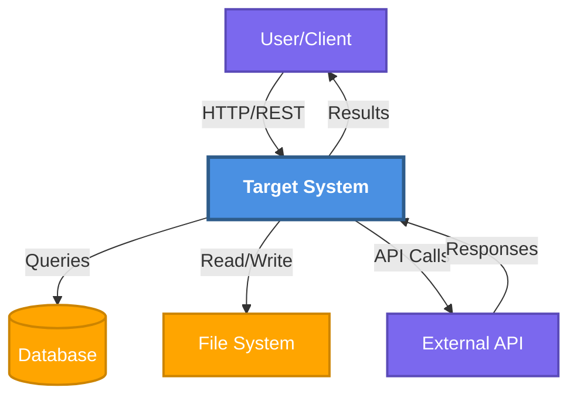

# Context Diagram

**Purpose**: System boundary and external interactions  
**Generated**: [DATE]  
**Status**: [Draft/Approved/Implemented]

---

## Diagram

[Generate a Mermaid graph or DOT diagram showing the target system as the central node with all external actors, systems, and services. Show data flow directions and protocols. Use DOT for >7 external entities.]

---

## Boundary

**Inside**: [Components the system owns and controls]  
**Outside**: [External actors and dependencies]

### External Actors

- **[Actor]**: [Type, role, and data exchanged]

### External Systems

- **[System]**: [Purpose, protocol, and failure handling]

---

**Document Version**: [MAJOR.MINOR.PATCH]  
**Last Updated**: [YYYY-MM-DD]  
**Versioning**: SemVer; bump on any change (minimum: PATCH).  
**Owner**: [git.user.name]  
**Reviewers**: [git.user.name]

### Change Log

| Version | Date         | Summary         | Author          |
|---------|--------------|-----------------|-----------------|
| 1.0.0   | [YYYY-MM-DD] | Initial version | [git.user.name] |
