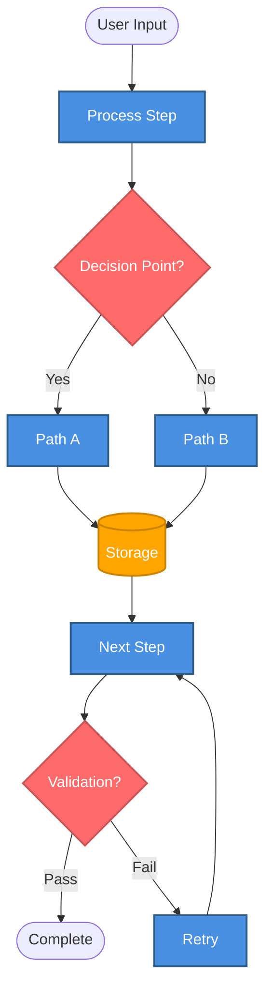

# Data Flow

**Purpose**: End-to-end data flow from user input to project completion

**Generated**: [DATE]  
**Status**: [Draft/Approved/Implemented]

---

## Diagram

[Generate a Mermaid flowchart showing the complete data flow from start to end. Include process steps, decision points, storage operations, and feedback loops. Use consistent styling for different node types.]



---

## Flow Phases

[Describe 3-5 major phases of the data flow. For each phase, list the key steps.]

### Phase 1: [Phase Name]
1. [Step description]
2. [Step description]

### Phase 2: [Phase Name]
1. [Step description]
2. [Step description]

---

## Data Transformations

[List key data transformations showing input type, process, and output type.]

| Input | Process | Output |
|-------|---------|--------|
| [Input Type] | [Process Name] | [Output Type] |
| [Input Type] | [Process Name] | [Output Type] |

---

## Storage Operations

[Describe storage systems involved in the flow. For each, explain what data is stored, when, and how it's accessed.]

### [Storage System Name]
- [What data is stored]
- [When it's stored]
- [How it's accessed]

---

## Feedback Loops

[Identify feedback loops in the flow. Show the loop path and explain when it activates.]

### [Loop Name]
```
[Step] → [Decision] → [Retry] → [Step]
```
[Description of when and why this loop activates]

---

## Decision Points

[List major decision points. For each, describe location, criteria, and possible paths.]

### [Decision Name]
- **Location**: [Process step where decision occurs]
- **Criteria**: [What determines the path taken]
- **Paths**:
  - [Path A]: [Description]
  - [Path B]: [Description]

---

## Error Handling

[Describe how errors are detected and handled in the flow.]

### [Error Type]
- **Detection**: [How error is detected]
- **Recovery**: [How system recovers]
- **Impact**: [What happens to the flow]

---

## Related Documentation

- **System Overview**: `.zeno/docs/architecture/system-overview.md` - Component architecture
- **Gate Lifecycle**: `.zeno/docs/architecture/gate-lifecycle.md` - State machine
- **Gate Roadmap**: `.zeno/docs/architecture/gate-roadmap.md` - Gate roadmap
- **Project PRD**: `.zeno/docs/PROJECT_PRD.md` - Full specification

---

**Source**: `.zeno/docs/architecture/data-flow.mmd`  
**Generated by**: Zeno's Planner

