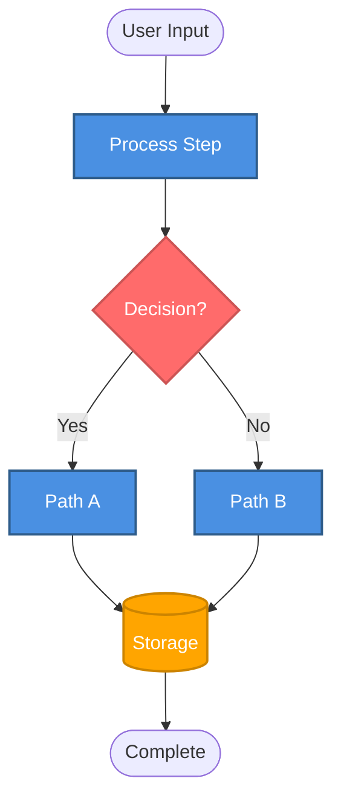

# Data Flow

**Purpose**: End-to-end data flow from user input to project completion  
**Generated**: [DATE]  
**Status**: [Draft/Approved/Implemented]

---

## Diagram

[Generate a Mermaid flowchart or DOT diagram showing the complete data flow. Include process steps, decision points, storage operations, and feedback loops. Use DOT for >5 total nodes.]

---

## Phases

[1-2 sentences per phase describing key steps and data transformations.]

### [Phase Name 1]

[What happens and what data moves]

### [Phase Name 2]

[What happens and what data moves]

---

**Document Version**: [MAJOR.MINOR.PATCH]  
**Last Updated**: [YYYY-MM-DD]  
**Versioning**: SemVer; bump on any change (minimum: PATCH).  
**Owner**: [git.user.name]  
**Reviewers**: [git.user.name]

### Change Log

| Version | Date         | Summary         | Author          |
|---------|--------------|-----------------|-----------------|
| 1.0.0   | [YYYY-MM-DD] | Initial version | [git.user.name] |
