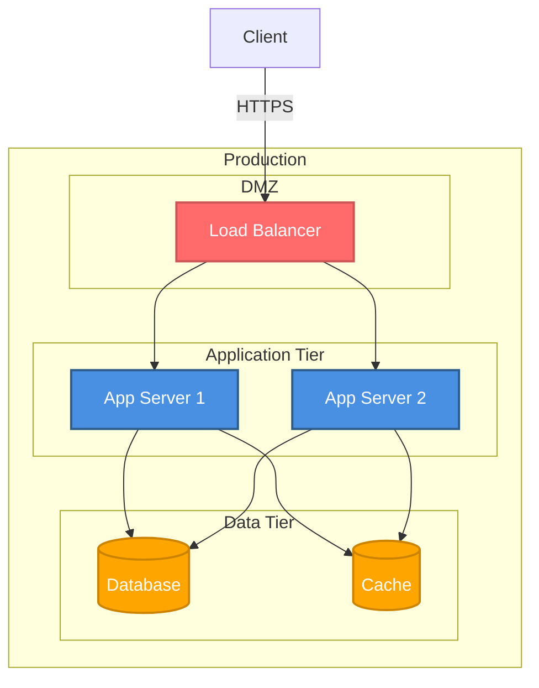

# Deployment Diagram

**Purpose**: Runtime deployment architecture and infrastructure  
**Environment**: [dev/staging/production]  
**Generated**: [DATE]  
**Status**: [Draft/Approved/Implemented]

---

## Diagram

[Generate a Mermaid graph or DOT diagram showing physical/virtual nodes, containers, services, and relationships. Include network boundaries, load balancers, databases, and external services. Use DOT for >8 components.]

---

## Infrastructure

[1-2 sentences per component: type, technology, and scaling strategy.]

- **[Component]**: [Type, specs, redundancy]

---

**Document Version**: [MAJOR.MINOR.PATCH]  
**Last Updated**: [YYYY-MM-DD]  
**Versioning**: SemVer; bump on any change (minimum: PATCH).  
**Owner**: [git.user.name]  
**Reviewers**: [git.user.name]

### Change Log

| Version | Date | Summary | Author |
|---------|------|---------|--------|
| 1.0.0 | [YYYY-MM-DD] | Initial version | [git.user.name] |
