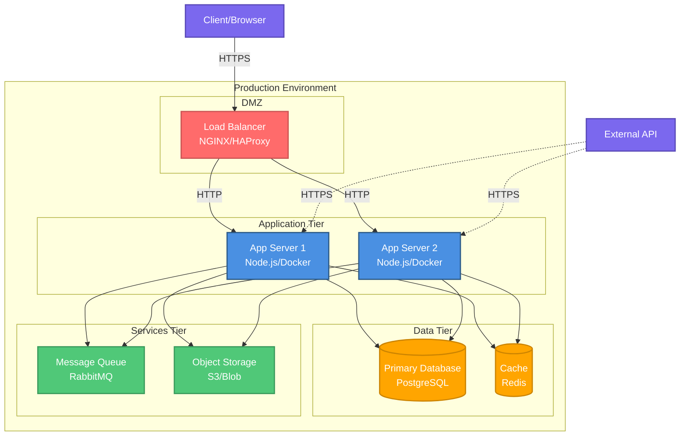

# Deployment Diagram

**Purpose**: Runtime deployment architecture and infrastructure
**Environment**: [dev/staging/production]

**Generated**: [DATE]  
**Status**: [Draft/Approved/Implemented]

---

## Diagram

[Generate a Mermaid deployment diagram showing physical/virtual nodes, containers, services, and their relationships. Include network boundaries, load balancers, databases, and external services.]

---

## Deployment Overview

[Describe the overall deployment strategy in 2-3 paragraphs: cloud provider, hosting approach, scaling strategy.]

---

## Infrastructure Components

[List 5-10 infrastructure components with specifications.]

### [Component Name]
- **Type**: [Server/Container/Service/Database]
- **Technology**: [Specific tech: AWS EC2, Docker, Kubernetes, etc.]
- **Specifications**:
  - CPU: [vCPUs or cores]
  - Memory: [RAM amount]
  - Storage: [Disk type and size]
  - Network: [Bandwidth requirements]
- **Redundancy**: [High availability setup]
- **Scaling**: [Horizontal/Vertical/Auto-scaling strategy]
- **Location**: [Region/Availability zone]

### [Component Name]
- **Type**: [Server/Container/Service/Database]
- **Technology**: [Specific tech]
- **Specifications**: [Resource specs]
- **Redundancy**: [HA setup]
- **Scaling**: [Strategy]
- **Location**: [Region/AZ]

---

## Network Architecture

[Describe network topology, security groups, VPCs, subnets.]

### Network Topology
- **VPC/Network**: [Network configuration]
- **Subnets**: 
  - Public Subnet: [Purpose and CIDR]
  - Private Subnet: [Purpose and CIDR]
- **Internet Gateway**: [How public access is provided]
- **NAT Gateway**: [For private subnet internet access]

### Security Groups / Firewall Rules
| Source | Destination | Port | Protocol | Purpose |
|--------|-------------|------|----------|---------|
| [Source] | [Dest] | [Port] | [TCP/UDP] | [Why] |
| [Source] | [Dest] | [Port] | [TCP/UDP] | [Why] |

### Load Balancer Configuration
- **Type**: [Application/Network/Classic]
- **Algorithm**: [Round-robin/Least-connections/IP-hash]
- **Health Checks**: [How backend health is monitored]
- **SSL/TLS**: [Certificate management]

---

## Compute Resources

[Detail compute infrastructure.]

### Application Servers
- **Count**: [Number of instances]
- **Type**: [VM/Container/Serverless]
- **OS**: [Operating system]
- **Runtime**: [Runtime environment: Node.js version, Python version, etc.]
- **Auto-scaling**: [Min/Max instances, scaling triggers]

### Container Orchestration (if applicable)
- **Platform**: [Kubernetes/ECS/Docker Swarm]
- **Cluster Size**: [Nodes]
- **Namespace/Service Organization**: [How services are organized]
- **Resource Limits**: [CPU/Memory limits per container]

---

## Data Storage

[Describe data persistence layer.]

### Primary Database
- **Type**: [PostgreSQL/MySQL/MongoDB/etc.]
- **Version**: [Specific version]
- **Configuration**:
  - Instance Type: [Spec]
  - Storage: [Type and size]
  - IOPS: [Performance characteristics]
- **Backup**: [Backup strategy and schedule]
- **Replication**: [Read replicas, multi-region]
- **Failover**: [HA strategy]

### Cache Layer
- **Type**: [Redis/Memcached]
- **Configuration**: [Memory size, eviction policy]
- **Usage**: [What's cached]
- **TTL Strategy**: [Cache expiration]

### Object Storage
- **Type**: [S3/Azure Blob/GCS]
- **Buckets/Containers**: [Organization]
- **Access Control**: [IAM policies]
- **Lifecycle Policies**: [Archival, deletion]

---

## External Services

[List third-party services and integrations.]

### [Service Name]
- **Purpose**: [Why this service is used]
- **Integration**: [How it's accessed: API, SDK, webhook]
- **Authentication**: [Auth mechanism]
- **Failover**: [What happens if unavailable]
- **Rate Limits**: [API limits and handling]

---

## Monitoring & Observability

[Describe monitoring, logging, and alerting infrastructure.]

### Monitoring
- **Tool**: [Prometheus/Datadog/CloudWatch]
- **Metrics Collected**: [CPU, memory, request rate, error rate, etc.]
- **Dashboards**: [What's visualized]

### Logging
- **Tool**: [ELK/Splunk/CloudWatch Logs]
- **Log Aggregation**: [How logs are collected]
- **Retention**: [How long logs are kept]

### Alerting
- **Tool**: [PagerDuty/Opsgenie/SNS]
- **Alert Rules**: [What triggers alerts]
- **Escalation**: [Who gets notified]

### Tracing (if applicable)
- **Tool**: [Jaeger/Zipkin/X-Ray]
- **Instrumentation**: [How tracing is implemented]

---

## CI/CD Pipeline

[Describe deployment automation.]

### Build Pipeline
- **Tool**: [GitHub Actions/Jenkins/GitLab CI]
- **Stages**: [Build → Test → Deploy stages]
- **Artifacts**: [What's produced]

### Deployment Strategy
- **Type**: [Blue-green/Canary/Rolling/Recreate]
- **Rollback**: [How to roll back failed deployments]
- **Approval**: [Manual/Automatic promotion]

### Infrastructure as Code
- **Tool**: [Terraform/CloudFormation/Ansible]
- **Repository**: [Where IaC is stored]
- **State Management**: [How state is tracked]

---

## Disaster Recovery

[Describe backup, recovery, and business continuity plans.]

### Backup Strategy
- **Frequency**: [How often backups are taken]
- **Retention**: [How long backups are kept]
- **Location**: [Where backups are stored]
- **Testing**: [How backups are validated]

### Recovery Objectives
- **RTO**: [Recovery Time Objective]
- **RPO**: [Recovery Point Objective]

### Failover Procedures
1. [Step to failover]
2. [Step to failover]
3. [Step to failover]

---

## Cost Optimization

[Describe cost management strategies.]

- **Reserved Instances**: [Long-term capacity reservations]
- **Auto-scaling**: [Scale down during low usage]
- **Storage Tiering**: [Archive old data]
- **Cost Monitoring**: [Tool and budget alerts]

---

## Security Considerations

[Describe security measures in deployment.]

### Network Security
- **Firewall**: [Rules and policies]
- **VPN**: [Secure access for admins]
- **DDoS Protection**: [Mitigation strategy]

### Data Security
- **Encryption at Rest**: [How data is encrypted]
- **Encryption in Transit**: [TLS/SSL configuration]
- **Key Management**: [KMS/Secrets management]

### Access Control
- **IAM**: [Role-based access control]
- **Secrets**: [How credentials are managed]
- **Audit Logging**: [Who accessed what]

---

## Environment Differences

[Describe differences between environments.]

| Aspect | Development | Staging | Production |
|--------|-------------|---------|------------|
| Instances | 1 | 2 | 4+ |
| Database | Shared | Dedicated | Clustered |
| Scaling | Manual | Auto | Auto |
| Monitoring | Basic | Full | Full |

---

## Related Documentation

- **Context Diagram**: `.zeno/architecture/context.md` - External dependencies
- **Network Diagram**: `.zeno/architecture/network.md` - Detailed network topology
- **System Overview**: `.zeno/architecture/system-overview.md` - Application architecture

---

**Source**: `.zeno/architecture/deployment.mmd`  
**Generated by**: Zeno's Planner

---

**Document Version**: [MAJOR.MINOR.PATCH]  
**Last Updated**: [YYYY-MM-DD]  
**Versioning**: SemVer; bump on any change (minimum: PATCH).  

### Change Log

| Version | Date | Summary | Author |
|---------|------|---------|--------|
| 1.0.0 | [YYYY-MM-DD] | Initial version | [git.user.name] |

