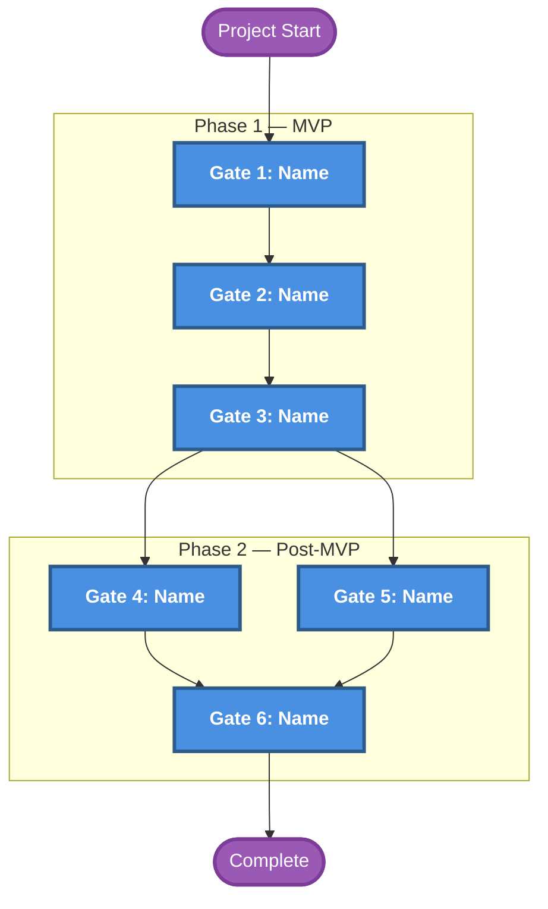

# Gate Roadmap

**Purpose**: Gate sequence, dependencies, and parallel work opportunities
**Generated**: [DATE]
**Status**: [Draft/Approved/Implemented]

---

## Diagram

[Generate a Mermaid graph or DOT diagram showing all gates from project start to completion. Show sequential dependencies with arrows and parallel gates branching from common points. Use DOT for >8 gates.]

---

## Sequencing

**Phases**: [Group gates by delivery milestone — e.g. Phase 1 (MVP): gates 1-4; Phase 2 (Post-MVP): gates 5-7; or named milestones like 'May Demo', 'Beta', 'GA'. Deferred/Backup gates noted separately.]
**Parallel Gates**: [Identify gates that can run simultaneously and why]
**Critical Path**: [Longest sequential chain through the roadmap]

---

**Document Version**: [MAJOR.MINOR.PATCH]
**Last Updated**: [YYYY-MM-DD]
**Versioning**: SemVer; bump on any change (minimum: PATCH).
**Owner**: [git.user.name]
**Reviewers**: [git.user.name]

### Change Log

| Version | Date         | Summary         | Author          |
|---------|--------------|-----------------|-----------------|
| 1.0.0   | [YYYY-MM-DD] | Initial version | [git.user.name] |
