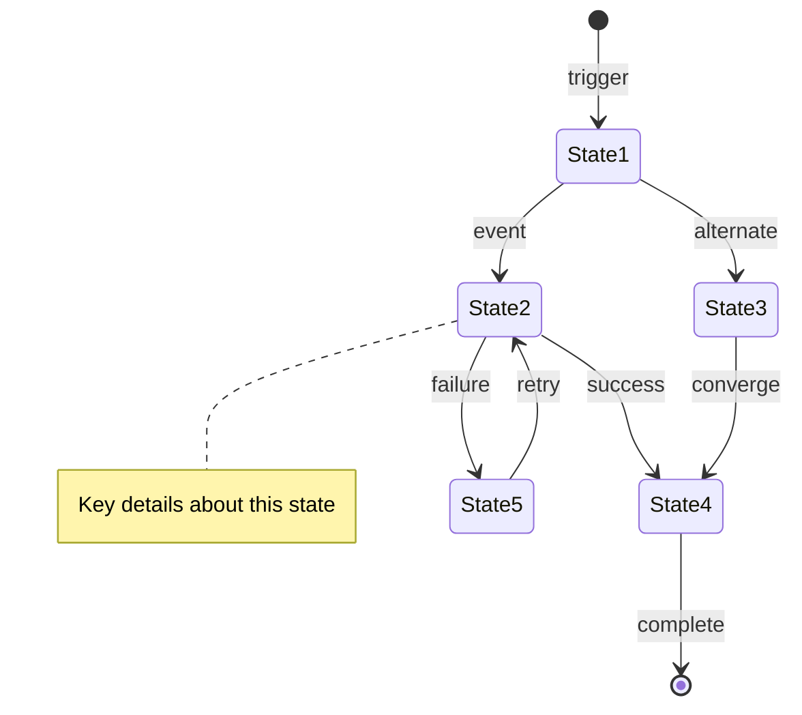

# Lifecycle: [Entity/Process Name]

**Purpose**: State machine showing the complete lifecycle of [entity/process]  
**Generated**: [DATE]  
**Status**: [Draft/Approved/Implemented]

---

## Diagram

[Generate a Mermaid stateDiagram-v2 or DOT diagram showing all states, transitions, and decision points. Add notes for key states. Use DOT for >6 states.]

---

## States

[1-2 sentences per state describing purpose and transitions.]

- **[State Name]**: [What happens and valid transitions]
- **[State Name]**: [What happens and valid transitions]

---

**Document Version**: [MAJOR.MINOR.PATCH]  
**Last Updated**: [YYYY-MM-DD]  
**Versioning**: SemVer; bump on any change (minimum: PATCH).  
**Owner**: [git.user.name]  
**Reviewers**: [git.user.name]

### Change Log

| Version | Date         | Summary         | Author          |
|---------|--------------|-----------------|-----------------|
| 1.0.0   | [YYYY-MM-DD] | Initial version | [git.user.name] |
