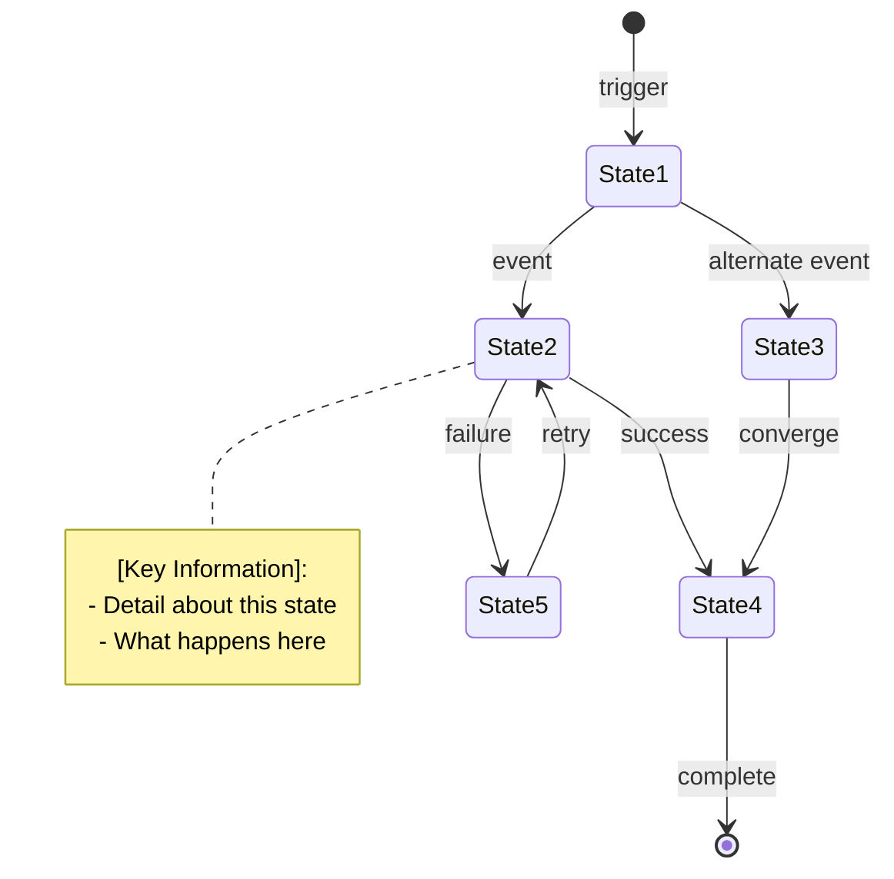

# Lifecycle Diagram: [Entity/Process Name]

**Purpose**: State machine showing the complete lifecycle of [entity/process]
**Gate**: Gate [X] (if gate-specific)

**Generated**: [DATE]  
**Status**: [Draft/Approved/Implemented]

---

## Diagram

[Generate a Mermaid state diagram showing the complete lifecycle. Include all states, transitions, and key decision points. Add notes for important states explaining what happens.]



---

## State Descriptions

[Group states into logical phases. Describe what happens in each state.]

### [Phase Name]
- **[State Name]**: [What happens in this state and its purpose]
- **[State Name]**: [What happens in this state and its purpose]

### [Phase Name]
- **[State Name]**: [What happens in this state and its purpose]
- **[State Name]**: [What happens in this state and its purpose]

---

## State Transitions

[Describe major transition paths through the state machine.]

### [Transition Path Name]
```
[State] → [State] → [State]
```
[Describe when this path is taken and what triggers it]

---

## Feedback Loops

[Identify feedback loops where the system returns to previous states.]

### [Loop Name]
```
[State] → [State] → [State]
```
[Describe the purpose of this loop and when it activates]

---

## Decision Points

[List key decision points where the path diverges based on conditions.]

### [Decision Name]
- **Location**: [State where decision occurs]
- **Criteria**: [What determines the path taken]
- **Outcomes**: 
  - [Outcome A]: [Description]
  - [Outcome B]: [Description]

---

## Quality Gates / Checkpoints

[List quality gates, approval points, or validation checkpoints in the lifecycle.]

- **[Checkpoint Name]**: [Description and criteria for passing]

---

## Related Documentation

- **System Overview**: `.zeno/architecture/system-overview.md` - Component architecture
- **Data Flow**: `.zeno/architecture/data-flow.md` - End-to-end process
- **Gate Roadmap**: `.zeno/architecture/gate-roadmap.md` - Project roadmap
- **Project PRD**: `.zeno/PROJECT_PRD.md` - Full specification

---

**Source**: `.zeno/architecture/lifecycle-[name].mmd`  
**Generated by**: Zeno's Planner

