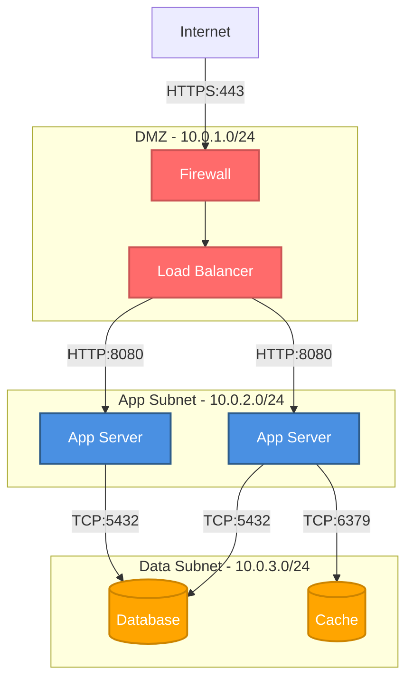

# Network Diagram

**Purpose**: Network topology and communication patterns  
**Scope**: [Entire system/Specific subsystem]  
**Generated**: [DATE]  
**Status**: [Draft/Approved/Implemented]

---

## Diagram

[Generate a Mermaid graph or DOT diagram showing network topology, subnets, firewalls, and communication paths. Include IP ranges, ports, and protocols. Use DOT for >8 network nodes.]

---

## Zones

[1-2 sentences per zone: CIDR, purpose, and access level.]

- **[Zone]** (`CIDR`): [Purpose, ingress/egress rules]

### Firewall Rules

| Source | Destination | Port | Protocol | Purpose |
|--------|-------------|------|----------|---------|
| [Source] | [Dest] | [Port] | [TCP/UDP] | [Why] |

---

**Document Version**: [MAJOR.MINOR.PATCH]  
**Last Updated**: [YYYY-MM-DD]  
**Versioning**: SemVer; bump on any change (minimum: PATCH).  
**Owner**: [git.user.name]  
**Reviewers**: [git.user.name]

### Change Log

| Version | Date | Summary | Author |
|---------|------|---------|--------|
| 1.0.0 | [YYYY-MM-DD] | Initial version | [git.user.name] |
