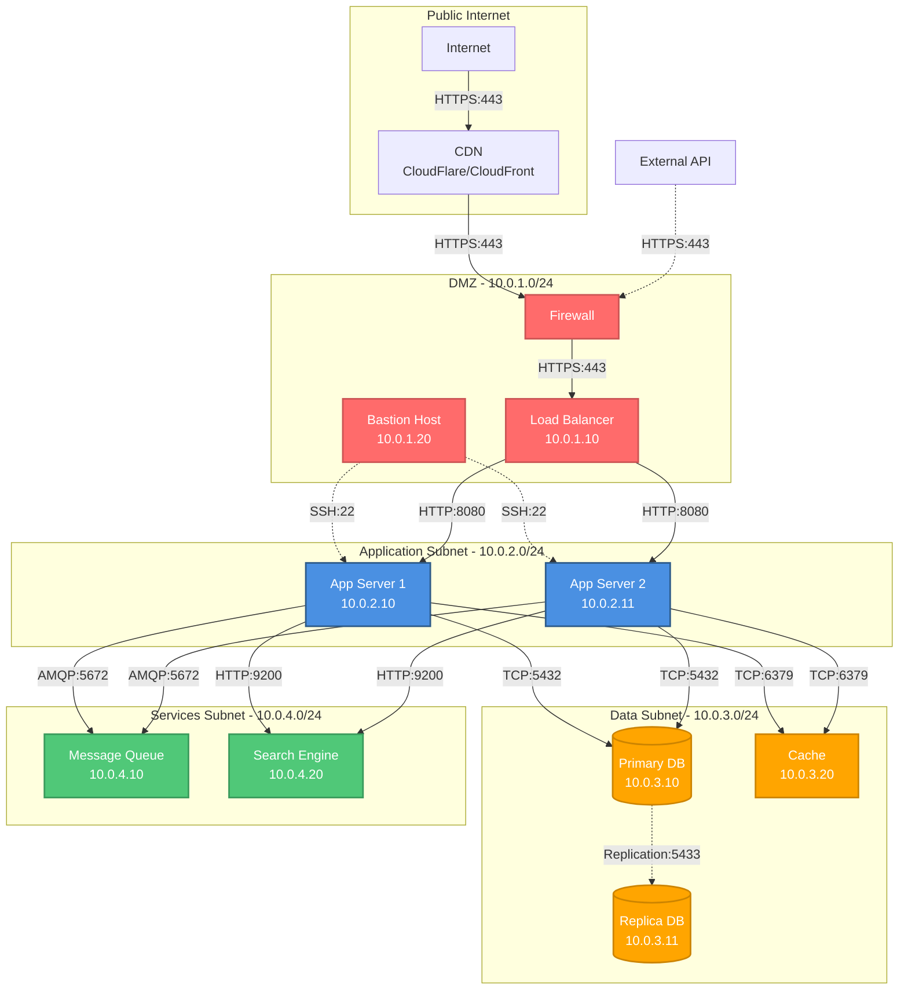

# Network Diagram

**Purpose**: Network topology and communication patterns
**Scope**: [Entire system/Specific subsystem]

**Generated**: [DATE]  
**Status**: [Draft/Approved/Implemented]

---

## Diagram

[Generate a Mermaid diagram showing network topology, subnets, routers, firewalls, and communication paths. Include IP ranges, ports, and protocols.]



---

## Network Overview

[Describe the overall network architecture in 2-3 paragraphs: topology type, security zones, communication patterns.]

---

## Network Zones

[Describe 3-6 network zones/subnets with their purposes and security levels.]

### [Zone Name]
- **CIDR**: [IP range: 10.0.X.0/24]
- **Purpose**: [What this zone is for]
- **Access Level**: [Public/Private/Restricted]
- **Components**: [What's in this zone]
- **Ingress Rules**: [What can access this zone]
- **Egress Rules**: [What this zone can access]

### [Zone Name]
- **CIDR**: [IP range]
- **Purpose**: [What this zone is for]
- **Access Level**: [Public/Private/Restricted]
- **Components**: [What's in this zone]
- **Ingress/Egress**: [Access rules]

---

## IP Addressing

[Describe IP allocation strategy.]

### Static IP Addresses
| Component | IP Address | Purpose |
|-----------|------------|---------|
| [Component] | [IP] | [Why static] |
| [Component] | [IP] | [Why static] |

### DHCP Ranges
| Subnet | DHCP Range | Purpose |
|--------|------------|---------|
| [Subnet] | [Range] | [Dynamic allocation for...] |

### Reserved Addresses
- [IP Range] - [Reserved for future use / specific purpose]

---

## Network Services

[List network-level services.]

### DNS
- **Internal DNS**: [Domain names for internal services]
- **External DNS**: [Public domain configuration]
- **Resolution**: [How DNS queries are resolved]

### Load Balancing
- **Type**: [L4/L7]
- **Algorithm**: [Distribution strategy]
- **Health Checks**: [Endpoint and frequency]
- **Session Persistence**: [If applicable]

### NAT/Gateway
- **NAT Gateway**: [For private subnet internet access]
- **Internet Gateway**: [For public subnet]

---

## Firewall Rules

[Define firewall rules and security policies.]

### Inbound Rules
| Source | Destination | Port | Protocol | Action | Purpose |
|--------|-------------|------|----------|--------|---------|
| [Source] | [Dest] | [Port] | [TCP/UDP] | [Allow/Deny] | [Why] |
| [Source] | [Dest] | [Port] | [TCP/UDP] | [Allow/Deny] | [Why] |

### Outbound Rules
| Source | Destination | Port | Protocol | Action | Purpose |
|--------|-------------|------|----------|--------|---------|
| [Source] | [Dest] | [Port] | [TCP/UDP] | [Allow/Deny] | [Why] |

### Default Policy
- **Inbound**: [Default action: deny all]
- **Outbound**: [Default action: allow or deny]

---

## Communication Protocols

[Describe protocols used for inter-component communication.]

### [Protocol Name]
- **Port**: [Port number]
- **Usage**: [What components use this]
- **Encryption**: [TLS/SSL/None]
- **Authentication**: [How auth is handled]

### [Protocol Name]
- **Port**: [Port number]
- **Usage**: [What components use this]
- **Encryption**: [Security]
- **Authentication**: [Auth mechanism]

---

## Network Paths

[Describe key network paths and data flows.]

### Client to Application Flow
```
Client → CDN (443) → Firewall (443) → Load Balancer (443) → App Server (8080)
```
- **Latency**: [Expected latency]
- **Bandwidth**: [Expected bandwidth]
- **Bottlenecks**: [Potential bottlenecks]

### Application to Database Flow
```
App Server (10.0.2.10) → Database (10.0.3.10:5432)
```
- **Connection Pooling**: [Pool configuration]
- **Max Connections**: [Limit]

---

## Network Security

[Describe network-level security measures.]

### Encryption
- **In Transit**: [TLS 1.3 for all public traffic]
- **Internal**: [Encryption between internal components]
- **Certificates**: [Certificate management]

### DDoS Protection
- **Service**: [CloudFlare/AWS Shield]
- **Rate Limiting**: [Requests per second limits]
- **Traffic Scrubbing**: [How malicious traffic is filtered]

### VPN Access
- **Type**: [Site-to-site/Client VPN]
- **Purpose**: [Admin access to private resources]
- **Authentication**: [MFA/Certificate-based]

### Network Segmentation
- **Strategy**: [How network is segmented]
- **Isolation**: [Traffic isolation between segments]

---

## Bandwidth & Performance

[Describe network performance characteristics.]

### Bandwidth Requirements
| Connection | Required | Peak | Notes |
|------------|----------|------|-------|
| [Connection] | [Mbps] | [Mbps] | [Details] |
| [Connection] | [Mbps] | [Mbps] | [Details] |

### Latency Targets
| Path | Target | Notes |
|------|--------|-------|
| [Path] | [ms] | [Requirement] |
| [Path] | [ms] | [Requirement] |

### QoS Policies
- [Traffic prioritization rules]
- [Bandwidth allocation]

---

## High Availability

[Describe network-level HA measures.]

### Redundancy
- **Load Balancers**: [Active-active/Active-passive]
- **Network Links**: [Multiple paths/Failover]
- **DNS**: [Multiple nameservers]

### Failover
- **Detection**: [How failures are detected]
- **Switchover Time**: [RTO]
- **Automatic**: [Yes/No, conditions]

---

## Monitoring & Troubleshooting

[Describe network monitoring.]

### Network Monitoring
- **Tool**: [Nagios/Zabbix/CloudWatch]
- **Metrics**: [Bandwidth, latency, packet loss, etc.]
- **Alerts**: [What triggers alerts]

### Traffic Analysis
- **Tool**: [Wireshark/tcpdump/VPC Flow Logs]
- **Retention**: [How long traffic logs are kept]

### Diagnostics
- **Tools Available**: [Ping, traceroute, netstat, etc.]
- **Access**: [Who can run diagnostics]

---

## Network Limitations

[List known network constraints.]

- **Bandwidth**: [Maximum throughput]
- **Latency**: [Geographic/Infrastructure limitations]
- **Connection Limits**: [Max concurrent connections]
- **Cost**: [Data transfer costs]

---

## Disaster Recovery

[Describe network DR strategy.]

### Backup Links
- **Primary**: [Main connection]
- **Secondary**: [Backup connection]
- **Failover**: [Automatic/Manual]

### Geographic Redundancy
- **Regions**: [Primary and DR regions]
- **Data Replication**: [How data syncs between regions]

---

## Future Network Evolution

[Describe planned network changes.]

- [Planned upgrade or expansion]
- [Planned upgrade or expansion]

---

## Related Documentation

- **Deployment Diagram**: `.zeno/architecture/deployment.md` - Infrastructure layout
- **Context Diagram**: `.zeno/architecture/context.md` - External connections
- **Security Documentation**: [Link to security docs]

---

**Source**: `.zeno/architecture/network.mmd`  
**Generated by**: Zeno's Planner

---

**Document Version**: [MAJOR.MINOR.PATCH]  
**Last Updated**: [YYYY-MM-DD]  
**Versioning**: SemVer; bump on any change (minimum: PATCH).  

### Change Log

| Version | Date | Summary | Author |
|---------|------|---------|--------|
| 1.0.0 | [YYYY-MM-DD] | Initial version | [git.user.name] |


