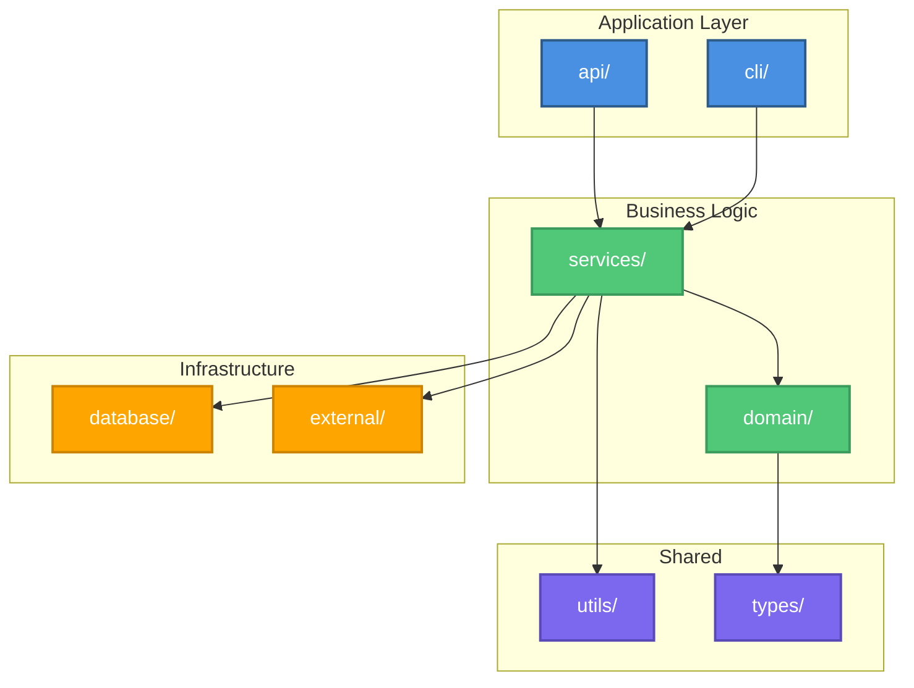

# Package/Module Diagram

**Purpose**: Code organization and module dependencies  
**Language**: [Primary language]  
**Generated**: [DATE]  
**Status**: [Draft/Approved/Implemented]

---

## Diagram

[Generate a Mermaid graph or DOT diagram showing directory/package structure and import relationships. Group by architectural layer. Use DOT for >10 modules.]

---

## Modules

[1-2 sentences per module: path, purpose, and key exports.]

- **[Module]** (`src/path/`): [Purpose and public API]

### Dependency Rules
- [Allowed direction]: [Layer] -> [Layer]
- [Forbidden]: [Layer] -> [Layer] (reason)

---

**Document Version**: [MAJOR.MINOR.PATCH]  
**Last Updated**: [YYYY-MM-DD]  
**Versioning**: SemVer; bump on any change (minimum: PATCH).  
**Owner**: [git.user.name]  
**Reviewers**: [git.user.name]

### Change Log

| Version | Date | Summary | Author |
|---------|------|---------|--------|
| 1.0.0 | [YYYY-MM-DD] | Initial version | [git.user.name] |
