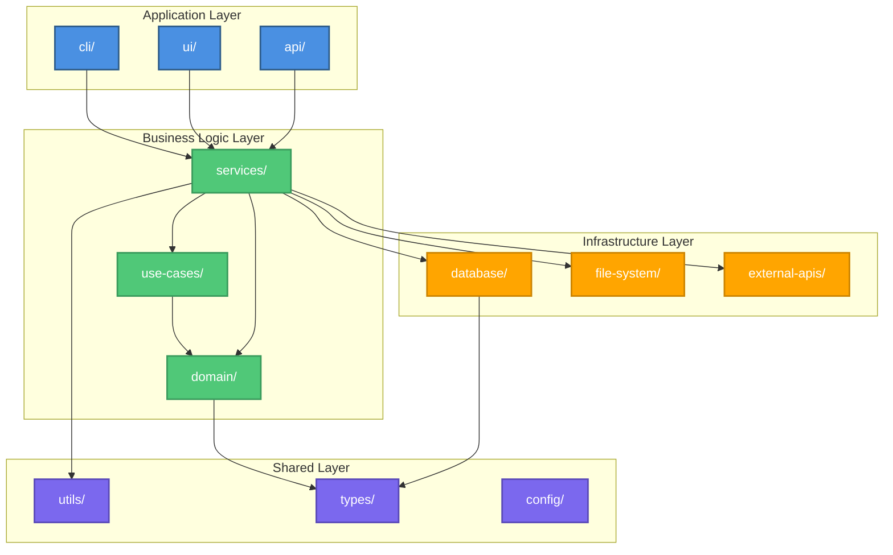

# Package/Module Diagram

**Purpose**: Code organization and module dependencies
**Language**: [Primary language: TypeScript/Python/Java/etc.]

**Generated**: [DATE]  
**Status**: [Draft/Approved/Implemented]

---

## Diagram

[Generate a Mermaid graph showing the directory/package structure and import/dependency relationships. Show module boundaries and key dependencies.]



---

## Module Structure

[Describe the overall organization philosophy and layering strategy.]

---

## Packages/Modules

[List 8-15 key packages/modules with their purposes and public APIs.]

### [Package Name]
- **Path**: `src/[path]/`
- **Purpose**: [What this package is responsible for]
- **Public API**: [Key exports: classes, functions, types]
- **Dependencies**: [What packages this depends on]
- **Dependents**: [What packages depend on this]

### [Package Name]
- **Path**: `src/[path]/`
- **Purpose**: [What this package is responsible for]
- **Public API**: [Key exports]
- **Dependencies**: [What it depends on]
- **Dependents**: [What depends on it]

---

## Dependency Rules

[Define architectural constraints and dependency rules.]

### Allowed Dependencies
- **Application Layer** → Business Logic Layer
- **Business Logic Layer** → Infrastructure Layer
- **All Layers** → Shared Layer

### Forbidden Dependencies
- **Infrastructure Layer** → Business Logic Layer (violates clean architecture)
- **Business Logic Layer** → Application Layer (creates coupling)

### Circular Dependencies
[List any known circular dependencies that need resolution]
- [Package A] ↔ [Package B] - [Plan to resolve]

---

## Module Boundaries

[Describe what defines a module boundary and cohesion strategy.]

### Cohesion Criteria
- [Criteria for grouping code into a module]
- [Criteria for splitting a module]

### Interface Points
- [How modules expose their functionality]
- [How modules communicate]

---

## Entry Points

[List main entry points into the codebase.]

### [Entry Point Name]
- **File**: `src/[path]/index.ts`
- **Purpose**: [What this entry point provides]
- **Exports**: [Key exports]

---

## Shared/Common Code

[Describe shared utilities, types, and configuration.]

### Utils Package
- **Path**: `src/utils/`
- **Contents**: [Helper functions, common utilities]
- **Usage**: [How and when to use]

### Types Package
- **Path**: `src/types/`
- **Contents**: [Shared types, interfaces, enums]
- **Usage**: [Type definitions used across modules]

### Config Package
- **Path**: `src/config/`
- **Contents**: [Configuration management]
- **Usage**: [How configuration is accessed]

---

## External Dependencies

[List major external npm/pip/maven packages and their usage.]

| Package | Version | Purpose | Used By |
|---------|---------|---------|---------|
| [name] | [version] | [why] | [which modules] |
| [name] | [version] | [why] | [which modules] |

---

## Build & Compilation

[Describe build structure and compilation targets.]

- **Build Tool**: [Webpack/Vite/tsc/etc.]
- **Output**: [Where compiled files go]
- **Entry Points**: [Build entry points]
- **Optimization**: [Tree-shaking, code-splitting, etc.]

---

## Module Resolution

[Describe how imports are resolved.]

- **Base Path**: [Project root or src/]
- **Path Aliases**: 
  - `@/components` → `src/components/`
  - `@/utils` → `src/utils/`
- **Module Strategy**: [Node, Classic, etc.]

---

## Testing Organization

[Describe test file organization relative to source code.]

- **Test Location**: [Colocated/Separate test directory]
- **Naming Convention**: `[name].test.ts` or `[name].spec.ts`
- **Test Structure**: [Mirror source structure]

---

## Migration Notes

[If refactoring from old structure, describe migration path.]

### Old Structure
```
[Describe previous organization]
```

### New Structure
```
[Describe new organization]
```

### Migration Steps
1. [Step to migrate]
2. [Step to migrate]

---

## Related Documentation

- **System Overview**: `.zeno/architecture/system-overview.md` - High-level architecture
- **Component Diagrams**: `.zeno/architecture/component-*.md` - Detailed components
- **Build Documentation**: [Link to build docs]

---

**Source**: `.zeno/architecture/packages.mmd`  
**Generated by**: Zeno's Planner

