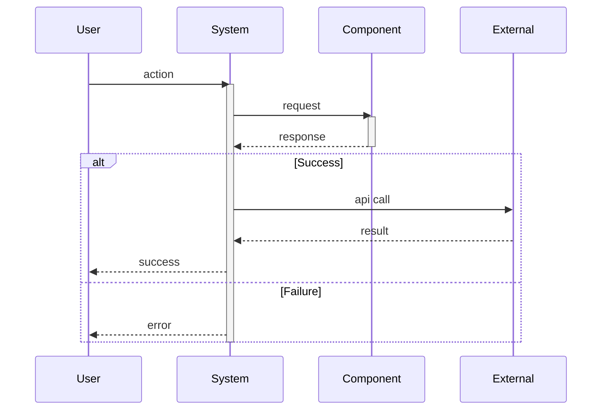

# Sequence: [Use Case Name]

**Purpose**: Step-by-step interaction flow for [use case]  
**Gate**: Gate [X]  
**Actors**: [List participants]  
**Generated**: [DATE]  
**Status**: [Draft/Approved/Implemented]

---

## Diagram

[Generate a Mermaid sequence diagram or DOT diagram showing temporal interactions between actors/components. Include message passing, return values, and alt/opt blocks for decision points. Use DOT for >6 participants.]

---

## Steps

[1 sentence per interaction step.]

1. **[Step]**: [Actor -> Actor: what happens]
2. **[Step]**: [Actor -> Actor: what happens]

---

**Document Version**: [MAJOR.MINOR.PATCH]  
**Last Updated**: [YYYY-MM-DD]  
**Versioning**: SemVer; bump on any change (minimum: PATCH).  
**Owner**: [git.user.name]  
**Reviewers**: [git.user.name]

### Change Log

| Version | Date         | Summary         | Author          |
|---------|--------------|-----------------|-----------------|
| 1.0.0   | [YYYY-MM-DD] | Initial version | [git.user.name] |
