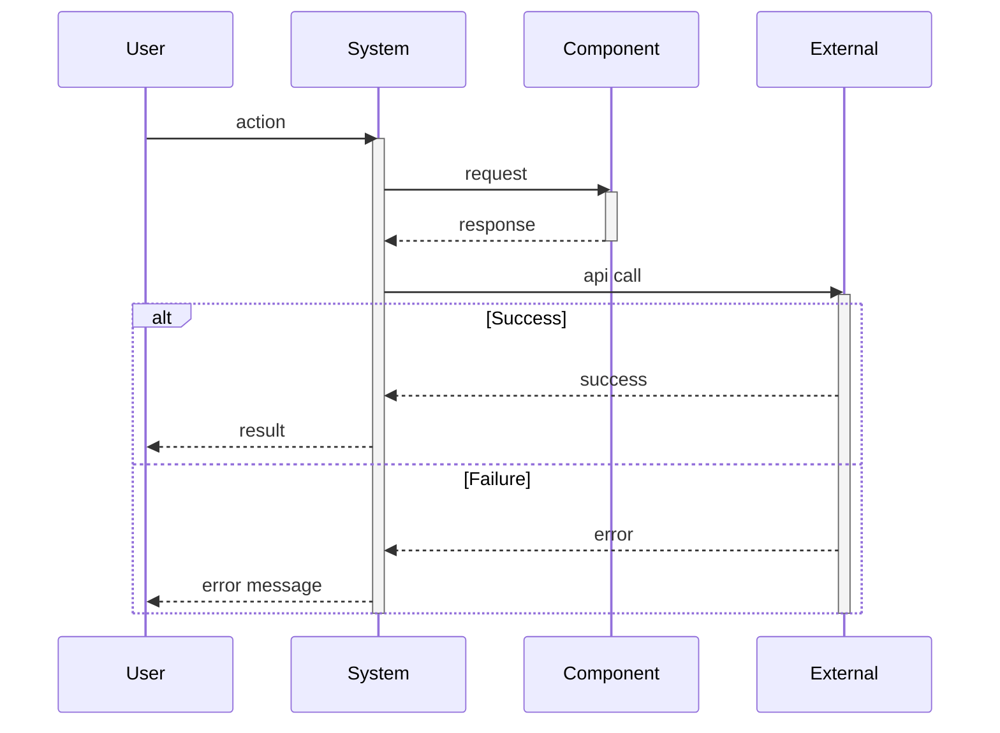

# Sequence Diagram: [Use Case Name]

**Purpose**: Step-by-step interaction flow for specific use case
**Gate**: Gate [X]
**Actors**: [List participants: User, System, External Service]

**Generated**: [DATE]  
**Status**: [Draft/Approved/Implemented]

---

## Diagram

[Generate a Mermaid sequence diagram showing temporal interactions between actors and components. Include message passing, return values, and critical decision points. Show 5-10 key interactions.]



---

## Flow Description

[Describe the sequence in 3-5 paragraphs explaining what happens, why, and the expected outcomes.]

---

## Interaction Steps

[List 5-10 detailed steps in the sequence.]

### 1. [Step Name]
- **Actor**: [Who initiates]
- **Action**: [What happens]
- **Data**: [What's passed]
- **Result**: [Expected outcome]

### 2. [Step Name]
- **Actor**: [Who initiates]
- **Action**: [What happens]
- **Data**: [What's passed]
- **Result**: [Expected outcome]

---

## Alternative Flows

[Describe 2-4 alternative paths: error handling, edge cases, optional branches.]

### [Alternative Name]
```
[Actor] → [Actor] → [Outcome]
```
[When this path is taken and what happens]

---

## Error Handling

[List error scenarios and how the system responds.]

- **[Error Type]**: [How it's detected and handled]
- **[Error Type]**: [How it's detected and handled]

---

## Performance Considerations

[List timing requirements, bottlenecks, or optimization notes if applicable.]

- [Performance consideration]
- [Performance consideration]

---

## Related Documentation

- **Data Flow**: `.zeno/architecture/data-flow.md` - Overall system flow
- **Component Diagram**: `.zeno/architecture/component-[name].md` - Component details
- **Gate PRD**: `.zeno/gates/gate-[XX]-[name].md` - Gate requirements

---

**Source**: `.zeno/architecture/sequence-[use-case].mmd`  
**Generated by**: Zeno's Planner

