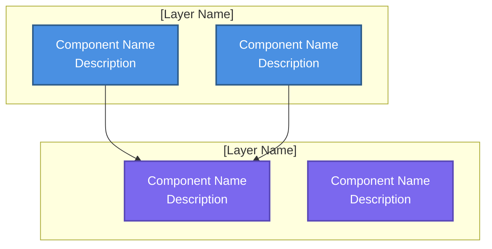

# System Overview

**Purpose**: High-level system architecture showing major components and relationships

**Generated**: [DATE]  
**Status**: [Draft/Approved/Implemented]

---

## Diagram

[Generate a Mermaid graph showing 3-5 architectural layers with 2-4 components per layer. Use subgraphs for layers and show key relationships with arrows. Apply consistent styling.]



---

## Architecture Layers

[Describe 3-5 architectural layers. For each layer, list components and their responsibilities.]

### 1. [Layer Name]
- **[Component Name]**: [Component responsibilities and purpose]
- **[Component Name]**: [Component responsibilities and purpose]

### 2. [Layer Name]
- **[Component Name]**: [Component responsibilities and purpose]
- **[Component Name]**: [Component responsibilities and purpose]

---

## Design Principles

[List 3-5 key architectural principles that guide the system design.]

### [Principle Name]
[Describe the principle and why it matters for this system]

### [Principle Name]
[Describe the principle and why it matters for this system]

---

## Component Interactions

[Describe 2-4 key interaction patterns showing how components communicate.]

### [Interaction Pattern Name]
```
[Component] → [Component] → [Component]
```
[Describe this interaction flow and when it occurs]

---

## Related Documentation

- **Data Flow**: `.zeno/docs/architecture/data-flow.md` - End-to-end process flow
- **Gate Lifecycle**: `.zeno/docs/architecture/gate-lifecycle.md` - State machine
- **Gate Roadmap**: `.zeno/docs/architecture/gate-roadmap.md` - Gate roadmap
- **Project PRD**: `.zeno/docs/PROJECT_PRD.md` - Full specification

---

**Source**: `.zeno/docs/architecture/system-overview.mmd`  
**Generated by**: Zeno's Planner

