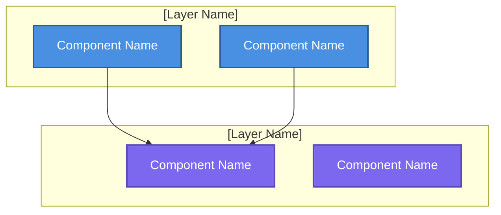

# System Overview

**Purpose**: High-level system architecture showing major components and relationships  
**Generated**: [DATE]  
**Status**: [Draft/Approved/Implemented]

---

## Diagram

[Generate a Mermaid graph or DOT diagram showing 3-5 architectural layers with 2-4 components per layer. Use subgraphs for layers. Apply consistent styling. Use DOT for >5 total components.]

---

## Layers

[1-2 sentences per layer describing components and responsibilities.]

### [Layer Name]
[Components and what they handle]

### [Layer Name]
[Components and what they handle]

---

**Document Version**: [MAJOR.MINOR.PATCH]  
**Last Updated**: [YYYY-MM-DD]  
**Versioning**: SemVer; bump on any change (minimum: PATCH).  
**Owner**: [git.user.name]  
**Reviewers**: [git.user.name]

### Change Log

| Version | Date | Summary | Author |
|---------|------|---------|--------|
| 1.0.0 | [YYYY-MM-DD] | Initial version | [git.user.name] |
