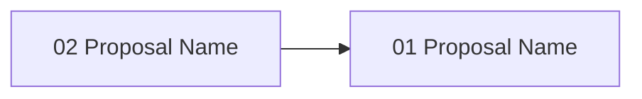

---
zeno:
  id: gate-XX
  name: '[Gate Name]'
  sequence: XX
  type: feature   # feature | quality | rescope
  status: pending
  hash: gXXslug
  created_at: 'YYYY-MM-DD'
  depends_on: []   # optional: ['gate-01', 'gate-02']
---

# Gate [XX]: [Gate Name]

**Hash**: `#gXXslug`
**Status**: pending
**Type**: [feature | quality | rescope]
**Created**: [YYYY-MM-DD]
**Sequence**: [X of Y]

<!-- Status lifecycle:
  - pending: Gate generated at init, requirements not yet decomposed
  - in_progress: Gate started via `zeno gates start`, requirements generated
  - completed: All requirements tested, gate approved
  - archived: Gate completed and moved to archive with final artifacts
  - rejected: Gate rejected during review
  - cancelled: Gate cancelled/dropped with optional reason
  - backlog: Gate deferred to later implementation
-->

## Overview

[2-3 sentences describing what this gate accomplishes and how it moves the project closer to the end state. Focus on concrete deliverables.]

## Objectives

[List 3-5 specific, measurable objectives. Each should have a concrete outcome with clear completion criteria.]

- [ ] [Objective with measurable outcome]
- [ ] [Objective with measurable outcome]
- [ ] [Objective with measurable outcome]

## Context

### What Was Completed Before This Gate

[Summarize previous gate deliverables this builds upon. List key infrastructure or capabilities now available.]

- [Previous capability or infrastructure]
- [Previous capability or infrastructure]

### What This Gate Enables

[Describe future gates or capabilities that depend on this completion. Explain strategic value.]

- [Future capability enabled]
- [Future capability enabled]

### Scope Boundaries

**In Scope**:
[List specific features, modules, or capabilities included in this gate.]

- [Specific deliverable]
- [Specific deliverable]

**Out of Scope**:
[List features explicitly deferred to later gates or intentionally excluded.]

- [Deferred feature]
- [Deferred feature]

## Open Questions

[Optional: Capture questions that need resolution before gate start or proposal generation. Mark each item `[x]` once answered. The validator requires every listed question to be resolved (`[x]`) before proposals can be generated — or set this section to `N/A` if there are none. Remove this section entirely if not needed.]

- [ ] [Question text — replace once resolved or remove this placeholder]

---

## Requirements

<!-- Requirements-First Workflow:
  1. Project-level requirements: PRIMARILY defined during `zeno init` at project inception (BEFORE gates).
     These are high-level, cross-cutting requirements derived from the end state.
  2. Gate generation (`/zeno-gate`): Attributes existing project-level requirements to gates.
     Requirements are PRIMARILY mapped and attributed here, not created.
     During rebaseline/rescope: Requirements may be updated or added as part of rescoping.
  3. Gate start (`zeno gates start`): Generates gate-specific requirements that decompose
     project requirements and gate objectives into actionable items.
  4. Proposal generation (`/zeno-proposal`): Breaks requirements down into individual tasks.

  Workflow: Requirements (init - PRIMARY) → Gates (attribute, may update/add during rescope) → Gate Requirements (decompose) → Tasks (proposals)
-->

### Project Requirements (Attributed to This Gate)

[Project-level requirements were defined during `zeno init` at project inception. This section lists those that are attributed to this gate. Query all project requirements via `zeno req list --project`.]

| Hash    | Name                       | Type                                     | Priority              | How This Gate Addresses It   |
| ------- | -------------------------- | ---------------------------------------- | --------------------- | ---------------------------- |
| #[hash] | [Project Requirement Name] | [functional\|non_functional\|constraint] | [must\|should\|could] | [How this gate addresses it] |

### Gate-Specific Requirements

[Gate-specific requirements are generated when `zeno gates start <gate-id>` is called. These decompose project requirements and gate objectives into actionable items. Stored in `.zeno/registry.db` and queried via `zeno req list --gate <id>`.]

**Status**: Requirements will be generated when gate is started.

[After gate start, view detailed requirement information via: `zeno req show <hash>`]

### Inherited/Transferred Requirements

[Requirements transferred from other gates or shared across gates.]

<!-- Requirement sources:
  - Transferred: Requirements moved from another gate (e.g., during rescope)
  - Shared: Requirements that span multiple gates (tracked via dependencies)
-->

- **From Gate [X]**: #[hash] - [Requirement name and reason for transfer]

### Requirement-to-Task Breakdown

[Individual tasks are created during proposal generation (`/zeno-proposal`), not during gate generation. Each requirement may spawn multiple proposals (tasks) that implement it.]

---

## Proposals

**Status**: Proposals will be generated when gate is started.

[After gate start, view detailed proposal information via: `zeno proposal show <hash>`]

### Proposal Status

| Proposal        | Hash    | Status  | Notes            |
| --------------- | ------- | ------- | ---------------- |
| [proposal-name] | #[hash] | pending | [Optional notes] |

### Proposal Dependency Graph

<!-- Generated by /zeno-proposal when proposals are created. Shows requires relationships between proposals. -->

### High-Level Delta (Gate Completion Summary)

[1-2 sentence summary of what this gate accomplished overall. Focus on user-facing value, not proposal details.]

**Key Deliverables**:

- [Key deliverable 1]
- [Key deliverable 2]
- [Key deliverable 3]

**Quality Metrics**: Coverage [X]%, Security [Y] issues, Lint <[Z]%

---

## Architecture Diagrams

<!-- LLM Instructions: Populate this section with applicable architecture diagrams for this gate.
     Core diagrams (system-overview, data-flow, gate-lifecycle, gate-roadmap, context) are always included.
     For conditional diagrams, use the diagram catalogue to select additional diagrams based on this gate's scope.
     Set order numbers sequentially starting from 1 (core diagrams should come first with orders 1-5,
     then conditional diagrams with orders 6+).
-->

| Name                              | Type               | Order | Status    |
| --------------------------------- | ------------------ | ----- | --------- |
| System Overview                   | system-overview    | 1     | pending   |
| Data Flow Diagram                 | data-flow          | 2     | pending   |
| Gate Lifecycle State Machine      | gate-lifecycle     | 3     | pending   |
| Gate Roadmap                      | gate-roadmap       | 4     | pending   |
| System Context Diagram            | context            | 5     | pending   |
<!-- Add conditional diagrams as needed (sequence, component, package, deployment, network). Use the diagram catalogue to select types relevant to this gate's scope. Number orders 6+ sequentially. -->

---

## Technical Decisions for This Gate

[List 2-4 gate-specific technical decisions. Focus on choices specific to this gate, not project-wide architecture.]

### [Decision Name]

- **Choice**: [Specific technical decision made for this gate]
- **Alternatives Considered**: [Other options evaluated]
- **Rationale**: [Why this choice for this specific gate]
- **Impact**: [How this affects implementation and future gates]
- **Trade-offs**: [What was gained/lost with this decision]

## Architecture Updates

### Components Modified or Created

[List components that will be created or modified. Include paths, purpose, and key interfaces.]

- **[Component Name]** (`path/to/component`)
  - Purpose: [What this component does]
  - Changes: [What's being added or modified]
  - Interfaces: [Key APIs or contracts]

### Diagram Update Requirements

[Specify which diagrams need updates and what changes are required.]

- System Overview: `zeno/architecture/system-overview.md` - [describe specific changes]
- Data Flow: `zeno/architecture/data-flow.md` - [describe specific changes]
- Gate Roadmap: `zeno/architecture/gate-roadmap.md` - [updated with this gate's position]

### Integration Points

[Describe how this gate's deliverables integrate with existing systems or modules.]

- **[System/Module Name]**: [How integration works]
- **[System/Module Name]**: [How integration works]

## Gate-Specific Quality Considerations

[Only include sections that apply to this gate. Omit if not applicable.]

### Security Considerations

[If this gate involves security-sensitive code, list specific concerns and mitigation approaches.]

- [Security concern and mitigation]
- [Threat model consideration]

### Performance Requirements

[If this gate has specific performance targets, list benchmarks and constraints.]

- [Performance target or benchmark]
- [Resource constraint or optimization goal]

## Dependencies

### External Dependencies (New or Updated)

[List any new npm packages or version updates required. Include justification.]

- **[package-name]** (version) - [Purpose and justification]

### Internal Dependencies

[Specify gate dependencies and module requirements using hash references.]

- **Depends on Gate(s)**: [Gate X: Name] - [What capabilities are required]
- **Blocks Gate(s)**: [Gate Y: Name] - [What gates wait for this completion]
- **Requires Modules**: #[hash] - [module name and why]

### Infrastructure Dependencies

[List any infrastructure changes needed. Omit section if none.]

- [Database schema changes, environment variables, external services, or build system changes]

## Implementation Steps

[List 3-6 high-level steps in execution order. The first step should define acceptance tests, middle steps implement features, and the final step refines test coverage.]

1. **Define Acceptance Tests**
   - Write tests that define the gate's acceptance criteria
   <!-- Tests establish the contract before implementation begins -->

2. **[Step Name]**
   - [What needs to be done]
   - [Dependencies on previous steps]
   - [What it enables for subsequent steps]

3. **[Step Name]**
   - [What needs to be done]
   - [Dependencies on previous steps]
   - [What it enables for subsequent steps]

4. **Test Cleanup**
   <!-- Refine tests, add edge cases, ensure coverage ≥90% -->
   <!-- Validates all gate deliverables meet quality thresholds -->

## Known Issues & Limitations

### Current Limitations

[List limitations introduced or accepted by this gate and explain why they exist.]

- [Limitation and rationale]

### Technical Debt

[List technical debt being introduced with plan to address.]

- [Technical debt item] - [plan to address]

### Future Improvements

[List enhancements deferred to later gates.]

- [Enhancement] - [deferred to Gate X]

## Risks & Mitigation

[Identify 2-5 significant risks specific to this gate. Include both technical and process risks.]

### Technical Risks

1. **[Risk Name]**
   - **Impact**: [High/Medium/Low]
   - **Probability**: [High/Medium/Low]
   - **Mitigation**: [Specific actions to reduce risk]
   - **Contingency**: [Backup plan if risk materializes]

### Process Risks

1. **[Risk Name]**
   - **Impact**: [High/Medium/Low]
   - **Probability**: [High/Medium/Low]
   - **Mitigation**: [Specific actions to reduce risk]
   - **Contingency**: [Backup plan if risk materializes]

## Gate Completion Criteria

[Standard checklist for gate completion. All items must be checked before marking gate complete.]

- [ ] All must-have requirements implemented and tested
- [ ] All should-have requirements implemented or explicitly deferred
- [ ] All proposals completed and approved
- [ ] All acceptance criteria met
- [ ] Architecture diagrams updated
- [ ] Gate-specific quality considerations addressed
- [ ] Stakeholder approval obtained

## Notes

### Implementation Notes

[Any additional guidance for implementers not covered above.]

- [Specific guidance or consideration]

### Proposal Summary

[Populated during proposal archival. Contains 1-2 sentence summaries of completed proposals as they are cleaned up, preserving a record of work completed in this gate.]

| Proposal Hash | Summary                                           |
| ------------- | ------------------------------------------------- |
| #[hash]       | [1-2 sentence summary of proposal work completed] |

### Next Gate Preview

[Brief preview of what Gate [XX+1] will focus on and how it builds on this gate's deliverables.]

---

**Document Version**: [MAJOR.MINOR.PATCH]
**Last Updated**: [YYYY-MM-DD]
**Versioning**: SemVer; bump on any change (minimum: PATCH).
**Owner**: [git.user.name]
**Reviewers**: [git.user.name]

### Change Log

| Version | Date         | Summary         | Author          |
| ------- | ------------ | --------------- | --------------- |
| 1.0.0   | [YYYY-MM-DD] | Initial version | [git.user.name] |

**Related Documents**:

- Project PRD: `zeno/overview/PROJECT_PRD.md`
- Previous Gate: `zeno/gates/gate-[XX-1]-[name].md`
- Next Gate: `zeno/gates/gate-[XX+1]-[name].md`
- Architecture: `zeno/architecture/`
