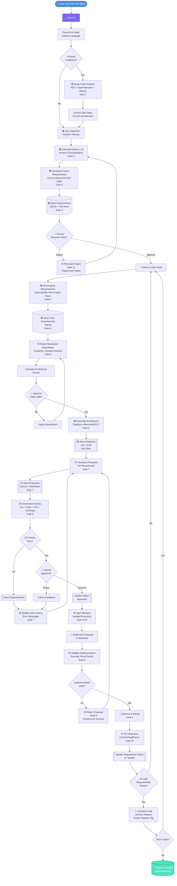

```mermaid
flowchart TD
    Start(["👤 User: Describe End State"]) --> Init["zeno init"]
    
    Init --> ParseEndState["Parse End State<br/>Natural Language"]
    
    ParseEndState --> AnalyzeExisting{"Existing<br/>Codebase?"}
    
    AnalyzeExisting -->|Yes| DeepAnalysis["🟢 Deep Code Analysis<br/>AST + Dependencies + Metrics<br/>Gate 2"]
    AnalyzeExisting -->|No| ZenoAlgo["🟢 Zeno Algorithm<br/>Iterative Halving"]
    
    DeepAnalysis --> ExtractStartState["Extract Start State<br/>Current Architecture"]
    ExtractStartState --> ZenoAlgo
    
    ZenoAlgo --> GenerateGates["🟢 Generate Gates 1-14<br/>Iterative Decomposition<br/>Gate 3"]
    
    GenerateGates --> GenProjectReqs["🟢 Generate Project Requirements<br/>Cross-cutting from End State<br/>Gate 4"]
    
    GenProjectReqs --> StoreProjectReqs[("🟢 Store Requirements<br/>SQLite + File Store<br/>Gate 4")]
    
    StoreProjectReqs --> ReviewGates{"👤 Human<br/>Reviews Gates?"}
    
    ReviewGates -->|Reject| Replan["🟡 Rescope Engine<br/>Gate 11<br/>Regenerate Gates"]
    Replan --> GenerateGates
    
    ReviewGates -->|Approve| startGate["👤 Select & Start Gate"]
    
    startGate --> DecomposeReqs["🟢 Decompose Requirements<br/>Gate-specific from Project Reqs<br/>Gate 4"]
    
    DecomposeReqs --> StoreGateReqs[("🟢 Store Gate Requirements<br/>SQLite<br/>Gate 4")]
    
    StoreGateReqs --> DetectRepos["🟡 Detect Repository Boundaries<br/>Coupling + Domain Analysis<br/>Gate 6"]
    
    DetectRepos --> CalcConfidence["Calculate Confidence Scores"]
    
    CalcConfidence --> RepoApproval{"👤 Approve<br/>Repo Split?"}
    
    RepoApproval -->|No| AdjustBoundaries["Adjust Boundaries"]
    AdjustBoundaries --> DetectRepos
    
    RepoApproval -->|Yes| GenArchitecture["🟢 Generate Architecture<br/>Diagrams (Mermaid/DOT)<br/>Gate 5"]
    
    GenArchitecture --> StoreArch[["🟢 Store Diagrams<br/>.md + SVG<br/>File Store"]]
    
    StoreArch --> GenProposals["🟡 Generate Proposals<br/>Per Requirement<br/>Gate 7"]
    
    GenProposals --> StoreProposals[["🟡 Store Proposals<br/>SQLite + Markdown<br/>Gate 7"]]
    
    StoreProposals --> AutoChecks["🟡 Automated Checks<br/>Lint + Type + Test + Coverage<br/>Gate 8"]
    
    AutoChecks --> CheckResults{"All Checks<br/>Pass?"}
    
    CheckResults -->|No| StoreFailed[["Store Failed Results"]]
    StoreFailed --> Replan2["🟡 Replan with Context<br/>Error Messages<br/>Gate 7"]
    Replan2 --> GenProposals
    
    CheckResults -->|Yes| HumanReview{"👤 Human<br/>Approval?"}
    
    HumanReview -->|Reject| CollectFeedback["Collect Feedback"]
    CollectFeedback --> Replan2
    
    HumanReview -->|Approve| UpdateProposalStatus[["Update Status:<br/>Approved"]]
    
    UpdateProposalStatus --> StartWorktree["🟡 Start Worktree<br/>Isolated Execution<br/>Gate 9-10"]
    
    StartWorktree --> Implement["👤 Implement Proposal<br/>in Worktree"]
    
    Implement --> ValidateImplementation["🟡 Validate Implementation<br/>Running Tests/Checks<br/>Gate 8"]
    
    ValidateImplementation --> MergeResult{"Implementation<br/>Valid?"}
    
    MergeResult -->|No| RejectProposal["🟡 Reject Proposal<br/>Gate 9<br/>Preserve for Rework"]
    RejectProposal --> GenProposals
    
    MergeResult -->|Yes| ApproveProposal["👤 Approve & Merge<br/>Gate 9"]
    
    ApproveProposal --> GitIntegration["🟡 Git Integration<br/>Commit/Tag/Branch<br/>Gate 10"]
    
    GitIntegration --> UpdateRequirements[["Update Requirement Status<br/>to 'Tested'"]]
    
    UpdateRequirements --> AllComplete{"All Gate<br/>Requirements<br/>Tested?"}
    
    AllComplete -->|No| startGate
    
    AllComplete -->|Yes| CompleteGate["👤 Complete Gate<br/>Archive Artifacts<br/>Create Release Tag"]
    
    CompleteGate --> NextGate{"More Gates?"}
    
    NextGate -->|Yes| startGate
    NextGate -->|No| ProjectComplete[("✅ Project Complete<br/>Vision Realized")]
    
    style Start fill:#4A90E2,stroke:#2E5C8A,stroke-width:2px,color:#fff
    style ProjectComplete fill:#50E3C2,stroke:#2FA284,stroke-width:2px,color:#fff
    style Init fill:#7B68EE,stroke:#5A4AB8,stroke-width:2px,color:#fff
```