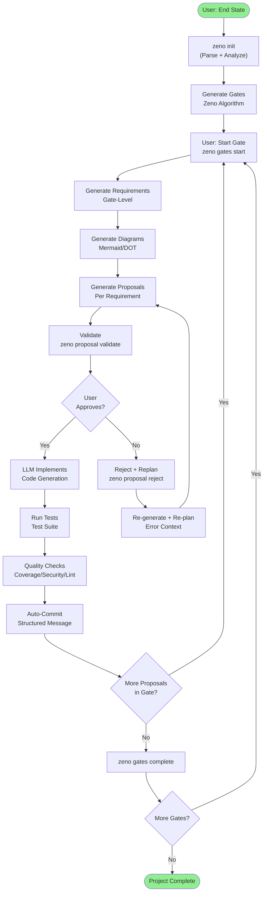
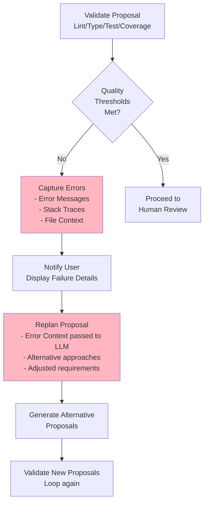
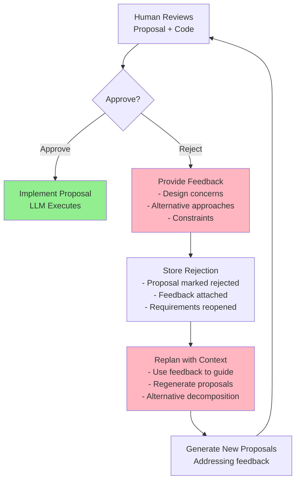
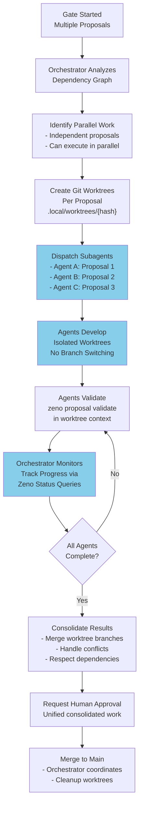
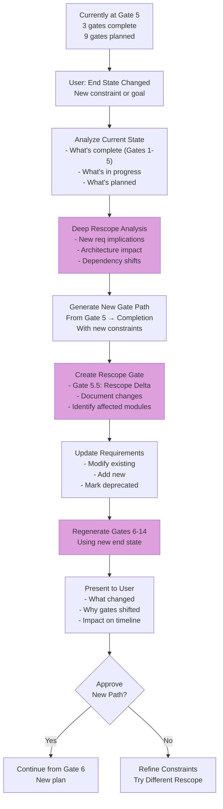

# Data Flow

**Purpose**: End-to-end data flow from user input to project completion, including error recovery and rescope paths

**Last Updated**: 2026-02-23  
**Status**: Approved (Initialized path complete; Error Recovery, Subagent Orchestration, and Rescope paths in Gates 9-11)

---

## Diagram

```mermaid
flowchart TD
    Start([User: Describe End State]) --> Init[zeno init]
    
    Init --> ParseEndState[Parse End State<br/>Natural Language]
    
    ParseEndState --> AnalyzeExisting{Existing<br/>Codebase?}
    
    AnalyzeExisting -->|Yes| DeepAnalysis[Deep Code Analysis<br/>AST + Dependencies + Metrics]
    AnalyzeExisting -->|No| ZenoAlgo[Zeno's Paradox Algorithm]
    
    DeepAnalysis --> ExtractStartState[Extract Start State<br/>Current Architecture]
    ExtractStartState --> ZenoAlgo
    
    ZenoAlgo --> GenerateGates[Generate Gates<br/>Iterative Halving]
    
    GenerateGates --> GenProjectReqs[Generate Project Requirements<br/>Cross-cutting from End State]
    
    GenProjectReqs --> StoreProjectReqs[(Store Project Requirements<br/>SQLite level=project)]
    
    StoreProjectReqs --> StoreGates[(Store Gates<br/>SQLite + Files)]
    
    StoreGates --> SelectGate{User Selects Gate}
    
    SelectGate --> DecomposeReqs[Decompose into Gate Requirements<br/>From Project Reqs + Gate Objectives]
    
    DecomposeReqs --> InheritReqs[Inherit/Transfer Requirements<br/>From Project or Other Gates]
    
    InheritReqs --> StoreReqs[(Store Gate Requirements<br/>SQLite level=gate)]
    
   StoreReqs --> GenArchitecture[Generate Architecture<br/>Mermaid/DOT Diagrams]
    
   GenArchitecture --> StoreArch[(Store Diagrams<br/>.md + SVG)]
    
    StoreArch --> DetectRepos[Detect Repository Boundaries<br/>Coupling + Domain + Size]
    
    DetectRepos --> CalcConfidence[Calculate Confidence Scores]
    
    CalcConfidence --> RepoApproval{User Approves<br/>Repo Split?}
    
    RepoApproval -->|No| AdjustBoundaries[Adjust Boundaries]
    AdjustBoundaries --> DetectRepos
    
    RepoApproval -->|Yes| ScaffoldRepos[Scaffold Repositories<br/>package.json + tsconfig]
    
    ScaffoldRepos --> StoreRepos[(Store Repo Metadata<br/>SQLite)]
    
    StoreRepos --> BuildDepGraph[Build Dependency Graph<br/>Cross-Repo]
    
    BuildDepGraph --> StoreDepGraph[(Store Dependencies<br/>Hash-based)]
    
    StoreDepGraph --> GenProposals[Generate Proposals<br/>Per Requirement]
    
    GenProposals --> StoreProposals[(Store Proposals<br/>SQLite + Markdown)]
    
    StoreProposals --> AutoChecks[Automated Checks<br/>Lint + Type + Test + Coverage]
    
    AutoChecks --> CheckResults{All Checks<br/>Pass?}
    
    CheckResults -->|No| StoreFailed[(Store Failed Results)]
    StoreFailed --> Replan[Replan with Context<br/>Error Messages]
    Replan --> GenProposals
    
    CheckResults -->|Yes| HumanReview{Human<br/>Approval?}
    
    HumanReview -->|Reject| CollectFeedback[Collect Feedback]
    CollectFeedback --> Replan
    
    HumanReview -->|Approve| UpdateStatus[(Update Proposal Status<br/>Approved)]
    
    UpdateStatus --> LLMExecute[LLM Executes in Cursor<br/>Generate Code]
    
    LLMExecute --> RunTests[Run Tests]
    
    RunTests --> TestResults{Tests<br/>Pass?}
    
    TestResults -->|No| Replan
    
    TestResults -->|Yes| QualityCheck[Quality Gate Check<br/>Coverage/Security/Lint]
    
    QualityCheck --> QualityResults{Thresholds<br/>Met?}
    
    QualityResults -->|No| Replan
    
    QualityResults -->|Yes| GitCommit[Auto-commit with Hooks<br/>Structured Message]
    
    GitCommit --> UpdateGateStatus{All Proposals<br/>Complete?}
    
    UpdateGateStatus -->|No| SelectGate
    
    UpdateGateStatus -->|Yes| GateRelease[Create Git Tag<br/>Gate Release]
    
    GateRelease --> MoreGates{More<br/>Gates?}
    
    MoreGates -->|Yes| CheckRescope{End State<br/>Changed?}
    
    CheckRescope -->|Yes| RescopeGate[Generate Rescope Gate]
    RescopeGate --> RegenerateGates[Regenerate Future Gates]
    RegenerateGates --> SelectGate
    
    CheckRescope -->|No| SelectGate
    
    MoreGates -->|No| Complete([Project Complete])
    
    %% Styling
    classDef storageStyle fill:#FFA500,stroke:#CC8400,stroke-width:2px,color:#fff
    classDef processStyle fill:#4A90E2,stroke:#2E5C8A,stroke-width:2px,color:#fff
    classDef decisionStyle fill:#FF6B6B,stroke:#CC5555,stroke-width:2px,color:#fff
    classDef llmStyle fill:#50C878,stroke:#3A9B5C,stroke-width:2px,color:#fff
    
    class StoreGates,StoreProjectReqs,StoreReqs,StoreArch,StoreRepos,StoreDepGraph,StoreProposals,StoreFailed,UpdateStatus storageStyle
    class DeepAnalysis,ZenoAlgo,GenerateGates,GenProjectReqs,DecomposeReqs,InheritReqs,GenArchitecture,DetectRepos,ScaffoldRepos,BuildDepGraph,GenProposals,AutoChecks,QualityCheck,GitCommit,GateRelease processStyle
    class AnalyzeExisting,SelectGate,RepoApproval,CheckResults,HumanReview,TestResults,QualityResults,UpdateGateStatus,MoreGates,CheckRescope decisionStyle
    class LLMExecute,RunTests llmStyle
```

---

## Workflow Paths

### Path 1: Happy Path (Sequential Single-Agent)

**Current Implementation** (Gates 1-5): User describes end state → Zeno generates gates → LLM executes proposals sequentially

---

### Path 2: Error Recovery (Validation Failures)

**Future Implementation** (Gates 8-9): When automated checks or human review fail, capture context and replan

---

### Path 3: Human Rejection & Replan

**Future Implementation** (Gate 9): User reviews proposal and rejects with feedback

---

### Path 4: Parallel Multi-Agent Execution (Subagent Orchestration)

**Planned Implementation** (Gate 13): Orchestrator creates git worktrees for independent proposals, dispatches to specialized agents

---

### Path 5: Rescope Mid-Project

**Planned Implementation** (Gate 11): User changes end state mid-project; regenerate future gates

---

## Data Locations & State Management

| Artifact | Location | Format | Updated By | When |
|----------|----------|--------|------------|------|
| Project metadata | `.zeno/project-overview.json` | JSON | `zeno init`, `zeno gates start`, `zeno gates complete` | Gate creation, start, completion |
| Gate PRDs | `zeno/gates/gate-XX-*.md` | Markdown | `zeno gates start` (generates) | Gate generation |
| Requirements | `.zeno/requirements.db` | SQLite | `zeno req` commands, gate/proposal workflows | Requirement generation/updates |
| Proposals | `zeno/proposals/gate-XX/*.md` | Markdown | `zeno proposal` commands, LLM implementations | Proposal generation/implementation |
| Diagrams | `zeno/architecture/*.md` (Mermaid/SVG) | Markdown/SVG | `zeno arch generate` | Architecture generation |
| Completed gates | `zeno/gates/archive/` | Markdown | `zeno gates complete` (archives proposals) | Gate completion |
| Git history | `.git/` | Git objects | Git hooks, auto-commit on validation pass | Code changes, quality gate pass |
| Worktree state | `.local/worktrees/{hash}/` | File system | `zeno proposal start`, `zeno proposal approve` | Proposal execution (transient) |

---

## Implementation Phases

| Phase | Gates | Status | Key Capability |
|-------|-------|--------|-----------------|
| **Initialization** | 1-5 | Complete | Project init + gate generation + diagram generation + requirement decomposition |
| **Multi-Repo** | 6 | InProgress | Repository boundary detection and scaffolding |
| **Proposals** | 7 | Planned | Proposal generation and artifact validation |
| **Validation** | 8 | Planned | Automated checks (lint, type, test, coverage, security) |
| **Approval** | 9 | Planned | Human approval workflow, rejection handling, error recovery replan |
| **Git Integration** | 10 | Planned | Git hooks, auto-commit, worktree management, conflict detection |
| **Rescope** | 11 | Planned | Mid-project end state changes, gate regeneration, delta analysis |
| **Dashboard** | 12 | Planned | Web UI, progress visualization, gate/proposal status |
| **Subagent Orch** | 13 | Planned | Cursor workflows, parallel agent execution, merge coordination |
| **Documentation** | 14 | Planned | Final docs, performance tuning, quality assessment |

---

**Document Version**: 2.0.0  
**Last Updated**: 2026-02-23  
**Status**: Approved (Happy path implemented; error recovery and rescope paths in design phase)  
**Owner**: jamesonBatworker  

### Change Log

| Version | Date | Summary | Author |
|---------|------|---------|--------|
| 2.0.0 | 2026-02-23 | Added error recovery, human rejection, subagent orchestration, and rescope workflow paths. Reorganized as forward-looking design with implementation phases. | jamesonBatworker |
| 1.0.0 | 2026-01-04 | Initial simplified data flow diagram (Gates 1-5 path) | jamesonBatworker |

