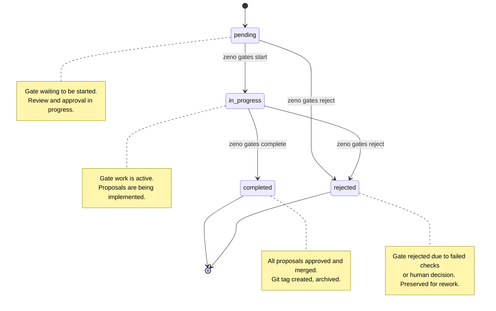

```mermaid
stateDiagram-v2
    [*] --> pending

    pending --> in_progress: zeno gates start
    pending --> rejected: zeno gates reject

    in_progress --> completed: zeno gates complete
    in_progress --> rejected: zeno gates reject

    completed --> [*]
    rejected --> [*]

    note right of pending
        Gate waiting to be started.
        Review and approval in progress.
    end note

    note right of in_progress
        Gate work is active.
        Proposals are being implemented.
    end note

    note right of completed
        All proposals approved and merged.
        Git tag created, archived.
    end note

    note right of rejected
        Gate rejected due to failed checks
        or human decision. Preserved for rework.
    end note
```