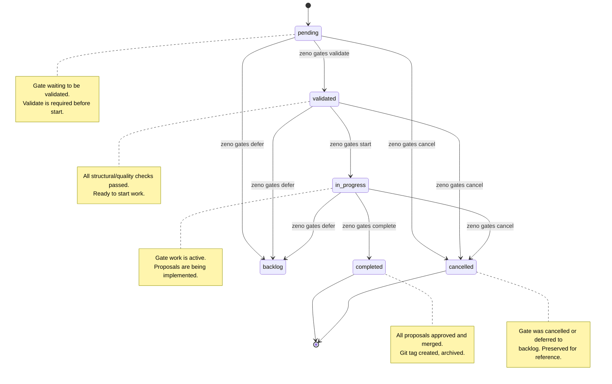

```mermaid
stateDiagram-v2
    [*] --> pending

    pending --> validated: zeno gates validate
    pending --> cancelled: zeno gates cancel
    pending --> backlog: zeno gates defer

    validated --> in_progress: zeno gates start
    validated --> cancelled: zeno gates cancel
    validated --> backlog: zeno gates defer

    in_progress --> completed: zeno gates complete
    in_progress --> cancelled: zeno gates cancel
    in_progress --> backlog: zeno gates defer

    completed --> [*]
    cancelled --> [*]

    note right of pending
        Gate waiting to be validated.
        Validate is required before start.
    end note

    note right of validated
        All structural/quality checks passed.
        Ready to start work.
    end note

    note right of in_progress
        Gate work is active.
        Proposals are being implemented.
    end note

    note right of completed
        All proposals approved and merged.
        Git tag created, archived.
    end note

    note right of cancelled
        Gate was cancelled or deferred to
        backlog. Preserved for reference.
    end note
```
