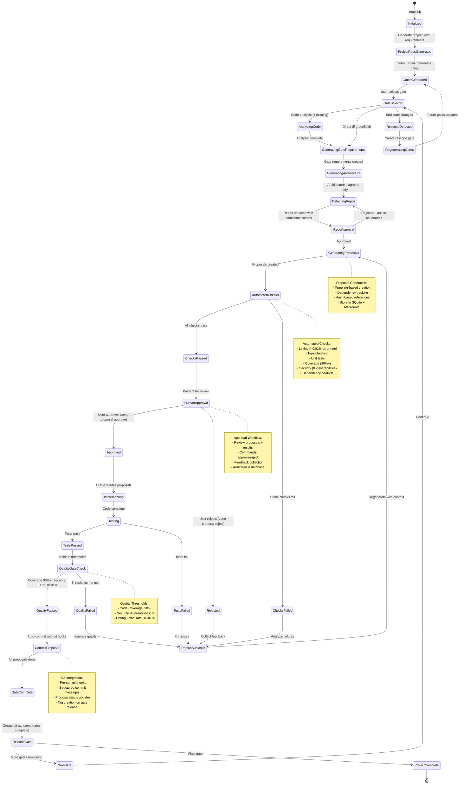

# Gate Lifecycle

**Purpose**: State machine showing the complete lifecycle of gates and proposals

**Generated**: 2026-01-04  
**Status**: Approved

---

## Diagram

---

## States

- **Initialized → ProjectReqsGenerated → GatesGenerated**: Project created, requirements extracted from end state, gates generated via paradox algorithm
- **GateSelected → AnalyzingCode / GeneratingGateRequirements**: User picks gate; code analysis runs if existing codebase, then gate requirements decomposed
- **GeneratingArchitecture → DetectingRepos → RepoApproval**: Diagrams created, repo boundaries detected with confidence scores, human approves/rejects split
- **GeneratingProposals → AutomatedChecks**: Proposals created from requirements, validated (lint/type/test/coverage/security)
- **ChecksPassed → HumanApproval → Approved/Rejected**: Passing proposals presented for human review
- **Implementing → Testing → QualityGateCheck**: LLM executes code, tests run, quality thresholds enforced (90% coverage, 0 vulns, <0.01% lint)
- **CommitProposal → GateComplete → ReleaseGate**: Auto-commit, git tag on gate release
- **RescopeDetected → RegeneratingGates**: End state changed mid-project, future gates regenerated
- **ReplanSubtasks**: Universal recovery state — handles check failures, rejections, test failures, quality failures

---

**Document Version**: 1.0.0  
**Last Updated**: 2026-01-04  
**Versioning**: SemVer; bump on any change (minimum: PATCH).  
**Owner**: jamesonBatworker  
**Reviewers**: jamesonBatworker

### Change Log

| Version | Date | Summary | Author |
|---------|------|---------|--------|
| 1.0.0 | 2026-01-04 | Initial version | jamesonBatworker |

