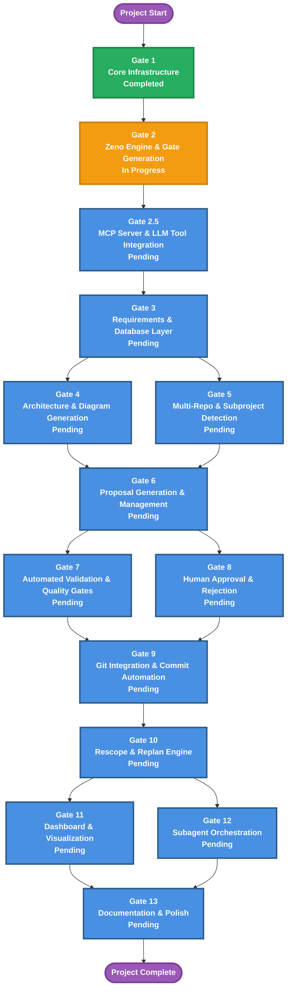

# Gate Roadmap Diagram

**Purpose**: Gate roadmap showing parallel relationships and gate dependencies

**Generated**: 2026-01-04  
**Last Updated**: 2026-01-31  
**Status**: Approved

---

## Diagram

---

## Description

The gate roadmap diagram displays the complete gate sequence showing dependencies between all 13 gates (plus Gate 2.5 MCP Server). Each gate represents concrete deliverables that progressively move the project toward completion.

**Gate Summary:**
- **Gate 1**: Core Infrastructure (Completed)
- **Gate 2**: Zeno Engine & Gate Generation (In Progress)
- **Gate 2.5**: MCP Server & LLM Tool Integration (bridges CLI to LLM-native execution)
- **Gate 3**: Requirements & Database Layer (hierarchical requirements, CRUD, dependency tracking)
- **Gates 4-5**: Architecture & Multi-Repo (diagrams, repository detection) - **Parallel**
- **Gate 6**: Proposal Generation & Management (decompose requirements into implementation tasks)
- **Gates 7-8**: Validation & Approval (quality checks and human review) - **Parallel**
- **Gate 9**: Git Integration & Worktree Automation (commit automation, isolated parallel development)
- **Gate 10**: Rescope & Replan Engine (handle mid-project scope changes)
- **Gates 11-12**: Dashboard & Subagent Orchestration (visibility and parallel execution) - **Parallel**
- **Gate 13**: Documentation & Polish (comprehensive docs, examples, tutorials)

**Key Architectural Insights:**
- Early gates (1-3) establish infrastructure and core data structures
- Middle gates (4-9) implement full execution pipeline (generation → validation → approval → commit)
- Late gates (10-13) add advanced capabilities (rescoping, monitoring, orchestration, documentation)
- Multiple parallel opportunities (Gates 4-5, 7-8, 11-12) enable concurrent development

---

## Parallel Gates

Gates that can be worked on simultaneously (independent execution paths):

### Gates 4 & 5 (Post-Gate 3)
- **Gate 4**: Architecture & Diagram Generation (Mermaid/Graphviz rendering)
- **Gate 5**: Multi-Repo & Subproject Detection (repository boundary detection)

These gates are independent and can proceed in parallel after Gate 3 completes. Both require database and requirements API from Gate 3 but have no direct dependencies on each other.

### Gates 7 & 8 (Post-Gate 6)
- **Gate 7**: Automated Validation & Quality Gates (ESLint, TypeScript, coverage, security)
- **Gate 8**: Human Approval & Rejection Workflow (approval prompts, feedback collection)

Validation and approval workflows are independent systems. Validation feeds into approval but both can be developed simultaneously. Implementation can start in parallel after Gate 6 provides proposal structure.

### Gates 11 & 12 (Post-Gate 10)
- **Gate 11**: Dashboard & Visualization (TUI dashboard, project status overview)
- **Gate 12**: Subagent Orchestration & Parallel Execution (orchestrator, worktree coordination)

Dashboard and orchestration features are independent. Dashboard visualizes project state while orchestration manages execution. Both depend on earlier infrastructure but can be developed simultaneously.

---

## Gate Dependencies & Critical Path

**Critical Path** (longest sequential chain):
Gate 1 → Gate 2 → Gate 2.5 → Gate 3 → Gate 6 → Gate 7 → Gate 9 → Gate 10 → Gate 11/12 → Gate 13

This path determines minimum project timeline. Parallel opportunities (Gates 4-5, 7-8, 11-12) can reduce overall time but don't affect critical path.

**Key Dependency Notes:**
- **Gate 2.5** depends on: Gate 2 (all CLI commands must exist before wrapping in MCP)
- **Gate 2.5** enables: All downstream gates (3-13) via MCP tool interface (LLM-native execution)
- **Gate 3** enables: Gate 4-6 (all depend on requirement database and CRUD operations)
- **Gate 6** depends on: Gates 4-5 (proposal generation needs architecture diagrams and repository structure for context)
- **Gate 9** depends on: Gates 7-8 (git automation depends on validated proposals)
- **Gate 10** depends on: Gate 9 (rescoping needs git history for impact analysis)
- **Gate 11** depends on: Gate 10 (dashboard needs complete project state for visualization)
- **Gate 12** depends on: Gate 10 (orchestration needs git integration for worktree management)
- **Gate 13** depends on: Gates 11-12 (documentation focuses on system as a whole including monitoring and orchestration)

---

## Related Documentation

- **Project PRD**: `zeno/PROJECT_PRD.md` - Complete project specification with all gate objectives
- **Individual Gate PRDs**: `zeno/gates/gate-XX-name.md` - Detailed requirements and objectives per gate
  - `gate-03-mcp-server.md` - LLM-native tool integration
  - `gate-04-requirements-database-layer.md` - Requirement storage and querying
  - `gate-05-architecture-diagram-generation.md` - Mermaid & Graphviz rendering
  - `gate-06-multi-repo-subproject-detection.md` - Repository boundary detection
  - `gate-07-proposal-generation-management.md` - Requirement decomposition
  - `gate-08-automated-validation-quality-gates.md` - Quality checks and validation
  - `gate-09-human-approval-rejection-workflow.md` - Approval process and feedback
  - `gate-10-git-integration-commit-automation.md` - Worktree management and merging
  - `gate-11-rescope-replan-engine.md` - Scope change handling
  - `gate-12-dashboard-visualization.md` - TUI dashboard and progress tracking
  - `gate-13-subagent-orchestration-parallel-execution.md` - Multi-agent coordination
  - `gate-14-documentation-polish.md` - Documentation and examples
- **AGENTS.md**: AI agent instructions (root level and project-specific)
- **Architecture Diagrams**: `zeno/architecture/*.md` - System design diagrams

---

**Source**: `zeno/architecture/gate-roadmap.md`  
**Generated by**: Zeno's Planner

