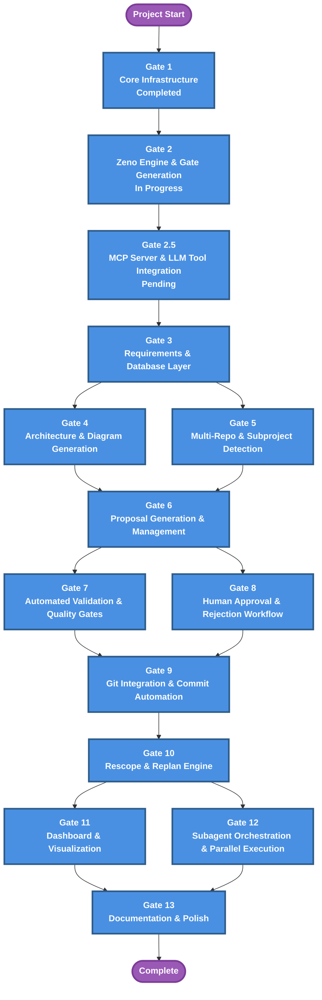

# Gate Roadmap Diagram

**Purpose**: Gate roadmap showing parallel relationships and gate dependencies

**Generated**: 2026-01-04  
**Last Updated**: 2026-01-31  
**Status**: Approved

---

## Diagram

---

## Description

The gate roadmap diagram displays the gate sequence showing dependencies between gates. Each gate represents concrete deliverables that progressively move the project toward completion.

**New Addition (Gate 2.5)**: MCP Server & LLM Tool Integration bridges CLI execution and native LLM tool integration, enabling AI agents to invoke Zeno functions via structured tools instead of terminal commands.

---

## Parallel Gates

Gates that can be worked on simultaneously:

### Gates 4 & 5
- **Gate 4**: Architecture & Diagram Generation
- **Gate 5**: Multi-Repo & Subproject Detection

These gates are independent and can proceed in parallel after Gate 3 completes.

### Gates 7 & 8
- **Gate 7**: Automated Validation & Quality Gates
- **Gate 8**: Human Approval & Rejection Workflow

Validation and approval workflows are independent systems that can be developed simultaneously.

### Gates 11 & 12
- **Gate 11**: Dashboard & Visualization
- **Gate 12**: Subagent Orchestration & Parallel Execution

Dashboard and orchestration features can be developed simultaneously, with Gate 12 leveraging MCP tools (Gate 2.5) to coordinate parallel execution.

---

## Gate Dependencies

- **Gate 2.5 depends on**: Gate 2 (all CLI commands must exist before wrapping in MCP)
- **Gate 2.5 enables**: All downstream gates (3-13) by providing MCP tool interface
- **Gate 2.5 is required for**: Subagent orchestration (Gate 12) to work via parallel task execution

---

## Related Documentation

- **Project PRD**: `zeno/PROJECT_PRD.md` - Full project specification
- **Gate PRDs**: `zeno/gates/gate-XX-name.md` - Detailed feature breakdowns per gate
- **MCP Server Gate**: `zeno/gates/gate-02-5-mcp-server.md` - Detailed MCP implementation spec
- **AGENTS.md**: Root-level AI agent instructions

---

**Source**: `zeno/architecture/gate-roadmap.md`  
**Generated by**: Zeno's Planner

