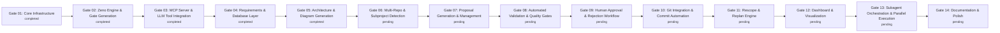

```mermaid
graph LR
    G1["Gate 01: Core Infrastructure<br/><small>completed</small>"]
    G2["Gate 02: Zeno Engine & Gate Generation<br/><small>completed</small>"]
    G3["Gate 03: MCP Server & LLM Tool Integration<br/><small>completed</small>"]
    G4["Gate 04: Requirements & Database Layer<br/><small>completed</small>"]
    G5["Gate 05: Architecture & Diagram Generation<br/><small>completed</small>"]
    G6["Gate 06: Multi-Repo & Subproject Detection<br/><small>pending</small>"]
    G7["Gate 07: Proposal Generation & Management<br/><small>pending</small>"]
    G8["Gate 08: Automated Validation & Quality Gates<br/><small>pending</small>"]
    G9["Gate 09: Human Approval & Rejection Workflow<br/><small>pending</small>"]
    G10["Gate 10: Git Integration & Commit Automation<br/><small>pending</small>"]
    G11["Gate 11: Rescope & Replan Engine<br/><small>pending</small>"]
    G12["Gate 12: Dashboard & Visualization<br/><small>pending</small>"]
    G13["Gate 13: Subagent Orchestration & Parallel Execution<br/><small>pending</small>"]
    G14["Gate 14: Documentation & Polish<br/><small>pending</small>"]
    G1 --> G2
    G2 --> G3
    G3 --> G4
    G4 --> G5
    G5 --> G6
    G6 --> G7
    G7 --> G8
    G8 --> G9
    G9 --> G10
    G10 --> G11
    G11 --> G12
    G12 --> G13
    G13 --> G14

    classDef pending fill:#FFA500,stroke:#CC8400,stroke-width:2px,color:#000
    classDef in_progress fill:#4A90E2,stroke:#2E5C8A,stroke-width:2px,color:#fff
    classDef completed fill:#50E3C2,stroke:#2FA284,stroke-width:2px,color:#000
```