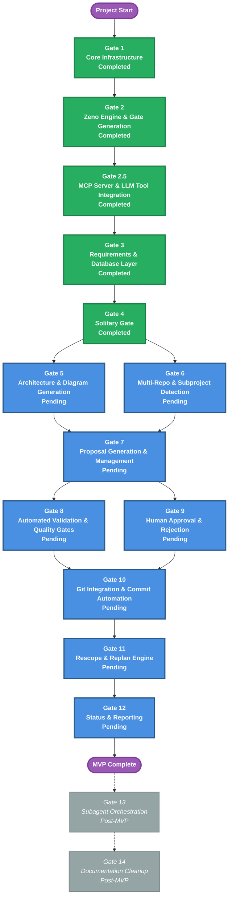

# Gate Roadmap

**Purpose**: Gate sequence, dependencies, and parallel work opportunities  
**Generated**: 2026-01-04  
**Last Updated**: 2026-02-13  
**Status**: Approved

---

## Diagram

---

## Sequencing

**Parallel Gates**: 5 & 6 (Architecture + Multi-Repo, post-Gate 4); 8 & 9 (Validation + Approval, post-Gate 7)  
**Critical Path**: G1 → G2 → G2.5 → G3 → G4 → G5/6 → G7 → G8/9 → G10 → G11 → G12

- **Gates 1-4**: Core Infrastructure, Zeno Engine, MCP Server, Requirements DB, Solitary (Completed)
- **Gates 5-6**: Architecture diagrams + Multi-Repo detection (parallel, independent)
- **Gate 7**: Proposal Generation (depends on 5+6)
- **Gates 8-9**: Validation + Approval workflows (parallel, post-Gate 7)
- **Gate 10**: Git Integration (depends on 8+9)
- **Gate 11**: Rescope & Replan Engine
- **Gate 12**: Status & Reporting
- **Gates 13-14**: Subagent Orchestration + Documentation (post-MVP, deferred)

---

**Document Version**: 1.2.0  
**Last Updated**: 2026-02-13  
**Versioning**: SemVer; bump on any change (minimum: PATCH).  
**Owner**: jamesonBatworker  
**Reviewers**: jamesonBatworker

### Change Log

| Version | Date | Summary | Author |
|---------|------|---------|--------|
| 1.0.0 | 2026-01-04 | Initial version | jamesonBatworker |
| 1.1.0 | 2026-01-31 | Added Gate 2.5, solitary gate, updated statuses | jamesonBatworker |
| 1.2.0 | 2026-02-13 | Aligned to slim template format | jamesonBatworker |

