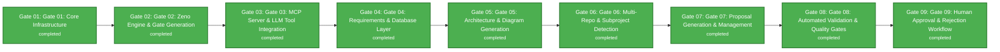

```mermaid
graph LR
    G1["Gate 01: Gate 01: Core Infrastructure<br/><small>completed</small>"]
    G2["Gate 02: Gate 02: Zeno Engine & Gate Generation<br/><small>completed</small>"]
    G3["Gate 03: Gate 03: MCP Server & LLM Tool Integration<br/><small>completed</small>"]
    G4["Gate 04: Gate 04: Requirements & Database Layer<br/><small>completed</small>"]
    G5["Gate 05: Gate 05: Architecture & Diagram Generation<br/><small>completed</small>"]
    G6["Gate 06: Gate 06: Multi-Repo & Subproject Detection<br/><small>completed</small>"]
    G7["Gate 07: Gate 07: Proposal Generation & Management<br/><small>completed</small>"]
    G8["Gate 08: Gate 08: Automated Validation & Quality Gates<br/><small>completed</small>"]
    G9["Gate 09: Gate 09: Human Approval & Rejection Workflow<br/><small>completed</small>"]
    G1 --> G2
    G2 --> G3
    G3 --> G4
    G4 --> G5
    G5 --> G6
    G6 --> G7
    G7 --> G8
    G8 --> G9

    class G1,G2,G3,G4,G5,G6,G7,G8,G9 completed

    classDef pending fill:#4A90E2,stroke:#2E5C8A,stroke-width:2px,color:#fff
    classDef in_progress fill:#FFC107,stroke:#F57F17,stroke-width:2px,color:#000
    classDef completed fill:#4CAF50,stroke:#2E7D32,stroke-width:2px,color:#fff
```
