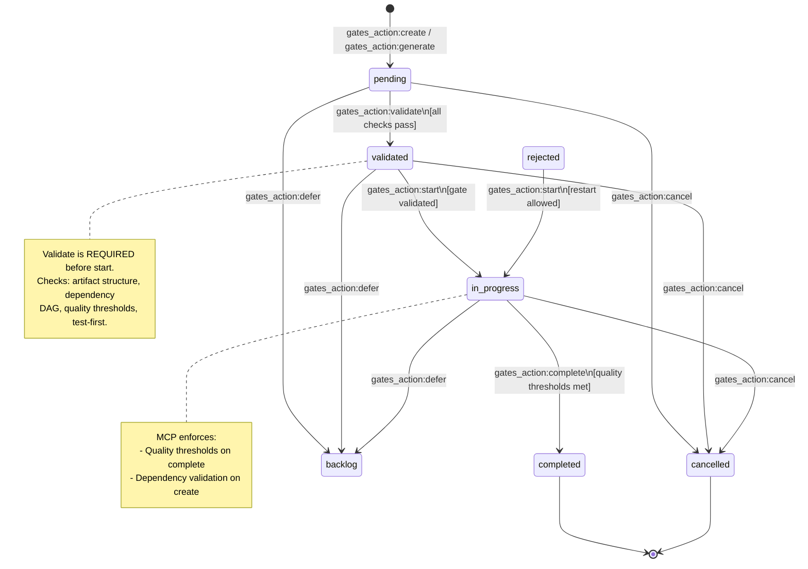

# MCP Workflow State Machines

Formal state machines for Gates and Proposals. Each transition is triggered by a specific MCP action (via `gates_action` or `proposal_action`). Preconditions and postconditions enforce the Zeno workflow contract enforced at the MCP handler layer.

---

## Gate State Machine

### Valid Transitions

| From | Action (MCP) | To | Precondition | Postcondition |
|---|---|---|---|---|
| `pending` | `gates_action: validate` | `validated` | Gate exists with status `pending`; all structural/quality checks pass | Gate status set to `validated` |
| `pending` | `gates_action: cancel` | `cancelled` | Gate exists | Reason recorded |
| `pending` | `gates_action: defer` | `backlog` | Gate exists | Reason recorded |
| `validated` | `gates_action: start` | `in_progress` | Gate exists with status `validated` | Requirements are attributed; gate PRD is present |
| `validated` | `gates_action: cancel` | `cancelled` | Gate exists | Reason recorded |
| `validated` | `gates_action: defer` | `backlog` | Gate exists | Reason recorded |
| `in_progress` | `gates_action: complete` | `completed` | Gate exists with status `in_progress`; quality thresholds met | All proposals archived; git tag created |
| `in_progress` | `gates_action: cancel` | `cancelled` | Gate exists with status `in_progress` | Reason recorded |
| `in_progress` | `gates_action: defer` | `backlog` | Gate exists with status `in_progress` | Reason recorded |
| `rejected` | `gates_action: start` | `in_progress` | Gate exists with status `rejected` | Restart allowed |

**Terminal states**: `completed`, `cancelled` — no outgoing transitions.



### Gate Preconditions & Postconditions

**`validate` (pending → validated)**

- *Pre*: Gate status must be `pending`
- *Pre*: Artifact file passes structure validation; dependencies form a valid DAG; quality metrics meet thresholds; test-first structure present
- *Post*: Gate status = `validated`; `validated_at` timestamp set
- *Note*: Dry-run — validates checks and advances status; does not start work

**`start` (validated → in_progress)**

- *Pre*: Gate status must be `validated` (or `rejected` for restart)
- *Pre*: All dependency gates must be `completed`
- *Post*: Gate status = `in_progress`; `started_at` timestamp set
- *Idempotent*: Calling `start` on an already `in_progress` gate returns success (no-op)

**`complete` (in_progress → completed)**

- *Pre*: Gate status must be `in_progress`
- *Pre*: Quality metrics must meet configured thresholds (`codeCoverage ≥90%`, `securityVulnerabilities = 0`, `lintingErrorRate <0.01%`)
- *Post*: Gate status = `completed`; git tag created; proposals archived
- *Idempotent*: Calling `complete` on an already `completed` gate returns success (no-op)

---

## Proposal State Machine

### Valid Transitions

| From | Action (MCP) | To | Precondition | Postcondition |
|---|---|---|---|---|
| `pending` | `proposal_action: validate` | `validated` | Proposal exists with status `pending`; artifact validation passes | Proposal status set to `validated` |
| `pending` | `proposal_action: cancel` | `cancelled` | Proposal exists | Reason recorded |
| `pending` | `proposal_action: defer` | `backlog` | Proposal exists | Reason recorded |
| `validated` | `proposal_action: start` | `in_progress` | Proposal exists with status `validated` | Worktree created (if applicable) |
| `validated` | `proposal_action: cancel` | `cancelled` | Proposal exists | Reason recorded |
| `validated` | `proposal_action: defer` | `backlog` | Proposal exists | Reason recorded |
| `in_progress` | `proposal_action: approve` | `completed` | Proposal exists with status `in_progress`; quality thresholds met | Requirements set to `implemented` |
| `in_progress` | `proposal_action: reject` | `rejected` | Proposal exists with status `in_progress` | Rejection reason recorded |
| `in_progress` | `proposal_action: cancel` | `cancelled` | Proposal exists | Reason recorded |
| `in_progress` | `proposal_action: defer` | `backlog` | Proposal exists | Reason recorded |

**Terminal states**: `completed`, `cancelled` — no outgoing transitions.



```mermaid
stateDiagram-v2
    [*] --> pending : proposal_action:create / proposal_action:generate
    pending --> validated : proposal_action:validate\n[artifact valid, checks pass]
    pending --> cancelled : proposal_action:cancel
    pending --> backlog : proposal_action:defer
    validated --> in_progress : proposal_action:start\n[status=validated; artifact valid]
    validated --> cancelled : proposal_action:cancel
    validated --> backlog : proposal_action:defer
    in_progress --> completed : proposal_action:approve\n[quality thresholds met]
    in_progress --> rejected : proposal_action:reject
    in_progress --> cancelled : proposal_action:cancel
    in_progress --> backlog : proposal_action:defer
    completed --> [*]
    cancelled --> [*]

    note right of validated
        Validate is REQUIRED before start.
        Checks: structural, scope, test-first,
        phases, quality thresholds.
    end note
    note right of in_progress
        MCP enforces:
        - Apply-phase constraints on start
        - Quality thresholds on approve
        - State pre-conditions enforced
          at the MCP handler layer
    end note
```

### Proposal Preconditions & Postconditions

**`validate` (pending → validated)**

- *Pre*: Proposal status must be `pending`
- *Pre*: Artifact file passes format + structure validation; structural checks (scope, test-first, phases) pass
- *Post*: Proposal status = `validated`
- *Note*: Qualitative review is still MANDATORY after `validate` passes before calling `start`

**`start` (validated → in_progress)**

- *Pre*: Proposal status must be `validated`
- *Pre*: `preReview` evidence required (apply phase)
- *Pre*: No git operations detected (`validateApplyPhase`)
- *Post*: Proposal status = `in_progress`; `started_at` timestamp set
- *Idempotent*: Calling `start` on an already `in_progress` proposal returns success (no-op)

**`approve` (in_progress → completed)**

- *Pre*: Proposal status must be `in_progress`
- *Pre*: Quality metrics must meet configured thresholds
- *Post*: Proposal status = `completed`; requirements set to `implemented`
- *Idempotent*: Calling `approve` on an already `completed` proposal returns success (no-op)

**`reject` (in_progress → rejected)**

- *Pre*: Proposal status must be `in_progress`
- *Post*: Proposal status = `rejected`; rejection reason recorded
- *Idempotent*: Calling `reject` on an already `rejected` proposal returns success (no-op)

---

## Error Response Contract

When an invalid transition is attempted, the MCP handler returns a structured error:

```json
{
  "action": "start",
  "error": "Validation failed",
  "validation": {
    "allowed": false,
    "errors": [
      "gate:completed cannot transition to in_progress. Valid transitions from completed: none"
    ]
  }
}
```

The error message format is: `<entity>:<currentStatus> cannot transition to <targetStatus>. Valid transitions from <currentStatus>: <validTargets | none>`

This format allows callers to programmatically determine the next valid action without reading documentation.

---

## Implementation Notes

State transition enforcement is split across two layers:

| Layer | Responsibility |
|---|---|
| **MCP Handler (validators)** | Pre-condition checks before any action is executed; returns structured error with valid next actions |
| **CLI layer** | Secondary safety net (handles direct CLI invocations bypassing MCP) |

The MCP layer is authoritative when Zeno runs as an MCP server. The CLI layer provides defence-in-depth for direct CLI usage.

Source: `src/mcp/tools/gate-tools.ts`, `src/mcp/tools/proposal-tools.ts`, `src/mcp/tools/entity-action-handler.ts`
