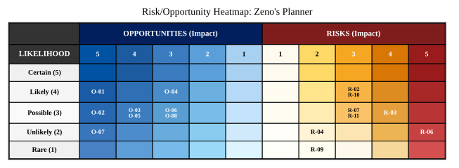

# R&O Matrix: Zeno's Planner

**Project**: Zeno's Planner
**Scope**: Full project lifecycle — MVP Gates 05–12 and beyond
**Created**: 2026-02-28
**Last Review**: 2026-02-28 (rev 2)
**Owner**: Project Lead

---

## Risk/Opportunity Heatmap

Score = Likelihood (1–5) × Impact (1–5). Opportunities on the left (blue, decreasing impact toward center); Risks on the right (amber→red, increasing severity toward edge).

```dot
digraph RiskOpportunityHeatmap {
    rankdir=LR;
    bgcolor=transparent;
    label="Risk/Opportunity Heatmap: Zeno's Planner";
    labelloc=top;
    fontsize=14;
    margin="0.1,0.05";

    matrix [shape=plaintext, label=<
        <TABLE BORDER="1" CELLBORDER="1" CELLSPACING="0" CELLPADDING="6" ALIGN="CENTER">
            <TR>
                <TD BGCOLOR="#333333" WIDTH="100"> </TD>
                <TD COLSPAN="5" BGCOLOR="#001f5c"><B><FONT COLOR="white" POINT-SIZE="11">OPPORTUNITIES (Impact)</FONT></B></TD>
                <TD COLSPAN="5" BGCOLOR="#7f1d1d"><B><FONT COLOR="white" POINT-SIZE="11">RISKS (Impact)</FONT></B></TD>
            </TR>
            <TR>
                <TD BGCOLOR="#333333" WIDTH="100"><B><FONT COLOR="white" POINT-SIZE="11">LIKELIHOOD</FONT></B></TD>
                <TD BGCOLOR="#0052a3" WIDTH="52"><B><FONT COLOR="white" POINT-SIZE="10">5</FONT></B></TD>
                <TD BGCOLOR="#1d5ba1" WIDTH="52"><B><FONT COLOR="white" POINT-SIZE="10">4</FONT></B></TD>
                <TD BGCOLOR="#3b7cc0" WIDTH="52"><B><FONT COLOR="white" POINT-SIZE="10">3</FONT></B></TD>
                <TD BGCOLOR="#5a9fd9" WIDTH="52"><B><FONT COLOR="white" POINT-SIZE="10">2</FONT></B></TD>
                <TD BGCOLOR="#a8d0f0" WIDTH="52"><B><FONT COLOR="black" POINT-SIZE="10">1</FONT></B></TD>
                <TD BGCOLOR="#fffaf0" WIDTH="52"><B><FONT COLOR="black" POINT-SIZE="10">1</FONT></B></TD>
                <TD BGCOLOR="#ffd966" WIDTH="52"><B><FONT COLOR="black" POINT-SIZE="10">2</FONT></B></TD>
                <TD BGCOLOR="#f5a623" WIDTH="52"><B><FONT COLOR="white" POINT-SIZE="10">3</FONT></B></TD>
                <TD BGCOLOR="#d97706" WIDTH="52"><B><FONT COLOR="white" POINT-SIZE="10">4</FONT></B></TD>
                <TD BGCOLOR="#991b1b" WIDTH="52"><B><FONT COLOR="white" POINT-SIZE="10">5</FONT></B></TD>
            </TR>
            <TR>
                <TD BGCOLOR="#f0f0f0" WIDTH="100"><B><FONT POINT-SIZE="10">Certain (5)</FONT></B></TD>
                <TD BGCOLOR="#0052a3"><FONT COLOR="white" POINT-SIZE="9"> </FONT></TD>
                <TD BGCOLOR="#1d5ba1"><FONT COLOR="white" POINT-SIZE="9"> </FONT></TD>
                <TD BGCOLOR="#3b7cc0"><FONT COLOR="white" POINT-SIZE="9"> </FONT></TD>
                <TD BGCOLOR="#5a9fd9"><FONT COLOR="white" POINT-SIZE="9"> </FONT></TD>
                <TD BGCOLOR="#a8d0f0"><FONT POINT-SIZE="9"> </FONT></TD>
                <TD BGCOLOR="#fefaf0"><FONT POINT-SIZE="9"> </FONT></TD>
                <TD BGCOLOR="#ffd966"><FONT POINT-SIZE="9"> </FONT></TD>
                <TD BGCOLOR="#f5a623"><FONT COLOR="white" POINT-SIZE="9"> </FONT></TD>
                <TD BGCOLOR="#d97706"><FONT COLOR="white" POINT-SIZE="9"> </FONT></TD>
                <TD BGCOLOR="#991b1b"><FONT COLOR="white" POINT-SIZE="9"> </FONT></TD>
            </TR>
            <TR>
                <TD BGCOLOR="#f5f5f5" WIDTH="100"><B><FONT POINT-SIZE="10">Likely (4)</FONT></B></TD>
                <TD BGCOLOR="#1a5ba6"><B><FONT COLOR="white" POINT-SIZE="9">O-01</FONT></B></TD>
                <TD BGCOLOR="#2f6fb3"><FONT COLOR="white" POINT-SIZE="9"> </FONT></TD>
                <TD BGCOLOR="#4a8cc7"><B><FONT COLOR="white" POINT-SIZE="9">O-04</FONT></B></TD>
                <TD BGCOLOR="#6aafde"><FONT COLOR="white" POINT-SIZE="9"> </FONT></TD>
                <TD BGCOLOR="#b5d9f7"><FONT POINT-SIZE="9"> </FONT></TD>
                <TD BGCOLOR="#fefbf1"><FONT POINT-SIZE="9"> </FONT></TD>
                <TD BGCOLOR="#ffe68d"><FONT POINT-SIZE="9"> </FONT></TD>
                <TD BGCOLOR="#f7b344"><B><FONT COLOR="black" POINT-SIZE="8">R-02<BR/>R-10</FONT></B></TD>
                <TD BGCOLOR="#dd8c21"><FONT COLOR="white" POINT-SIZE="9"> </FONT></TD>
                <TD BGCOLOR="#a82828"><FONT COLOR="white" POINT-SIZE="9"> </FONT></TD>
            </TR>
            <TR>
                <TD BGCOLOR="#fafafa" WIDTH="100"><B><FONT POINT-SIZE="10">Possible (3)</FONT></B></TD>
                <TD BGCOLOR="#2868b0"><B><FONT COLOR="white" POINT-SIZE="9">O-02</FONT></B></TD>
                <TD BGCOLOR="#3d7dbf"><B><FONT COLOR="white" POINT-SIZE="8">O-03<BR/>O-05</FONT></B></TD>
                <TD BGCOLOR="#589ed2"><B><FONT COLOR="white" POINT-SIZE="8">O-06<BR/>O-08</FONT></B></TD>
                <TD BGCOLOR="#7abce9"><FONT POINT-SIZE="9"> </FONT></TD>
                <TD BGCOLOR="#c3e2fc"><FONT POINT-SIZE="9"> </FONT></TD>
                <TD BGCOLOR="#fffcf2"><FONT POINT-SIZE="9"> </FONT></TD>
                <TD BGCOLOR="#ffecb3"><FONT POINT-SIZE="9"> </FONT></TD>
                <TD BGCOLOR="#f9c268"><B><FONT COLOR="black" POINT-SIZE="9">R-07</FONT></B></TD>
                <TD BGCOLOR="#e5a03d"><B><FONT COLOR="white" POINT-SIZE="9">R-03</FONT></B></TD>
                <TD BGCOLOR="#b93535"><FONT COLOR="white" POINT-SIZE="9"> </FONT></TD>
            </TR>
            <TR>
                <TD BGCOLOR="#f5f5f5" WIDTH="100"><B><FONT POINT-SIZE="10">Unlikely (2)</FONT></B></TD>
                <TD BGCOLOR="#3875ba"><B><FONT COLOR="white" POINT-SIZE="9">O-07</FONT></B></TD>
                <TD BGCOLOR="#4d8ccb"><FONT COLOR="white" POINT-SIZE="9"> </FONT></TD>
                <TD BGCOLOR="#68acdd"><FONT COLOR="white" POINT-SIZE="9"> </FONT></TD>
                <TD BGCOLOR="#8accf0"><FONT POINT-SIZE="9"> </FONT></TD>
                <TD BGCOLOR="#d0eafc"><FONT POINT-SIZE="9"> </FONT></TD>
                <TD BGCOLOR="#fffef8"><FONT POINT-SIZE="9"> </FONT></TD>
                <TD BGCOLOR="#fff4d6"><B><FONT COLOR="black" POINT-SIZE="9">R-04</FONT></B></TD>
                <TD BGCOLOR="#fce4b3"><FONT POINT-SIZE="9"> </FONT></TD>
                <TD BGCOLOR="#edb454"><FONT POINT-SIZE="9"> </FONT></TD>
                <TD BGCOLOR="#c64242"><B><FONT COLOR="white" POINT-SIZE="9">R-06</FONT></B></TD>
            </TR>
            <TR>
                <TD BGCOLOR="#f0f0f0" WIDTH="100"><B><FONT POINT-SIZE="10">Rare (1)</FONT></B></TD>
                <TD BGCOLOR="#4882c4"><FONT COLOR="white" POINT-SIZE="9"> </FONT></TD>
                <TD BGCOLOR="#5d9dd8"><FONT COLOR="white" POINT-SIZE="9"> </FONT></TD>
                <TD BGCOLOR="#78bbeb"><FONT POINT-SIZE="9"> </FONT></TD>
                <TD BGCOLOR="#9ad9f8"><FONT POINT-SIZE="9"> </FONT></TD>
                <TD BGCOLOR="#ddf5fe"><FONT POINT-SIZE="9"> </FONT></TD>
                <TD BGCOLOR="#fffff9"><FONT POINT-SIZE="9"> </FONT></TD>
                <TD BGCOLOR="#fffef0"><B><FONT COLOR="black" POINT-SIZE="9">R-09</FONT></B></TD>
                <TD BGCOLOR="#fef8ec"><FONT POINT-SIZE="9"> </FONT></TD>
                <TD BGCOLOR="#f5d89a"><FONT POINT-SIZE="9"> </FONT></TD>
                <TD BGCOLOR="#d45050"><FONT COLOR="white" POINT-SIZE="9"> </FONT></TD>
            </TR>
        </TABLE>
    >]
}
```

<!-- markdownlint-disable MD033 -->

View / Edit DOT Source

Regenerate SVG: `dot -Tsvg dot-diagrams/ro-matrix-heatmap.dot -o dot-diagrams/ro-matrix-heatmap.svg`

---

## Risk Register

<!-- Score = Likelihood (1–5) × Impact (1–5), range 1–25.
  Categories: Technical | Schedule | Resource | External | Security | Compliance
  Status: open → monitoring → mitigated | closed | realized -->

| ID | Category | Description | L | I | Score | Mitigation Strategy | Owner | Status | Review Date |
| -- | -------- | ----------- | - | - | ----- | ------------------- | ----- | ------ | ----------- |
| R-01 | External | **LLM Dependency Lock-in** *(mitigated by design)* — Core design decision: all operations are exposed as standard CLI/MCP tools with no vendor-specific API surface. Any LLM with tool-calling capability can invoke them. | 3 | 5 | 15 | Mitigated by architecture. CLI/MCP tools are LLM-agnostic; no Cursor/Claude-specific code exists in the engine. No action required. | Project Lead | `mitigated` | 2026-02-28 |
| R-02 | Technical | **Graphviz System Dependency** — Graphviz must be installed as a native binary. Windows users may not have it; silent failure or degraded diagrams will hurt first impressions. | 4 | 3 | 12 | Add a `zeno doctor` health-check command that verifies all system dependencies before first use and provides install instructions per platform. | Project Lead | `open` | 2026-03-31 |
| R-03 | Technical | **better-sqlite3 Native Binding Compilation** — Listed as a known blocker. Native module rebuild failures are common on Node.js version changes or ARM/Windows environments; Node.js >= 24.0.0 shrinks the supported platform base. | 3 | 4 | 12 | `zeno doctor` detects and reports native binding failures at startup with actionable remediation steps. Also: validate on all target platforms early (CI matrix: Windows/Mac/Linux × x64/ARM), pin Node.js to an LTS version, and document manual rebuild steps. | Project Lead | `mitigated` | 2026-03-31 |
| R-04 | Technical | **AST Parsing Performance on Large Codebases** — Zeno's purpose includes decomposing monorepos; scanning is a targeted, infrequent planning operation — not a CI hot path. Called rarely; results are cached. | 2 | 2 | 4 | Implement incremental analysis (changed files only) and cache results between runs. Low priority given infrequent invocation pattern. | Project Lead | `monitoring` | 2026-06-30 |
| R-05 | Technical | **Gate Generation Quality Regression** *(mitigated by architecture)* — The `architecture/` directory and AGENTS.md capture cross-gate context as artifacts, so each gate generation call only needs the current gate PRD — preventing cumulative context bloat. | 3 | 4 | 12 | Mitigated by architecture: gate PRDs scope LLM context per gate; architecture dir persists cross-gate state as durable artifacts rather than in-prompt history. | Project Lead | `mitigated` | 2026-02-28 |
| R-06 | Technical | **Hash Collision or Drift** — SHA-256 first-16-char hashes used as immutable references. Content-identical entities in different paths could produce hash collisions in the registry, causing silent requirement cross-contamination. | 2 | 5 | 10 | Add collision detection on registry insert, enforce uniqueness constraint in SQLite, and log a warning if a new hash matches an existing entity with different metadata. | Project Lead | `open` | 2026-06-30 |
| R-07 | Technical | **Orphaned Git Worktrees on Windows** — `git worktree` on Windows has edge cases (locked `.git` handles, path length limits >260 chars). An orphaned worktree that cannot be pruned could block future proposal starts. | 3 | 3 | 9 | Test worktree lifecycle on Windows CI, enforce short worktree path names, implement force-prune with error logging, and keep sequential fallback available for Windows. | Project Lead | `open` | 2026-03-31 |
| R-08 | Schedule | **MVP Scope Creep via Post-MVP Abstractions** *(closed)* — Gate 13 is correctly deferred for decomposition into multiple focused future gates. The PRD technical decisions for Gate 13 are forward-looking documentation, not active MVP implementation scope. | 4 | 2 | 8 | Gate 13 decomposed into future gates. Post-MVP boundary clearly marked in PRD. Technical decisions are design intent documentation, not Gates 5–12 scope. | Project Lead | `closed` | 2026-02-28 |
| R-09 | Technical | **Minimalist DB Schema Rigidity** — Partially mitigated by design: parser helper methods cover derived data (e.g. proposal dependencies from Markdown) without requiring additional DB tables. Schema is intentionally right-sized for operational queries only. | 1 | 2 | 2 | Parser helper methods handle on-demand derived data; Gate 11 is the designated review point to add tables if justified. Low likelihood given helper method coverage. | Project Lead | `monitoring` | 2026-06-30 |
| R-10 | Resource | **Single-Developer Adoption Barrier** — Target user is a solo developer but setup requires: Graphviz, Node >= 24, Git >= 2, better-sqlite3 native compilation, and an LLM with agent execution. High setup cost before any value is delivered. | 4 | 3 | 12 | Provide a `npx zeno-init` zero-config quickstart, a `zeno doctor` checker, and Docker-based fallback for environments where native deps are difficult. | Project Lead | `open` | 2026-03-31 |

---

## Opportunity Register

<!-- Score = Likelihood (1–5) × Impact (1–5), range 1–25.
  Categories: Technical | Process | Market | Resource | Partnership
  Status: identified → pursuing → realized | deferred | declined -->

| ID | Category | Description | L | I | Score | Exploitation Strategy | Owner | Status | Review Date |
| -- | -------- | ----------- | - | - | ----- | --------------------- | ----- | ------ | ----------- |
| O-01 | Market | **First-Mover in LLM-Native Project Planning** — No established tool is purpose-built for LLM agents to manage project state via an MCP server. Shipping a stable MCP interface first could make Zeno the de-facto standard for agentic project management. | 4 | 5 | 20 | Prioritize stabilizing the MCP server interface and publish to the MCP registry before Gates 5–12 fully complete; write community setup guide targeting Cursor and Claude Desktop users. | Project Lead | `pursuing` | 2026-03-31 |
| O-02 | Market | **AI IDE Agent Surface (VS Code, Cursor, Kiro, Windsurf, Claude Code, etc.)** — The MCP server + CLI architecture is IDE-agnostic. Any AI coding environment with MCP or tool-calling support can surface gate status, proposals, and approvals natively — not just VS Code/Cursor. | 3 | 5 | 15 | Design IDE integrations as separate thin adapters over the MCP server. Prioritize a VS Code extension first; document the MCP integration pattern for Kiro, Windsurf, and Claude Code communities. Evaluate as Gate 14 candidate. | Project Lead | `identified` | 2026-06-30 |
| O-03 | Market | **Agents Directory as a Flexible Multi-Submodule Ecosystem** — The `agents/` directory could evolve into a structured collection of swappable, independently maintained agent submodules per domain (security, architecture, data, etc.) — composable by Zeno or any third-party tool. Very flexible and extensible. | 3 | 4 | 12 | Define a stable agent submodule interface; grow `agents/` into a curated directory of composable per-category git submodules or npm packages. Publish and cross-link post-MVP. | Project Lead | `identified` | 2026-06-30 |
| O-04 | Technical | **GitHub Actions Integration** — Zeno's validation engine (coverage, linting, security) plus its structured commit format could power a native GitHub Action: run `zeno proposal validate` on every PR and post structured results as a check. | 4 | 3 | 12 | Create a `zeno-validate` GitHub Action wrapper as a thin shell script; document in README. Low effort, high visibility with open-source developers. | Project Lead | `identified` | 2026-04-30 |
| O-05 | Technical | **Multi-Language Support via Tree-sitter** — Replacing Babel AST with Tree-sitter would support Python, Rust, Go, C++ analysis at near-zero incremental cost, removing the TypeScript/JavaScript-only open question and opening Zeno to the broader developer market. | 3 | 4 | 12 | Solitary proposal created to evaluate Tree-sitter bindings for Node.js as an optional analyzer backend; integrate post-MVP. | Project Lead | `pursuing` | 2026-06-30 |
| O-06 | Process | **Exportable Risk/Opportunity Matrix Command** — The architecture templates already include an RO matrix. A first-class `zeno arch risks` command that auto-populates risks from requirement types, coupling metrics, and gate dependencies would differentiate Zeno from purely technical tools. | 3 | 3 | 9 | Added to Gate 12 scope: `zeno arch risks` generates a populated RO matrix from existing `ro-matrix-template.md` and metrics snapshot data. | Project Lead | `pursuing` | 2026-06-30 |
| O-07 | Market | **Hosted / SaaS Tier** — The core engine is stateless enough for a server-side version storing projects in PostgreSQL and offering a web UI. A freemium SaaS model would monetize without changing the local CLI offering. | 2 | 5 | 10 | Validate product-market fit with local users first; design the storage abstraction layer (Gate 3 SQLite) to be swappable for PostgreSQL. Evaluate post-MVP. | Project Lead | `identified` | 2026-12-31 |
| O-08 | Resource | **Teaching Tool Positioning** — The iterative gate decomposition model is pedagogically valuable. Positioning Zeno as a learning aid for bootcamp graduates could create a loyal user base and drive community contributions early. | 3 | 3 | 9 | Solitary proposal `#d379f29e` created: `zeno onboarding` — interactive guided first-run experience with step-by-step concept tour, sandbox project init, first-gate walkthrough, and MCP config snippet. Doubles as teaching on-ramp for bootcamp graduates. | Project Lead | `pursuing` | 2026-06-30 |

---

## Risk-Opportunity Interactions

| Risk ID | Opportunity ID | Relationship | Notes |
| ------- | -------------- | ------------ | ----- |
| R-02 | O-04 | Resolving R-02 (dependency health-check) enables O-04 | A GitHub Action that silently fails due to missing Graphviz would harm adoption; `zeno doctor` must run in CI first. |
| R-03 | O-04 | Resolving R-03 (platform CI matrix) is prerequisite for O-04 | The GitHub Action must succeed on GitHub-hosted runners (Ubuntu/macOS/Windows) without user intervention. |
| R-10 | O-01 | Reducing R-10 (setup friction) accelerates O-01 | A painful setup experience undermines first-mover advantage; zero-config onboarding is part of winning the MCP market. |
| R-07 | O-02 | Resolving R-07 (Windows worktree stability) unblocks O-02 | An IDE extension that wraps worktree operations must be rock-solid on Windows before shipping. |

---

## Review Log

| Date | Reviewer | Changes Made | Next Review |
| ---- | -------- | ------------ | ----------- |
| 2026-02-28 | Project Lead | Initial version — populated from PRD analysis | 2026-03-31 |
| 2026-02-28 | Project Lead | Rev 2 — closed R-01/R-08, mitigated R-05, lowered R-04 (L:2 I:2) and R-09 (L:1 I:2); updated O-02 (multi-IDE), O-03 (multi-submodule), O-05/O-06/O-08 (pursuing + proposals); regenerated SVG | 2026-06-30 |
| 2026-03-01 | Project Lead | Rev 3 — created solitary proposal `#d379f29e` for O-08 (`zeno onboarding` interactive guided first-run experience); updated O-08 notes with hash reference | 2026-06-30 |

---

**Document Version**: 1.2.0
**Last Updated**: 2026-03-01
**Owner**: Project Lead

### Change Log

| Version | Date       | Summary         | Author       |
| ------- | ---------- | --------------- | ------------ |
| 1.0.0   | 2026-02-28 | Initial version | Project Lead |
| 1.1.0   | 2026-02-28 | Close R-01/R-08, mitigate R-05, downgrade R-04/R-09; expand O-02 to multi-IDE, O-03 to multi-submodule; mark O-05/O-06/O-08 pursuing | Project Lead |
| 1.2.0   | 2026-03-01 | Assign proposal hash `#d379f29e` to O-08 notes; Rev 3 review log entry | Project Lead |
