# System Overview

**Purpose**: Forward-looking target architecture for Zeno's Planner (Gates 1-14), with clear delineation of Implementation Status

**Last Updated**: 2026-02-23  
**Status**: Approved (Gates 1-5 complete; Gate 6 in progress; Gates 7-14 planned)

**Implementation Status**:
- IMPLEMENTED (Gates 1-5 complete): User Interface, Core Engine (basic), Analysis (partial), Generation (full), Storage (minimalist 4-table) — shown in green
- IN_PROGRESS (Gate 6 started): Multi-Repo Detection, Repository Analysis — shown in amber
- PLANNED (Gates 7-14, in sequence): Proposals → Validation → Approval → Git Integration → Rescope Engine → Dashboard → Subagent Orchestration → Documentation — shown in blue

---

## Target Architecture Diagram (Full System, Gates 1-14)

```mermaid
graph TB
    User["User/LLM<br/>(via Cursor"]
    
    subgraph "User Interface Layer" 
        CLI["CLI Commands<br/>(Implemented)"]
        MCP["MCP Server<br/>LLM Tool Interface<br/>(Implemented)"]
        Dashboard["Dashboard<br/>Gate 12<br/>(Planned)"]
    end
    
    subgraph "Orchestration Layer"
        SubagentOrch["Subagent Orchestrator<br/>Gate 13<br/>(Planned)"]
        WorktreeOrch["Worktree Manager<br/>Gate 10<br/>Parallel Execution<br/>(In Progress)"]
    end
    
    subgraph "Core Engine Layer"
        ZenoEngine["Zeno Engine<br/>Gate Generation<br/>(Implemented)"]
        GateManager["Gate Manager<br/>Lifecycle Control<br/>(Implemented)"]
        ReplanEngine["Replan Engine<br/>Gate 11<br/>Rescope Logic<br/>(Planned)"]
        ProposalApproval["Approval Engine<br/>Gate 9<br/>Rejection Workflow<br/>(In Progress)"]
    end
    
    subgraph "Analysis Layer"
        CodeAnalyzer["Code Analyzer<br/>AST + Metrics<br/>(Implemented)"]
        RepoDetector["Repo Detector<br/>Gate 6<br/>Boundary Detection<br/>(In Progress)"]
        DepTracker["Dependency Tracker<br/>Hash-based<br/>(Implemented)"]
        ConflictDetector["Conflict Detector<br/>Gate 10<br/>File Collision<br/>(In Progress)"]
    end
    
    subgraph "Generation Layer"
        ReqGenerator["Requirement Generator<br/>Gate 4<br/>Decomposition<br/>(Implemented)"]
        MermaidGen["Diagram Generator<br/>Gate 5<br/>Mermaid/DOT<br/>(Implemented)"]
        ProposalGen["Proposal Generator<br/>Gate 7<br/>Change Notices<br/>(Planned)"]
        PRDGen["PRD Generator<br/>Template-based<br/>(Implemented)"]
        AgentsGen["AGENTS.md Generator<br/>AI Context<br/>(Implemented)"]
    end
    
    subgraph "Validation Layer"
        AutoChecks["Automated Checks<br/>Gate 8<br/>Coverage/Security/Lint<br/>(In Progress)"]
        QualityGates["Quality Gates<br/>Gate 8<br/>Threshold Enforcement<br/>(In Progress)"]
        DepValidator["Dependency Validator<br/>Gate 8<br/>Conflict Detection<br/>(In Progress)"]
        ArtifactValidator["Artifact Validator<br/>Gate 7<br/>Format/Structure<br/>(In Progress)"]
    end
    
    subgraph "Storage Layer"
        SQLite[("SQLite DB<br/>4-Table Schema<br/>Requirements/Repos/Proposals<br/>(Implemented)")]
        FileStore["File Store<br/>Markdown/JSON<br/>project-overview.json<br/>(Implemented)"]
        HashRegistry["Hash Registry<br/>Content-Addressable<br/>(Implemented)"]
        GitStore["Git Repository<br/>Version Control<br/>Commit History<br/>(Implemented)"]
    end
    
    subgraph "Integration Layer"
        GitHooks["Git Hooks<br/>Gate 10<br/>Pre-commit<br/>(In Progress)"]
        GitOps["Git Operations<br/>Gate 10<br/>Commit/Tag/Branch/Worktree<br/>(In Progress)"]
        HumanApproval["Human Approval<br/>Gate 9<br/>Gated Decision Points<br/>(In Progress)"]
    end
    
    %% User Interactions
    User --> MCP
    User --> CLI
    User --> Dashboard
    User --> HumanApproval
    
    %% UI to Core
    MCP --> GateManager
    MCP --> ProposalApproval
    CLI --> ZenoEngine
    Dashboard --> GateManager
    
    %% Orchestration to Core
    SubagentOrch --> GateManager
    SubagentOrch --> WorktreeOrch
    WorktreeOrch --> GateManager
    WorktreeOrch --> ConflictDetector
    
    %% Core Engine
    ZenoEngine --> CodeAnalyzer
    ZenoEngine --> ReqGenerator
    GateManager --> ReqGenerator
    GateManager --> ProposalGen
    GateManager --> AutoChecks
    ReplanEngine --> ZenoEngine
    ProposalApproval --> ProposalGen
    
    %% Analysis
    CodeAnalyzer --> RepoDetector
    CodeAnalyzer --> DepTracker
    RepoDetector --> DepTracker
    RepoDetector --> ConflictDetector
    
    %% Generation
    ReqGenerator --> MermaidGen
    ReqGenerator --> PRDGen
    ReqGenerator --> AgentsGen
    ProposalGen --> DepTracker
    ProposalGen --> ArtifactValidator
    MermaidGen --> FileStore
    PRDGen --> FileStore
    
    %% Validation
    AutoChecks --> QualityGates
    AutoChecks --> DepValidator
    AutoChecks --> ArtifactValidator
    DepValidator --> DepTracker
    ArtifactValidator --> ProposalApproval
    QualityGates --> HumanApproval
    
    %% Storage
    ReqGenerator --> SQLite
    ReqGenerator --> HashRegistry
    ProposalGen --> SQLite
    ProposalGen --> FileStore
    DepTracker --> SQLite
    GateManager --> SQLite
    GateManager --> FileStore
    HashRegistry --> SQLite
    
    %% Integration
    GateManager --> GitOps
    ProposalApproval --> GitOps
    AutoChecks --> GitHooks
    WorktreeOrch --> GitOps
    GitOps --> GitStore
    GitHooks --> GitStore
    
    %% Status Styling (Green=Implemented, Amber=InProgress, Blue=Planned)
    classDef implemented fill:#4CAF50,stroke:#2E7D32,stroke-width:2px,color:#fff
    classDef inProgress fill:#FFC107,stroke:#F57F17,stroke-width:2px,color:#000
    classDef planned fill:#2196F3,stroke:#1565C0,stroke-width:2px,color:#fff
    
    class CLI,MCP,ZenoEngine,GateManager,CodeAnalyzer,DepTracker,ReqGenerator,MermaidGen,PRDGen,AgentsGen,SQLite,FileStore,HashRegistry,GitStore implemented
    class RepoDetector,WorktreeOrch,ConflictDetector,ProposalGen,AutoChecks,QualityGates,DepValidator,ArtifactValidator,GitHooks,GitOps,ProposalApproval inProgress
    class SubagentOrch,Dashboard,ReplanEngine,HumanApproval planned
```

---

## Implementation Status by Layer

| Layer | Status | Implemented (Gates) | InProgress (Gate) | Planned (Gate) |
|-------|--------|---------------------|-------------------|----------------|
| **User Interface** | Complete | CLI, MCP (1-3) | — | Dashboard (12) |
| **Orchestration** | Partial | — | Worktree Mgr (10) | Subagent (13) |
| **Core Engine** | Partial | Gate Gen, Manager (1-2) | Approval (9) | Replan (11) |
| **Analysis** | Partial | Code Analyzer, Dep Tracker (2,4) | Repo Detector (6), Conflict (10) | — |
| **Generation** | Complete | Requirements, Diagrams, AGENTS (2,4,5) | Proposals (7) | — |
| **Validation** | Pending | — | Checks, Quality, Validators (8) | — |
| **Storage** | Complete | Minimalist 4-table, Files, Hash (4) | — | — |
| **Integration** | Pending | — | Git Hooks, Ops, Worktree (10) | — |

## Detailed Component Status

### User Interface Layer

**Implemented** (Gates 1-3):
- CLI Commands - Full command set for project, gates, requirements, proposals, repositories
- MCP Server - Model Context Protocol server with stdio transport for LLM integration
- Zeno CLI Functions - All operations available as functions for both CLI and MCP invocation

**Planned** (Gate 12):
- Dashboard - Web-based visualization of gates, proposals, progress tracking

### Orchestration Layer

**InProgress** (Gate 10):
- Worktree Manager - Create/merge/cleanup git worktrees for parallel proposal development
- Conflict Detector - Identify when parallel proposals modify same files; serialize or rebase as needed

**Planned** (Gate 13):
- Subagent Orchestrator - Cursor-based workflow orchestration for multi-agent parallel decomposition and implementation
  - Planning Phase: Specialized agents for gate analysis and decomposition
  - Dispatch: Allocate proposals to agents with worktree paths
  - Monitoring: Track subagent progress via Zeno status queries
  - Merge: Coordinate merge ordering with dependency awareness

### Core Engine Layer

**Implemented** (Gates 1-2):
- Zeno Engine - Iterative gate generation via paradox-inspired algorithm
- Gate Manager - Gate lifecycle management (pending → in_progress → completed/rejected)

**InProgress** (Gate 9):
- Approval Engine - Human approval workflow for gates and proposals with rejection handling and replan triggers

**Planned** (Gate 11):
- Replan Engine - Rescope and gate regeneration when requirements change mid-project

### Analysis Layer

**Implemented** (Gates 2, 4):
- Code Analyzer - AST analysis, metrics calculation, complexity scoring
- Dependency Tracker - Hash-based cross-repo dependency tracking

**InProgress** (Gate 6):
- Repo Detector - Automatic repository boundary detection (afferent/efferent coupling, domain boundaries, module size, confidence scoring)

### Generation Layer

**Implemented** (Gates 2, 4-5):
- Requirement Generator - Project and gate-level requirement decomposition from end state and gate objectives
- Diagram Generator - Hybrid Mermaid (simple ≤5 elements) + Graphviz DOT (complex >5 elements) rendering
- PRD Generator - Gate and project PRD generation from templates
- AGENTS.md Generator - AI context guide generation for project navigation

**InProgress** (Gate 7):
- Proposal Generator - Generation of implementation proposals from gate requirements with task breakdown

### Validation Layer

**InProgress** (Gate 8):
- Automated Checks - Lint (ESLint), type checking (TypeScript strict mode), test coverage (C8), security scanning (npm audit)
- Quality Gates - Threshold enforcement: 90% code coverage, 0 vulnerabilities, <0.01% lint errors, 0 type errors
- Dependency Validator - Conflict detection for parallel proposals affecting same modules
- Artifact Validator - Format and structure validation for proposals and artifacts

### Storage Layer

**Implemented** (Gate 4):
- SQLite Database - Minimalist 4-table schema (requirements, repositories, proposals, metrics_snapshots)
- File Store - Markdown proposals, JSON project metadata, YAML configuration
- Hash Registry - Content-addressable storage and resolution (SHA-256 first-16-chars)
- Git Repository - Version control with commit history as audit trail

### Integration Layer

**InProgress** (Gate 10):
- Git Hooks - Pre-commit validation and formatting
- Git Operations - Auto-commit with structured messages, tagging, branch management
- Worktree Operations - Create, merge, cleanup (see Orchestration Layer)

**InProgress** (Gate 9):
- Human Approval - Gated decision points for gates, proposals, repo boundaries, rescope triggers

---

## Gate-by-Gate Implementation Roadmap

| Gate | Focus | Status | Key Components | Integration |
|------|-------|--------|-----------------|-------------|
| **1-2** | Core Infrastructure & Engine | Complete | Zeno Engine, Gate Manager, CLI, MCP | — |
| **3-4** | Requirements & Database | Complete | Req Generator, SQLite, Hash Registry | Core Engine |
| **5** | Architecture & Diagrams | Complete | Diagram Generators (Mermaid/DOT), AGENTS.md | Generation |
| **6** | Multi-Repo Detection | Pending | Repo Detector, Boundary Analysis | Analysis |
| **7** | Proposal Management | Planned | Proposal Generator, Artifact Validator | Generation |
| **8** | Automated Validation | Planned | Checks, Quality Gates, Coverage/Security | Validation |
| **9** | Approval & Rejection | Planned | Approval Engine, Human Gates, Replan Trigger | Core Engine |
| **10** | Git Integration & Worktrees | Planned | Git Operations, Hooks, Worktree Manager | Integration |
| **11** | Rescope Engine | Planned | Replan Engine, Dependency Recalculation | Core Engine |
| **12** | Dashboard & Visualization | Planned | Web Dashboard, Progress Tracking | User Interface |
| **13** | Subagent Orchestration | Planned | Cursor Workflows, Multi-Agent Coordination | Orchestration |
| **14** | Documentation & Polish | Planned | Additional Docs, Performance Tuning | Horizontal |

---

## Updating Architecture as Work Progresses

This document is a **living forward-looking guide** that reflects the target end state. As each gate completes:

1. Move components from Planned → In Progress → Implemented
2. Update status indicators (Planned → In Progress → Implemented)
3. Add implementation notes in the gate completion PRD
4. Update the Gate-by-Gate table with completion date
5. Rebase planned gates if priorities shift (post-rescope checks)

**Last Updated**: 2026-02-23 (after Gate 05 completion)  
**Next Update**: After Gate 06 completion (multi-repo detection)

---

**Document Version**: 2.0.0  
**Last Updated**: 2026-02-23  
**Status**: Approved and Forward-Looking (Gates 1-5 implemented; Gates 6-14 aspirational)  
**Owner**: jamesonBatworker  

### Change Log

| Version | Date | Gate(s) | Summary | Author |
|---------|------|---------|---------|--------|
| 2.0.0 | 2026-02-23 | 1-5 | Forward-looking architecture with full 14-gate roadmap and status indicators. Reflects target end state, not just current implementation. | jamesonBatworker |
| 1.0.0 | 2026-01-04 | 1-4 | Initial architecture diagram (Gates 1-4 snapshot) | jamesonBatworker |

