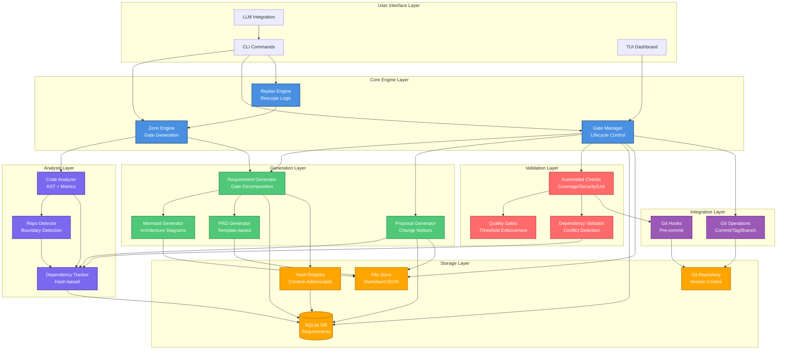

# System Overview

**Purpose**: High-level system architecture showing major components and relationships

**Generated**: 2026-01-04  
**Status**: Approved

---

## Diagram

---

## Architecture Layers

The system is organized into seven distinct layers, each with specific responsibilities:

### 1. User Interface Layer
- **CLI Commands**: Primary command-line interface for all operations
- **TUI Dashboard**: Terminal UI for visual project monitoring
- **LLM Integration**: Interface for AI coding assistants (Cursor, Claude, GPT-4)

### 2. Core Engine Layer
- **Zeno Engine**: Implements Zeno's paradox algorithm for gate generation
- **Gate Manager**: Controls gate lifecycle and state transitions
- **Replan Engine**: Handles rescoping and gate regeneration

### 3. Analysis Layer
- **Code Analyzer**: AST parsing, metrics calculation, complexity analysis
- **Repo Detector**: Identifies repository boundaries using coupling metrics
- **Dependency Tracker**: Hash-based cross-repository dependency tracking

### 4. Generation Layer
- **Requirement Generator**: Decomposes gates into hierarchical requirements
- **Mermaid Generator**: Creates architecture diagrams from project state
- **Proposal Generator**: Generates implementation proposals from requirements
- **PRD Generator**: Creates gate-specific PRDs from templates

### 5. Validation Layer
- **Automated Checks**: Runs linting, type checking, tests, coverage, security scans
- **Quality Gates**: Enforces thresholds (90% coverage, 0 vulnerabilities, <0.01% lint errors)
- **Dependency Validator**: Detects conflicts in cross-module dependencies

### 6. Storage Layer
- **SQLite DB**: Structured storage for requirements, gates, proposals, dependencies
- **File Store**: Human-readable artifacts (Markdown, JSON, Mermaid diagrams)
- **Hash Registry**: Content-addressable lookup for all entities
- **Git Repository**: Version control integration

### 7. Integration Layer
- **Git Hooks**: Pre-commit validation and automated checks
- **Git Operations**: Commit automation, tagging, branch management

---

## Design Principles

### Separation of Concerns
Each layer has a single, well-defined responsibility. Layers communicate through clean interfaces.

### Hybrid Storage Strategy
- **SQLite**: For queryable, structured data (requirements, dependencies)
- **Files**: For human-readable artifacts (PRDs, diagrams, proposals)
- **Git**: For version control and collaboration

### LLM-Friendly Design
- Hash-based references reduce context size by 50%+
- Structured data formats optimize AI consumption
- Clear interfaces enable AI-driven automation

### Quality-First Approach
Validation layer enforces quality gates before human review, catching issues early.

---

## Related Documentation

- **Data Flow**: `docs/architecture/data-flow.md` - End-to-end process flow
- **Gate Lifecycle**: `docs/architecture/gate-lifecycle.md` - State machine
- **Gate Roadmap**: `docs/architecture/gate-roadmap.md` - Gate roadmap
- **Project PRD**: `docs/PROJECT_PRD.md` - Full specification

---

**Source**: `zeno/architecture/system-overview.md`  
**Generated by**: Zeno's Planner

