# System Overview

**Purpose**: High-level system architecture showing major components and relationships

**Generated**: 2026-01-04  
**Status**: Approved

---

## Diagram

```mermaid
graph TB
    subgraph "User Interface Layer"
        CLI[CLI Commands]
        MCP[MCP Server<br/>LLM Tool Interface]
        LLM[LLM Integration]
    end
    
    subgraph "Core Engine Layer"
        ZenoEngine[Zeno Engine<br/>Gate Generation]
        GateManager[Gate Manager<br/>Lifecycle Control]
        ReplanEngine[Replan Engine<br/>Rescope Logic]
    end
    
    subgraph "Analysis Layer"
        CodeAnalyzer[Code Analyzer<br/>AST + Metrics]
        RepoDetector[Repo Detector<br/>Boundary Detection]
        DepTracker[Dependency Tracker<br/>Hash-based]
    end
    
    subgraph "Generation Layer"
        ReqGenerator[Requirement Generator<br/>Gate Decomposition]
        MermaidGen[Diagram Generator<br/>Mermaid/DOT]
        ProposalGen[Proposal Generator<br/>Change Notices]
        PRDGen[PRD Generator<br/>Template-based]
    end
    
    subgraph "Validation Layer"
        AutoChecks[Automated Checks<br/>Coverage/Security/Lint]
        QualityGates[Quality Gates<br/>Threshold Enforcement]
        DepValidator[Dependency Validator<br/>Conflict Detection]
    end
    
    subgraph "Storage Layer"
        SQLite[(SQLite DB<br/>Requirements)]
        FileStore[File Store<br/>Markdown/JSON]
        HashRegistry[Hash Registry<br/>Content-Addressable]
        GitStore[Git Repository<br/>Version Control]
    end
    
    subgraph "Integration Layer"
        GitHooks[Git Hooks<br/>Pre-commit]
        GitOps[Git Operations<br/>Commit/Tag/Branch]
    end
    
    %% User Interface connections
    CLI --> ZenoEngine
    CLI --> GateManager
    CLI --> ReplanEngine
    MCP --> GateManager
    MCP --> ZenoEngine
    LLM --> MCP
    
    %% Core Engine connections
    ZenoEngine --> CodeAnalyzer
    ZenoEngine --> ReqGenerator
    GateManager --> ReqGenerator
    GateManager --> ProposalGen
    GateManager --> AutoChecks
    ReplanEngine --> ZenoEngine
    
    %% Analysis Layer connections
    CodeAnalyzer --> RepoDetector
    CodeAnalyzer --> DepTracker
    RepoDetector --> DepTracker
    
    %% Generation Layer connections
    ReqGenerator --> MermaidGen
    ReqGenerator --> PRDGen
    ProposalGen --> DepTracker
    MermaidGen --> FileStore
    PRDGen --> FileStore
    
    %% Validation Layer connections
    AutoChecks --> QualityGates
    AutoChecks --> DepValidator
    DepValidator --> DepTracker
    
    %% Storage Layer connections
    ReqGenerator --> SQLite
    ReqGenerator --> HashRegistry
    ProposalGen --> SQLite
    ProposalGen --> FileStore
    DepTracker --> SQLite
    GateManager --> SQLite
    GateManager --> FileStore
    HashRegistry --> SQLite
    
    %% Integration Layer connections
    GateManager --> GitOps
    AutoChecks --> GitHooks
    GitOps --> GitStore
    GitHooks --> GitStore
    
    %% Styling
    classDef engineClass fill:#4A90E2,stroke:#2E5C8A,stroke-width:2px,color:#fff
    classDef analysisClass fill:#7B68EE,stroke:#5A4AB8,stroke-width:2px,color:#fff
    classDef generationClass fill:#50C878,stroke:#3A9B5C,stroke-width:2px,color:#fff
    classDef validationClass fill:#FF6B6B,stroke:#CC5555,stroke-width:2px,color:#fff
    classDef storageClass fill:#FFA500,stroke:#CC8400,stroke-width:2px,color:#fff
    classDef integrationClass fill:#9B59B6,stroke:#7D3C98,stroke-width:2px,color:#fff
    
    class ZenoEngine,GateManager,ReplanEngine engineClass
    class CodeAnalyzer,RepoDetector,DepTracker analysisClass
    class ReqGenerator,MermaidGen,ProposalGen,PRDGen generationClass
    class AutoChecks,QualityGates,DepValidator validationClass
    class SQLite,FileStore,HashRegistry,GitStore storageClass
    class GitHooks,GitOps integrationClass
```

---

## Layers

### User Interface
CLI commands, MCP Server (primary LLM interface), LLM integration for AI coding assistants.

### Core Engine
Zeno Engine (gate generation via paradox algorithm), Gate Manager (lifecycle control), Replan Engine (rescope logic).

### Analysis
Code Analyzer (AST + metrics), Repo Detector (boundary detection), Dependency Tracker (hash-based cross-repo).

### Generation
Requirement Generator, Diagram Generator (Mermaid/DOT), Proposal Generator, PRD Generator (template-based).

### Validation
Automated Checks (lint/type/test/coverage/security), Quality Gates (threshold enforcement), Dependency Validator (conflict detection).

### Storage
SQLite (requirements, dependencies), File Store (Markdown/JSON), Hash Registry (content-addressable), Git Repository.

### Integration
Git Hooks (pre-commit), Git Operations (commit/tag/branch automation).

---

**Document Version**: 1.0.0  
**Last Updated**: 2026-01-04  
**Versioning**: SemVer; bump on any change (minimum: PATCH).  
**Owner**: jamesonBatworker  
**Reviewers**: jamesonBatworker

### Change Log

| Version | Date | Summary | Author |
|---------|------|---------|--------|
| 1.0.0 | 2026-01-04 | Initial version | jamesonBatworker |

