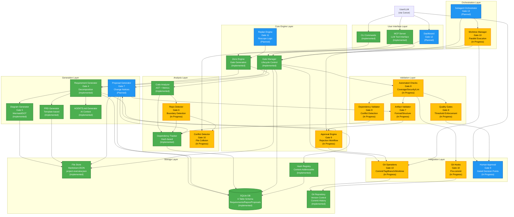

```mermaid
graph TB
    User["User/LLM<br/>(via Cursor)"]
    
    subgraph "User Interface Layer" 
        CLI["CLI Commands<br/>(Implemented)"]
        MCP["MCP Server<br/>LLM Tool Interface<br/>(Implemented)"]
        Dashboard["Dashboard<br/>Gate 12<br/>(Planned)"]
    end
    
    subgraph "Orchestration Layer"
        SubagentOrch["Subagent Orchestrator<br/>Gate 13<br/>(Planned)"]
        WorktreeOrch["Worktree Manager<br/>Gate 10<br/>Parallel Execution<br/>(In Progress)"]
    end
    
    subgraph "Core Engine Layer"
        ZenoEngine["Zeno Engine<br/>Gate Generation<br/>(Implemented)"]
        GateManager["Gate Manager<br/>Lifecycle Control<br/>(Implemented)"]
        ReplanEngine["Replan Engine<br/>Gate 11<br/>Rescope Logic<br/>(Planned)"]
        ProposalApproval["Approval Engine<br/>Gate 9<br/>Rejection Workflow<br/>(In Progress)"]
    end
    
    subgraph "Analysis Layer"
        CodeAnalyzer["Code Analyzer<br/>AST + Metrics<br/>(Implemented)"]
        RepoDetector["Repo Detector<br/>Gate 6<br/>Boundary Detection<br/>(In Progress)"]
        DepTracker["Dependency Tracker<br/>Hash-based<br/>(Implemented)"]
        ConflictDetector["Conflict Detector<br/>Gate 10<br/>File Collision<br/>(In Progress)"]
    end
    
    subgraph "Generation Layer"
        ReqGenerator["Requirement Generator<br/>Gate 4<br/>Decomposition<br/>(Implemented)"]
        MermaidGen["Diagram Generator<br/>Gate 5<br/>Mermaid/DOT<br/>(Implemented)"]
        ProposalGen["Proposal Generator<br/>Gate 7<br/>Change Notices<br/>(Planned)"]
        PRDGen["PRD Generator<br/>Template-based<br/>(Implemented)"]
        AgentsGen["AGENTS.md Generator<br/>AI Context<br/>(Implemented)"]
    end
    
    subgraph "Validation Layer"
        AutoChecks["Automated Checks<br/>Gate 8<br/>Coverage/Security/Lint<br/>(In Progress)"]
        QualityGates["Quality Gates<br/>Gate 8<br/>Threshold Enforcement<br/>(In Progress)"]
        DepValidator["Dependency Validator<br/>Gate 8<br/>Conflict Detection<br/>(In Progress)"]
        ArtifactValidator["Artifact Validator<br/>Gate 7<br/>Format/Structure<br/>(In Progress)"]
    end
    
    subgraph "Storage Layer"
        SQLite[("SQLite DB<br/>4-Table Schema<br/>Requirements/Repos/Proposals<br/>(Implemented)")]
        FileStore["File Store<br/>Markdown/JSON<br/>project-overview.json<br/>(Implemented)"]
        HashRegistry["Hash Registry<br/>Content-Addressable<br/>(Implemented)"]
        GitStore["Git Repository<br/>Version Control<br/>Commit History<br/>(Implemented)"]
    end
    
    subgraph "Integration Layer"
        GitHooks["Git Hooks<br/>Gate 10<br/>Pre-commit<br/>(In Progress)"]
        GitOps["Git Operations<br/>Gate 10<br/>Commit/Tag/Branch/Worktree<br/>(In Progress)"]
        HumanApproval["Human Approval<br/>Gate 9<br/>Gated Decision Points<br/>(In Progress)"]
    end
    
    %% User Interactions
    User --> MCP
    User --> CLI
    User --> Dashboard
    User --> HumanApproval
    
    %% UI to Core
    MCP --> GateManager
    MCP --> ProposalApproval
    CLI --> ZenoEngine
    Dashboard --> GateManager
    
    %% Orchestration to Core
    SubagentOrch --> GateManager
    SubagentOrch --> WorktreeOrch
    WorktreeOrch --> GateManager
    WorktreeOrch --> ConflictDetector
    
    %% Core Engine
    ZenoEngine --> CodeAnalyzer
    ZenoEngine --> ReqGenerator
    GateManager --> ReqGenerator
    GateManager --> ProposalGen
    GateManager --> AutoChecks
    ReplanEngine --> ZenoEngine
    ProposalApproval --> ProposalGen
    
    %% Analysis
    CodeAnalyzer --> RepoDetector
    CodeAnalyzer --> DepTracker
    RepoDetector --> DepTracker
    RepoDetector --> ConflictDetector
    
    %% Generation
    ReqGenerator --> MermaidGen
    ReqGenerator --> PRDGen
    ReqGenerator --> AgentsGen
    ProposalGen --> DepTracker
    ProposalGen --> ArtifactValidator
    MermaidGen --> FileStore
    PRDGen --> FileStore
    
    %% Validation
    AutoChecks --> QualityGates
    AutoChecks --> DepValidator
    AutoChecks --> ArtifactValidator
    DepValidator --> DepTracker
    ArtifactValidator --> ProposalApproval
    QualityGates --> HumanApproval
    
    %% Storage
    ReqGenerator --> SQLite
    ReqGenerator --> HashRegistry
    ProposalGen --> SQLite
    ProposalGen --> FileStore
    DepTracker --> SQLite
    GateManager --> SQLite
    GateManager --> FileStore
    HashRegistry --> SQLite
    
    %% Integration
    GateManager --> GitOps
    ProposalApproval --> GitOps
    AutoChecks --> GitHooks
    WorktreeOrch --> GitOps
    GitOps --> GitStore
    GitHooks --> GitStore
    
    %% Status Styling (Green=Implemented, Amber=InProgress, Blue=Planned)
    classDef implemented fill:#4CAF50,stroke:#2E7D32,stroke-width:2px,color:#fff
    classDef inProgress fill:#FFC107,stroke:#F57F17,stroke-width:2px,color:#000
    classDef planned fill:#2196F3,stroke:#1565C0,stroke-width:2px,color:#fff
    
    class CLI,MCP,ZenoEngine,GateManager,CodeAnalyzer,DepTracker,ReqGenerator,MermaidGen,PRDGen,AgentsGen,SQLite,FileStore,HashRegistry,GitStore implemented
    class RepoDetector,WorktreeOrch,ConflictDetector,AutoChecks,QualityGates,DepValidator,ArtifactValidator,GitHooks,GitOps,ProposalApproval inProgress
    class SubagentOrch,Dashboard,ReplanEngine,HumanApproval,ProposalGen planned
```
