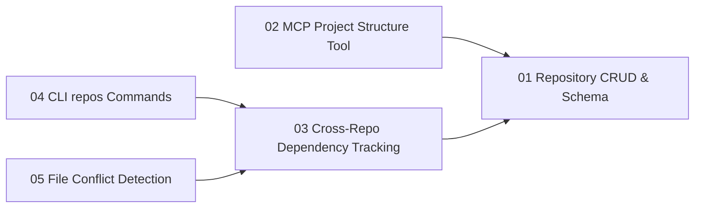

# Gate 06: Multi-Repo & Subproject Detection

**Status**: pending  
**Type**: feature  
**Created**: 2026-02-04  
**Sequence**: 6 of 12  
**Hash**: #g06multirepo

## Overview

Implements multi-repository and subproject support for distributed systems. Rather than building a static analysis engine, this gate leverages Zeno's MCP server to expose project structure to LLMs, which perform boundary analysis and recommend repository separation. Delivers repository declaration and CRUD in SQLite, cross-repo dependency tracking, LLM-driven boundary recommendation via MCP tools, and CLI commands for managing repositories. The coupling-analyzer agent (`agents/pipeline-agents/03-validation/coupling-analyzer.md`) handles coupling analysis as an LLM task rather than hardcoded metrics.

## Objectives

### Repository Declaration & Storage

- [ ] Create repositories table in SQLite database (name, path, type, metadata)
- [ ] Implement repository CRUD operations (insert, update, delete, query)
- [ ] Build repository hash registry (content-addressable references)
- [ ] Support repository metadata (type: main/service/library/tool, description)
- [ ] Support manual repository declaration (user declares repos via CLI or MCP)

### LLM-Driven Boundary Recommendation

- [ ] Expose project structure via MCP tool (`read_project_structure`) for LLM analysis
- [ ] Leverage `coupling-analyzer` agent for boundary recommendations
- [ ] LLM analyzes codebase via MCP and suggests repository boundaries with rationale
- [ ] Support human override of LLM-recommended boundaries
- [ ] No hardcoded coupling metrics calculator, domain boundary analyzer, or module size analyzer

### Cross-Repository Dependency Tracking

- [ ] Implement cross-repository relationship tracking in SQLite
- [ ] Create repository dependency resolution queries
- [ ] Build dependency visualization (via architecture diagram system from Gate 05)
- [ ] Detect circular dependencies between declared repositories

### Repository Management Commands

- [ ] Implement `zeno repos list` command (display declared repositories)
- [ ] Implement `zeno repos deps` command (show cross-repo dependency graph)
- [ ] Implement `zeno repos add` command (declare a new repository)
- [ ] Implement `zeno repos remove` command (remove a repository declaration)

### Integration with Proposals

- [ ] Track which repositories each proposal modifies
- [ ] Identify file conflicts between concurrent proposals across repos
- [ ] Support proposal-to-repository mapping for conflict detection

### Testing & Quality

- [ ] Write unit tests for repository CRUD operations
- [ ] Test cross-repo dependency queries
- [ ] Test conflict detection logic
- [ ] Achieve 90% test coverage for multi-repo module

## Context

### What Was Completed Before This Gate

Gate 01-05 established:

- Core infrastructure, CLI framework, SQLite database
- Zeno engine with iterative gate generation
- MCP server with function registry
- Requirements database with CRUD and dependency tracking
- Architecture diagram generation

### What This Gate Enables

- **Gate 7 (Proposal Generation)**: Repository information helps decompose proposals and assign to repos
- **Gate 10 (Git Integration)**: Multi-repo context enables conflict detection during parallel execution

### Scope Boundaries

**In Scope**:

- SQLite repositories table and CRUD operations
- Manual and LLM-recommended repository declaration
- Cross-repository dependency tracking
- Circular dependency detection
- `zeno repos` commands (list, deps, add, remove)
- File-level conflict detection for concurrent proposals
- Leveraging existing `coupling-analyzer` agent for boundary analysis
- Comprehensive test coverage (90% minimum)

**Out of Scope**:

- Hardcoded static analysis engine (coupling metrics, domain boundary analysis, module size analysis)
- Confidence scoring algorithms
- Repository scaffolding (package.json, tsconfig generation — not Zeno's job)
- Monorepo tooling integration (Turborepo, Nx)
- Git repository operations (handled in Gate 10)
- Package publishing or distribution
- Cross-repo TypeScript path resolution

## Requirements

<!-- Requirements-First Workflow:
  1. Project-level requirements: PRIMARILY defined during `zeno init` at project inception (BEFORE gates).
     These are high-level, cross-cutting requirements derived from the end state.
  2. Gate generation (`/zeno-gate`): Attributes existing project-level requirements to gates.
     Requirements are PRIMARILY mapped and attributed here, not created.
     During rebaseline/rescope: Requirements may be updated or added as part of rescoping.
  3. Gate start (`zeno gates start`): Generates gate-specific requirements that decompose
     project requirements and gate objectives into actionable items.
  4. Proposal generation (`/zeno-proposal`): Breaks requirements down into individual tasks.

  Workflow: Requirements (init - PRIMARY) → Gates (attribute, may update/add during rescope) → Gate Requirements (decompose) → Tasks (proposals)
-->

### Project Requirements (Attributed to This Gate)

[Project-level requirements were defined during `zeno init` at project inception. This section lists those that are attributed to this gate. Query all project requirements via `zeno req list --project`.]

| Hash    | Name                                     | Type            | Priority | How This Gate Addresses It                                              |
| ------- | ---------------------------------------- | --------------- | -------- | ----------------------------------------------------------------------- |
| #[hash] | Repository Declaration                   | functional      | must     | SQLite repositories table + CRUD operations                             |
| #[hash] | Cross-Repo Dependency Tracking           | functional      | must     | Dependency tracking queries in SQLite                                   |
| #[hash] | Concurrent Proposal Conflict Prevention  | non_functional  | must     | File-level conflict detection for concurrent proposals                  |
| #[hash] | LLM-Driven Boundary Analysis             | functional      | should   | MCP tool exposing project structure for LLM consumption                 |

### Gate-Specific Requirements

[Gate-specific requirements are generated when `zeno gates start <gate-id>` is called. These decompose project requirements and gate objectives into actionable items. Stored in `.zeno/registry.db` and queried via `zeno req list --gate <id>`.]

**Status**: Requirements will be generated when gate is started.

[After gate start, view detailed requirement information via: `zeno req show <hash>`]

### Inherited/Transferred Requirements

[Requirements transferred from other gates or shared across gates.]

- None at this time.

### Requirement-to-Task Breakdown

[Individual tasks are created during proposal generation (`/zeno-proposal`), not during gate generation. Each requirement may spawn multiple proposals (tasks) that implement it.]

---

## Proposals

**Status**: Proposals will be generated when gate is started.

[After gate start, view detailed proposal information via: `zeno proposal show <hash>`]

### Proposal Status

| Proposal        | Hash    | Status  | Notes            |
| --------------- | ------- | ------- | ---------------- |
| [proposal-name] | #[hash] | pending | [Optional notes] |

### Proposal Dependency Graph

<!-- Generated by /zeno-proposal when proposals are created. Shows requires relationships between proposals. -->

### High-Level Delta (Gate Completion Summary)

Multi-repo and subproject detection capability delivered. Repositories can be declared, queried, and cross-referenced, with LLM-driven boundary recommendations via MCP and file-level conflict prevention for concurrent proposals.

**Key Deliverables**:

- SQLite repository storage with CRUD operations and hash references
- `zeno repos` CLI commands (list, deps, add, remove)
- MCP `read_project_structure` tool for LLM boundary analysis
- Cross-repository dependency tracking with circular dependency detection
- File-level conflict detection for concurrent proposals

**Quality Metrics**: Coverage [X]%, Security 0 issues, Lint <0.01%

---

## Architecture Diagrams

| Name                              | Type               | Order | Status    |
| --------------------------------- | ------------------ | ----- | --------- |
| System Overview                   | system-overview    | 1     | pending   |
| Data Flow Diagram                 | data-flow          | 2     | pending   |
| Gate Lifecycle State Machine      | gate-lifecycle     | 3     | pending   |
| Gate Roadmap                      | gate-roadmap       | 4     | pending   |
| System Context Diagram            | context            | 5     | pending   |
| Component Diagram (Multi-Repo)    | component          | 6     | pending   |
| Dependency Graph (Cross-Repo)     | package            | 7     | pending   |

---

## Technical Decisions for This Gate

### 1. LLM-Driven Boundary Analysis via MCP

- **Choice**: Expose project structure via MCP tools; LLMs (with agent scripts like `coupling-analyzer`) analyze and recommend boundaries
- **Alternatives Considered**: Hardcoded metrics-based detection (afferent/efferent coupling, domain boundaries, module size), heuristics-based (directory structure)
- **Rationale**: LLMs understand project context, domain boundaries, and architectural intent better than threshold-based static analysis. Keeps Zeno lightweight — no metrics engine. Leverages existing agent infrastructure.
- **Trade-offs**: Gained simplicity and context-awareness; depends on LLM capability for analysis quality

### 2. Repository Storage in SQLite

- **Choice**: Repositories table in SQLite for queryability
- **Alternatives Considered**: JSON files, pure file-based tracking
- **Rationale**: SQLite enables efficient querying for dependency resolution and conflict detection. Consistent with existing requirements storage approach.

## Architecture Updates

### Components Modified or Created

- **repositories table** (`src/storage/schema.ts`)
  - Purpose: Persistent storage for declared repositories and their metadata
  - Changes: New table with columns: id, hash, name, path, type, description, metadata, created_at
  - Interfaces: insert/update/delete/query via storage module

- **RepositoryRegistry** (`src/registry/repository-registry.ts`)
  - Purpose: Hash-addressable CRUD for repository entities
  - Changes: New module mirroring GateRegistry/RequirementRegistry patterns
  - Interfaces: `declare()`, `remove()`, `list()`, `getByHash()`, `getDependencies()`

- **read_project_structure MCP tool** (`src/mcp/tools/repos.ts`)
  - Purpose: Exposes project file tree and existing declarations to LLM for boundary analysis
  - Changes: New MCP tool registered in function registry
  - Interfaces: Returns directory tree, file counts, existing repo declarations

- **ConflictDetector** (`src/core/conflict-detector.ts`)
  - Purpose: Detects overlapping file sets between concurrent proposals across repositories
  - Changes: New module, queries proposals-to-files mapping
  - Interfaces: `detectConflicts(proposalHash: string): ConflictReport`

- **repos CLI commands** (`src/cli/commands/repos.ts`)
  - Purpose: User-facing `zeno repos` subcommands
  - Changes: New command module registered with CLI router
  - Interfaces: `list`, `deps`, `add`, `remove` subcommands

### Diagram Updates Required

- System Overview: `zeno/architecture/system-overview.md` — add repositories layer to component diagram
- Data Flow: `zeno/architecture/data-flow.md` — add cross-repo dependency resolution flow
- Gate Roadmap: `zeno/architecture/gate-roadmap.md` — updated with Gate 06 position

### Integration Points

- **MCP Function Registry** (`src/mcp/index.ts`): Register `read_project_structure` tool
- **CLI Router** (`src/cli/index.ts`): Register `repos` command module
- **SQLite Schema** (`src/storage/schema.ts`): Add `repositories` and `repo_dependencies` tables
- **Proposal System** (`src/core/proposals.ts`): Integrate ConflictDetector during proposal creation

## Gate-Specific Quality Considerations

### Security Considerations

- Repository `path` fields must be validated to prevent path traversal (resolve to absolute paths, reject `..` sequences)
- MCP `read_project_structure` must respect `.gitignore` / `.zenoignore` to avoid exposing sensitive files to LLMs
- SQLite queries must use parameterized statements to prevent injection

### Performance Requirements

- `zeno repos list` must return results in <100ms for up to 50 declared repositories
- Cross-repo dependency graph queries must complete in <500ms for up to 200 nodes
- File conflict detection must complete in <200ms for 10 concurrent proposals

## Dependencies

### External Dependencies (New or Updated)

- No new npm packages required; leverages existing `better-sqlite3`, `commander`, and MCP infrastructure.

### Internal Dependencies

- **Depends on Gate(s)**: Gate 01 (Core Infrastructure & SQLite schema), Gate 03 (MCP Server), Gate 04 (Requirements Database)
- **Blocks Gate(s)**: Gate 07 (Proposal Generation — needs repo-to-proposal mapping), Gate 10 (Git Integration — needs multi-repo context)
- **Requires Modules**: Storage module (`src/storage/`), MCP function registry (`src/mcp/`), CLI router (`src/cli/`)

### Infrastructure Dependencies

- No new environment variables or external services required.
- SQLite schema migration: adds `repositories` and `repo_dependencies` tables.

## Implementation Steps

1. Add repositories table to SQLite schema
2. Implement repository CRUD operations
3. Expose project structure via MCP tool for LLM analysis
4. Implement cross-repo dependency tracking queries
5. Implement `zeno repos` commands (list, deps, add, remove)
6. Implement file conflict detection for concurrent proposals
7. Write comprehensive tests (unit tests for CRUD, dependency queries, conflict detection; integration tests for CLI commands and MCP tool)

## Known Issues & Limitations

### Current Limitations

- LLM boundary recommendations require an active MCP connection; offline analysis is not supported in this gate.
- Repository paths are stored as-is; symlink resolution is not handled in MVP.
- Conflict detection operates on declared file sets from proposals, not on actual filesystem state.

### Technical Debt

- Repository type enum (`main/service/library/tool`) may need extension for monorepo workspaces — deferred to Gate 10.
- `read_project_structure` returns full directory tree; pagination/filtering deferred to a future gate.

### Future Improvements

- Confidence scoring for LLM boundary recommendations — deferred to post-MVP.
- Automatic re-recommendation when project structure changes significantly — deferred to Gate 10.
- Monorepo tooling integration (Turborepo, Nx) — explicitly out of scope for this project.

## Risks & Mitigation

### Technical Risks

1. **LLM Boundary Quality**
   - **Impact**: Medium
   - **Probability**: Medium
   - **Mitigation**: Provide structured project structure output (file counts, directory depth, language breakdown) to improve LLM analysis quality; use `coupling-analyzer` agent prompt
   - **Contingency**: Allow full manual override via `zeno repos add/remove`; LLM recommendations are advisory only

2. **SQLite Schema Migration**
   - **Impact**: Low
   - **Probability**: Low
   - **Mitigation**: Add migration script for existing databases; test migration against existing test fixtures
   - **Contingency**: Rebuild schema from scratch if migration fails (no production data at this stage)

### Process Risks

1. **Scope Creep into Static Analysis**
   - **Impact**: High
   - **Probability**: Medium
   - **Mitigation**: Requirements explicitly exclude hardcoded coupling metrics, domain boundary analysis, and module size calculators; enforce in code review
   - **Contingency**: Reject PRs that introduce threshold-based static analysis; defer to coupling-analyzer agent

## Gate Completion Criteria

- [ ] Repositories can be declared, queried, updated, and deleted
- [ ] Cross-repo dependency graph generated from declared relationships
- [ ] Circular dependencies correctly detected and reported
- [ ] `zeno repos list` shows all declared repositories with metadata
- [ ] `zeno repos deps` displays dependency graph
- [ ] `zeno repos add/remove` manage repository declarations
- [ ] LLM can analyze project structure via MCP and recommend boundaries
- [ ] File conflict detection prevents concurrent proposals from overlapping
- [ ] All tests passing with TypeScript strict mode
- [ ] Test coverage ≥90% for multi-repo module
- [ ] Zero lint errors, zero type errors

## Notes

### Implementation Notes

- Follow the existing `GateRegistry` and `RequirementRegistry` patterns when implementing `RepositoryRegistry` to maintain consistency.
- The `read_project_structure` MCP tool should return a stable JSON schema so the `coupling-analyzer` agent prompt can reference field names deterministically.
- Conflict detection should be integrated as a non-blocking check that warns rather than hard-blocks proposal creation; hard enforcement can be added in Gate 07.

### Proposal Summary

[Populated during proposal archival. Contains 1-2 sentence summaries of completed proposals as they are cleaned up.]

| Proposal Hash | Summary                                           |
| ------------- | ------------------------------------------------- |
| #[hash]       | [1-2 sentence summary of proposal work completed] |

### Next Gate Preview

Gate 07 (Proposal Generation) will build on the repository and dependency foundation established here, generating structured implementation proposals scoped to specific repositories and leveraging conflict detection to safely parallelize work.

---

**Document Version**: 1.1.0  
**Last Updated**: 2026-02-27  
**Versioning**: SemVer; bump on any change (minimum: PATCH).  
**Owner**: zeno  
**Reviewers**: zeno

### Change Log

| Version | Date       | Summary                               | Author |
| ------- | ---------- | ------------------------------------- | ------ |
| 1.0.0   | 2026-02-04 | Initial version                       | zeno   |
| 1.1.0   | 2026-02-27 | Added missing template sections       | zeno   |

**Related Documents**:

- Project PRD: `zeno/PROJECT_PRD.md`
- Previous Gate: `zeno/gates/gate-05-architecture-diagrams.md`
- Next Gate: `zeno/gates/gate-07-proposal-generation.md`
- Architecture: `zeno/architecture/`
