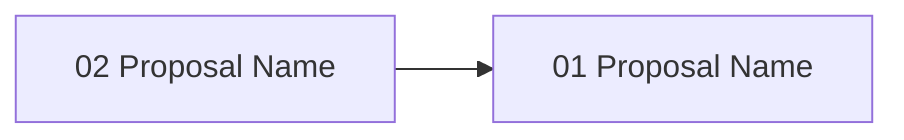

# Gate 07: Proposal Generation & Management

**Status**: pending
**Type**: feature
**Created**: 2026-02-04
**Sequence**: 7 of 14
**Hash**: #g07proposal

<!-- Status lifecycle:
  - pending: Gate generated at init, requirements not yet decomposed
  - in_progress: Gate started via `zeno gates start`, requirements generated
  - completed: All requirements tested, gate approved
  - archived: Gate completed and moved to archive with final artifacts
  - rejected: Gate rejected during review
  - cancelled: Gate cancelled/dropped with optional reason
  - backlog: Gate deferred to later implementation
-->

## Overview

The proposal generation and management infrastructure was largely bootstrapped before this gate started so that Zeno was usable during earlier gate work. The remaining deliverable is focused: integrate the **task-distributor** agent (via Copilot ACP or Claude CLI) to classify the dependency graph built by `calculateProposalDependencies()` into parallel execution sets, annotate each proposal with its `parallelSetIndex`, and surface those sets in `proposal list` and `proposal_action` MCP responses.

During proposal generation the **task-distributor** agent (`agents/categories/09-meta-orchestration/task-distributor.md`) is invoked to analyse the full proposal set, classify dependencies, and produce an optimal execution plan that maximises parallel throughput. Tasks that share no file-level or logical dependencies are grouped into parallel execution sets; the dependency graph is annotated with these sets so downstream gates and agents can consume the plan directly without re-analysis.

## Objectives

- [ ] Create proposal template system (markdown structure, sections, formatting)
- [ ] Implement proposal generator from gate requirements with requirement decomposition
- [ ] Support multiple proposal types (feature, refactoring, testing, documentation)
- [ ] Record design decisions during proposal/gate as RFC 2119 requirement updates in SQLite
- [ ] Implement proposal storage in `zeno/proposals/gate-XX/` with proposal-to-requirement mapping
- [ ] Implement proposal dependency analysis, parallel detection, and circular dependency detection
- [ ] Invoke `task-distributor` agent post-generation to classify proposals into parallel execution sets and annotate the dependency graph
- [ ] Expose parallel execution sets in proposal list output and MCP response
- [ ] Implement `zeno proposal list`, `zeno proposal show`, `zeno proposal start` commands

## Context

### What Was Completed Before This Gate

Gate 01-06 established:

- Core infrastructure, CLI framework, SQLite database
- Gate generation with iterative decomposition
- MCP server and function registry
- Requirements database with hierarchical structure and dependency tracking
- Architecture diagram generation
- Multi-repository declaration and dependency tracking

### What This Gate Enables

- **Gate 8 (Automated Validation)**: Validation rules applied to generated proposals
- **Gate 9 (Human Approval)**: Proposals presented to humans for approval/rejection
- **Gate 10 (Git Integration)**: Proposals drive git commits and branch creation

### Scope Boundaries

**In Scope**:

- Proposal template system with markdown structure
- Proposal generation from gate requirements
- Specification changes recorded as RFC 2119-compliant requirement updates in SQLite
- Proposal storage in `zeno/proposals/gate-XX/`
- Proposal-to-requirement mapping
- Proposal dependency analysis and sequencing
- `task-distributor` agent invocation to produce parallel execution sets from the dependency graph
- `zeno proposal list`, `zeno proposal show`, `zeno proposal start` commands
- Proposal status tracking (pending, in_progress, completed, rejected)
- Comprehensive test coverage (90% minimum)

**Out of Scope**:

- Spec format parsing (OpenAPI, GraphQL, Protobuf) — specs are requirements in the database
- Proposal versioning beyond Git history
- Proposal-to-code file mapping
- Proposal approval workflow (handled in Gate 9)
- Proposal implementation (agent responsibility)
- Web UI for proposal management

## Requirements

<!-- Requirements-First Workflow:
  1. Project-level requirements: PRIMARILY defined during `zeno init` at project inception (BEFORE gates).
     These are high-level, cross-cutting requirements derived from the end state.
  2. Gate generation (`/zeno-gate`): Attributes existing project-level requirements to gates.
     Requirements are PRIMARILY mapped and attributed here, not created.
     During rebaseline/rescope: Requirements may be updated or added as part of rescoping.
  3. Gate start (`zeno gates start`): Generates gate-specific requirements that decompose
     project requirements and gate objectives into actionable items.
  4. Proposal generation (`/zeno-proposal`): Breaks requirements down into individual tasks.

  Workflow: Requirements (init - PRIMARY) → Gates (attribute, may update/add during rescope) → Gate Requirements (decompose) → Tasks (proposals)
-->

### Project Requirements (Attributed to This Gate)

Project-level requirements were defined during `zeno init` at project inception. This section lists those that are attributed to this gate. Query all project requirements via `zeno req list --project`.

| Hash    | Name                       | Type       | Priority | How This Gate Addresses It                                |
| ------- | -------------------------- | ---------- | -------- | --------------------------------------------------------- |
| #[hash] | Clear Implementation Tasks | functional | must     | Each proposal specifies what needs to be implemented      |
| #[hash] | Requirement Traceability   | functional | must     | Each proposal traceable to originating requirement(s)     |
| #[hash] | Dependency Understanding   | functional | must     | Proposal dependencies visible for proper sequencing       |
| #[hash] | RFC 2119 Specifications    | functional | should   | Design decisions recorded using RFC 2119 keywords         |
| #[hash] | Proposal Immutability      | functional | should   | Completed proposals retain hash refs in gate archives     |

### Gate-Specific Requirements

Gate-specific requirements are generated when `zeno gates start <gate-id>` is called. These decompose project requirements and gate objectives into actionable items. Stored in `.zeno/registry.db` and queried via `zeno req list --gate <id>`.

**Status**: Requirements will be generated when gate is started.

After gate start, view detailed requirement information via: `zeno req show <hash>`

### Inherited/Transferred Requirements

No inherited or transferred requirements at this time.

### Requirement-to-Task Breakdown

Individual tasks are created during proposal generation (`/zeno-proposal`), not during gate generation. Each requirement may spawn multiple proposals (tasks) that implement it.

---

## Proposals

**Status**: Proposals will be generated when gate is started.

After gate start, view detailed proposal information via: `zeno proposal show <hash>`

### Proposal Status

| Proposal        | Hash    | Status  | Notes            |
| --------------- | ------- | ------- | ---------------- |
| [proposal-name] | #[hash] | pending | [Optional notes] |

### Proposal Dependency Graph

<!-- Generated by /zeno-proposal when proposals are created. Shows requires relationships between proposals. -->

### High-Level Delta (Gate Completion Summary)

[To be populated on gate completion.]

**Key Deliverables**:

- Proposal template system
- Proposal generation from requirements
- Proposal dependency analysis

**Quality Metrics**: Coverage [X]%, Security [Y] issues, Lint <[Z]%

---

## Architecture Diagrams

<!-- LLM Instructions: Populate this section with applicable architecture diagrams for this gate.
     Core diagrams (system-overview, data-flow, gate-lifecycle, gate-roadmap, context) are always included.
     For conditional diagrams, use the diagram catalogue to select additional diagrams based on this gate's scope.
     Set order numbers sequentially starting from 1 (core diagrams should come first with orders 1-5,
     then conditional diagrams with orders 6+).
-->

| Name                              | Type               | Order | Status    |
| --------------------------------- | ------------------ | ----- | --------- |
| System Overview                   | system-overview    | 1     | pending   |
| Data Flow Diagram                 | data-flow          | 2     | pending   |
| Gate Lifecycle State Machine      | gate-lifecycle     | 3     | pending   |
| Gate Roadmap                      | gate-roadmap       | 4     | pending   |
| System Context Diagram            | context            | 5     | pending   |

---

## Technical Decisions for This Gate

### 1. Markdown-Based Proposal Storage

- **Choice**: Store proposals as markdown files within gate proposal directories and keep completion metadata in place
- **Alternatives Considered**: Proposals in SQLite, YAML format
- **Rationale**: Markdown is human-readable, version-controllable, integrates with Git
- **Impact**: Proposal files stored in `zeno/proposals/gate-XX/`, indexed by hash
- **Trade-offs**: Gained readability and git integration; metadata split between markdown files and SQLite

### 2. Specifications as Requirements (RFC 2119)

- **Choice**: Record spec changes as requirement updates in SQLite using RFC 2119 keyword conventions
- **Alternatives Considered**: Separate spec-driven change notice format (OpenAPI, GraphQL, Protobuf parsing)
- **Rationale**: Specs are requirements. Treating them as structured database entries with RFC 2119 language avoids building parsers for multiple spec formats. Keeps Zeno lightweight. The LLM writes the requirements with proper RFC keywords; Zeno stores and tracks them.
- **Impact**: No separate spec format parsing needed; all specification data lives in requirements database
- **Trade-offs**: Gained simplicity; lost format-specific spec awareness (acceptable — LLMs handle format interpretation)

### 3. Proposal Dependency Tracking

- **Choice**: Build dependency graph from proposal-requirement mappings and explicit cross-proposal dependencies
- **Alternatives Considered**: Flat proposal lists, implicit ordering by creation time
- **Rationale**: Enables parallelization detection and proper sequencing
- **Impact**: Dependency graph drives proposal execution order and parallel work identification
- **Trade-offs**: Gained sequencing intelligence; added graph analysis complexity

### 5. task-distributor Agent for Parallel Execution Planning

- **Choice**: Invoke the `task-distributor` agent (`agents/categories/09-meta-orchestration/task-distributor.md`) immediately after the dependency graph is built to classify proposals into parallel execution sets
- **Alternatives Considered**: Static topological sort only, manual parallelization annotation by the LLM caller
- **Rationale**: `task-distributor` applies load-balancing and priority-scheduling algorithms specialised for distributed work allocation. Using it as a dedicated step decouples parallelization logic from proposal generation and reuses a vetted agent rather than duplicating its heuristics inside `ProposalGenerator`.
- **Impact**: Each generated proposal set carries a `parallelSets: string[][]` field (ordered arrays of proposal hashes). Consumers (Gate 08 validation, Gate 09 approval, Gate 10 git integration) read the sets directly without re-computing ordering.
- **Trade-offs**: Gained principled parallelization with load-balance variance <10% target; requires an agent call per gate generation (acceptable — runs once, results persisted)

### 4. Gate-Centric Historical Archival

- **Choice**: Gate artifacts are the sole long-term archive target; proposals are completed in place and summarized in gate archives
- **Alternatives Considered**: Separate proposal archives, dual archival hierarchies
- **Rationale**: Proposals are execution-scoped working artifacts, while gates are milestone records. Gate-centric archival removes duplicate storage and preserves milestone-level traceability.
- **Impact**: Proposal completion updates requirement progress; gate completion finalizes tested state and archival integration
- **Trade-offs**: Gained single archival surface; reduced lifecycle complexity

## Architecture Updates

### Components Modified or Created

- **ProposalTemplate** (`src/generation/proposal-template.ts`)
  - Purpose: Generates proposal markdown from template structure
  - Changes: New component
  - Interfaces: `generateProposal(requirement, gateContext): string`

- **ProposalGenerator** (`src/generation/proposal-generator.ts`)
  - Purpose: Decomposes gate requirements into proposal documents
  - Changes: New component
  - Interfaces: `generateFromRequirements(gateId): Proposal[]`

- **ProposalStorage** (`src/storage/proposal-storage.ts`)
  - Purpose: Read/write proposals as markdown files with metadata
  - Changes: New component
  - Interfaces: `save(proposal)`, `load(hash)`, `list(gateId)`

- **ProposalDependencyGraph** (`src/generation/proposal-dependency-graph.ts`)
  - Purpose: Analyze proposal dependencies and detect parallelizable work
  - Changes: New component
  - Interfaces: `buildGraph(proposals)`, `getExecutionOrder()`, `getParallelSets()`

- **TaskDistributorIntegration** (`src/generation/task-distributor-integration.ts`)
  - Purpose: Bridge between `ProposalDependencyGraph` output and the `task-distributor` agent; formats the dependency graph as agent input, invokes the agent, parses the returned parallel execution plan, and annotates proposals with `parallelSetIndex`
  - Changes: New component
  - Interfaces: `distributeProposals(graph: ProposalDependencyGraph): Promise<ParallelExecutionPlan>`, `annotateProposals(proposals, plan): AnnotatedProposal[]`
  - Agent Reference: `agents/categories/09-meta-orchestration/task-distributor.md`

### Diagram Updates

- System Overview: `zeno/architecture/system-overview.md` - Add proposal generation module
- Data Flow: `zeno/architecture/data-flow.md` - Add requirement → proposal decomposition flow

### Integration Points

- **Function Registry**: Proposal operations registered for unified CLI + MCP access
- **Requirements Database**: Proposals read requirements and write RFC 2119 updates
- **Gate System**: Gate start triggers proposal generation; gate complete integrates proposal summaries

## Gate-Specific Quality Considerations

### Security Considerations

- Proposal file paths must be sanitized to prevent directory traversal
- RFC 2119 requirement updates must be validated before database insertion

### Performance Requirements

- Proposal generation should complete within 5 seconds for a gate with up to 20 requirements
- Dependency graph analysis should handle up to 50 proposals without noticeable delay

## Dependencies

### External Dependencies (New or Updated)

No new external dependencies required.

### Internal Dependencies

- **Depends on Gate(s)**: Gate 06: Multi-Repo — subproject context for proposal generation
- **Blocks Gate(s)**: Gate 08: Automated Validation, Gate 09: Human Approval, Gate 10: Git Integration
- **Requires Modules**: Requirements database, Function Registry, Gate storage system

### Infrastructure Dependencies

- Proposal directory structure `zeno/proposals/gate-XX/` must be created on gate start

## Implementation Steps

1. **Define Acceptance Tests**
   - Write tests that define proposal generation, storage, and dependency analysis contracts
   - Tests establish the contract before implementation begins

2. **Design Proposal Template Structure**
   - Define markdown sections, formatting, and metadata fields
   - Create template rendering from requirement data

3. **Implement Proposal Generator**
   - Build requirement decomposition algorithm
   - Generate proposals from gate requirements with proper traceability

4. **Build Storage and Dependency System**
   - Implement proposal storage (markdown + metadata)
   - Build proposal dependency graph analyzer
   - Implement RFC 2119 requirement recording for spec changes

5. **Integrate task-distributor for Parallelization**
   - Implement `TaskDistributorIntegration` to invoke `task-distributor` agent after graph build
   - Format dependency graph as structured agent input (task list with dependency edges, priorities)
   - Parse agent response: extract `parallelSets[][]` — ordered parallel execution buckets
   - Annotate proposals with `parallelSetIndex` and persist via `ProposalStorage`
   - Surface parallel sets in `zeno proposal list` output and MCP `proposal_action` response

6. **Implement CLI Commands**
   - `zeno proposal list` with filtering (--gate, --status)
   - `zeno proposal show <hash>`
   - `zeno proposal start <hash>`

7. **Test Cleanup**
   - Refine tests, add edge cases, ensure coverage ≥90%
   - Validates all gate deliverables meet quality thresholds

## Known Issues & Limitations

### Current Limitations

- No spec format parsing (OpenAPI, GraphQL, Protobuf) — specs are requirements in the database
- No proposal versioning beyond Git history

### Technical Debt

- Proposal template structure may need refinement after real-world usage — plan to iterate in later gates

### Future Improvements

- Proposal-to-code file mapping — deferred to post-MVP
- Web UI for proposal management — deferred to post-MVP

## Risks & Mitigation

### Technical Risks

1. **Requirement Decomposition Quality**
   - **Impact**: High
   - **Probability**: Medium
   - **Mitigation**: Template-driven decomposition with clear section structure; LLM generates content within template constraints
   - **Contingency**: Manual proposal creation as fallback

2. **Circular Dependency Detection**
   - **Impact**: Medium
   - **Probability**: Low
   - **Mitigation**: Graph-based cycle detection algorithm in dependency analyzer
   - **Contingency**: Flag cycles for human review rather than blocking

### Process Risks

1. **Proposal Scope Creep**
   - **Impact**: Medium
   - **Probability**: Medium
   - **Mitigation**: Clear scope boundaries per proposal; requirement traceability ensures proposals stay on target
   - **Contingency**: Split oversized proposals into smaller units

## Gate Completion Criteria

- [ ] All must-have requirements implemented and tested
- [ ] All should-have requirements implemented or explicitly deferred
- [ ] All proposals completed and approved
- [ ] All acceptance criteria met
- [ ] Architecture diagrams updated
- [ ] Gate-specific quality considerations addressed
- [ ] Stakeholder approval obtained
- [ ] Proposal templates generate valid markdown with proper sections
- [ ] Proposals created from requirements capture all essential implementation details
- [ ] Proposal-to-requirement mapping covers all gate requirements
- [ ] Proposal dependency graph correctly identifies parallel and sequential work
- [ ] `task-distributor` agent invoked post-graph-build; parallel execution sets produced and stored
- [ ] Proposals annotated with `parallelSetIndex`; sets visible in `zeno proposal list` and MCP responses
- [ ] Design decisions recorded as RFC 2119 requirement updates in SQLite
- [ ] Proposal status transitions (pending → in_progress) work correctly
- [ ] Gate completion integrates completed proposal summaries into gate archival artifacts
- [ ] All tests passing with TypeScript strict mode
- [ ] Test coverage ≥90% for proposal module
- [ ] Zero lint errors, zero type errors

## Notes

### Implementation Notes

- Proposal hash generation should use the same hashing mechanism as gates and requirements for consistency
- RFC 2119 keyword validation: MUST, MUST NOT, REQUIRED, SHALL, SHALL NOT, SHOULD, SHOULD NOT, RECOMMENDED, MAY, OPTIONAL

### Proposal Summary

[Populated during proposal archival. Contains 1-2 sentence summaries of completed proposals as they are cleaned up, preserving a record of work completed in this gate.]

| Proposal Hash | Summary                                           |
| ------------- | ------------------------------------------------- |
| #[hash]       | [1-2 sentence summary of proposal work completed] |

### Next Gate Preview

Gate 08 (Automated Validation & Quality Gates) will implement automated validation that enforces quality gates before human approval, including a validation orchestrator, agent-driven quality assessment, and shared conflict detection.

---

**Document Version**: 1.2.0
**Last Updated**: 2026-02-28
**Versioning**: SemVer; bump on any change (minimum: PATCH).
**Owner**: Zeno
**Reviewers**: Zeno

### Change Log

| Version | Date       | Summary                                                          | Author |
| ------- | ---------- | ---------------------------------------------------------------- | ------ |
| 1.0.0   | 2026-02-04 | Initial version                                                  | Zeno   |
| 1.1.0   | 2026-02-27 | Aligned with gate-prd-template.md                                | Zeno   |
| 1.2.0   | 2026-02-28 | Integrate task-distributor agent for parallel proposal execution | Zeno   |

**Related Documents**:

- Project PRD: `zeno/PROJECT_PRD.md`
- Previous Gate: `zeno/gates/gate-06-multi-repo-subproject-detection.md`
- Next Gate: `zeno/gates/gate-08-automated-validation-quality-gates.md`
- Architecture: `zeno/architecture/`
