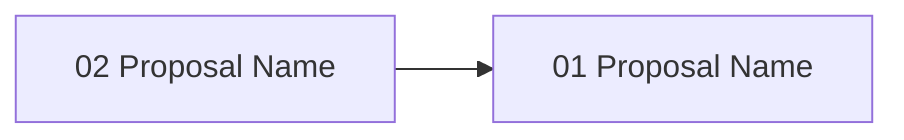

# Gate 08: Automated Validation & Quality Gates

**Status**: pending
**Type**: feature
**Created**: 2026-02-04
**Sequence**: 8 of 14
**Hash**: #g08validate

<!-- Status lifecycle:
  - pending: Gate generated at init, requirements not yet decomposed
  - in_progress: Gate started via `zeno gates start`, requirements generated
  - completed: All requirements tested, gate approved
  - archived: Gate completed and moved to archive with final artifacts
  - rejected: Gate rejected during review
  - cancelled: Gate cancelled/dropped with optional reason
  - backlog: Gate deferred to later implementation
-->

## Overview

Implements automated validation that enforces quality gates before human approval. Rather than hardcoding each validator, this gate creates a lightweight validation orchestrator that invokes existing tooling (ESLint, tsc, Vitest, npm audit) and leverages agent scripts from `agents/pipeline-agents/00-quality-assurance/` for configurable, LLM-driven quality assessment. The `quality-gate-controller` and `validation-depth-controller` agents define quality criteria and validation intensity; Zeno orchestrates their invocation via MCP. Quality gates catch issues early, ensuring proposals meet minimum standards before reaching human review.

## Objectives

- [ ] Create unified validation runner (invokes checks and aggregates results)
- [ ] Invoke ESLint, tsc, Vitest, c8, npm audit via shell and parse results
- [ ] Expose validation results via MCP tool for LLM/agent consumption
- [ ] Leverage `quality-gate-controller` and `validation-depth-controller` agents for configurable quality criteria
- [ ] Implement `zeno proposal validate <hash>` command with structured reporting
- [ ] Implement file-level conflict detection as a shared module (consumed by Gates 06, 10)
- [ ] Detect circular dependencies via requirement/proposal dependency graph

## Context

### What Was Completed Before This Gate

Gate 01-07 established:

- Core infrastructure and CLI framework
- Gate and requirement generation systems
- MCP server and function registry
- Requirements database and architecture diagrams
- Multi-repo support and proposal generation

### What This Gate Enables

- **Gate 9 (Human Approval)**: Only validated proposals reach human review
- **Gate 10 (Git Integration)**: Validated proposals committed to git with safety assurance

### Scope Boundaries

**In Scope**:

- Validation orchestrator wrapping existing tools (ESLint, tsc, Vitest, c8, npm audit)
- Agent-driven quality assessment via `quality-gate-controller` and `validation-depth-controller`
- `zeno proposal validate <hash>` command
- Structured validation reports (machine and human readable)
- Shared conflict detection module
- Threshold enforcement: 90% coverage, 0 CVEs (high/critical), <0.01% lint error rate
- Comprehensive test coverage (90% minimum)

**Out of Scope**:

- Custom ESLint rule development
- Hardcoded validator classes per check type
- Validation caching and incremental checking (premature optimization)
- Performance profiling or complexity metrics
- Code duplication detection
- License compliance or SBOM generation

## Requirements

<!-- Requirements-First Workflow:
  1. Project-level requirements: PRIMARILY defined during `zeno init` at project inception (BEFORE gates).
  2. Gate generation (`/zeno-gate`): Attributes existing project-level requirements to gates.
  3. Gate start (`zeno gates start`): Generates gate-specific requirements that decompose
     project requirements and gate objectives into actionable items.
  4. Proposal generation (`/zeno-proposal`): Breaks requirements down into individual tasks.

  Workflow: Requirements (init - PRIMARY) → Gates (attribute, may update/add during rescope) → Gate Requirements (decompose) → Tasks (proposals)
-->

### Project Requirements (Attributed to This Gate)

| Hash    | Name                       | Type           | Priority | How This Gate Addresses It                              |
| ------- | -------------------------- | -------------- | -------- | ------------------------------------------------------- |
| #[hash] | Automated Quality Gates    | functional     | must     | Proposals validated against thresholds before review    |
| #[hash] | Clear Feedback             | functional     | must     | LLMs receive structured validation results              |
| #[hash] | Agent-Configurable Quality | non_functional | should   | Quality criteria configured via agent scripts           |
| #[hash] | Shared Conflict Detection  | functional     | should   | Single conflict detection module across gates           |

### Gate-Specific Requirements

**Status**: Requirements will be generated when gate is started.

After gate start, view detailed requirement information via: `zeno req show <hash>`

### Inherited/Transferred Requirements

No inherited or transferred requirements at this time.

### Requirement-to-Task Breakdown

Individual tasks are created during proposal generation (`/zeno-proposal`), not during gate generation.

---

## Proposals

**Status**: Proposals will be generated when gate is started.

After gate start, view detailed proposal information via: `zeno proposal show <hash>`

### Proposal Status

| Proposal        | Hash    | Status  | Notes            |
| --------------- | ------- | ------- | ---------------- |
| [proposal-name] | #[hash] | pending | [Optional notes] |

### Proposal Dependency Graph

### High-Level Delta (Gate Completion Summary)

[To be populated on gate completion.]

**Key Deliverables**:

- Validation orchestrator
- Agent-driven quality assessment
- Shared conflict detection module

**Quality Metrics**: Coverage [X]%, Security [Y] issues, Lint <[Z]%

---

## Architecture Diagrams

| Name                         | Type            | Order | Status  |
| ---------------------------- | --------------- | ----- | ------- |
| System Overview              | system-overview | 1     | pending |
| Data Flow Diagram            | data-flow       | 2     | pending |
| Gate Lifecycle State Machine | gate-lifecycle  | 3     | pending |
| Gate Roadmap                 | gate-roadmap    | 4     | pending |
| System Context Diagram       | context         | 5     | pending |

---

## Technical Decisions for This Gate

### 1. Shell-Based Tool Invocation

- **Choice**: Invoke ESLint, tsc, Vitest, c8, npm audit via shell commands and parse output
- **Alternatives Considered**: TypeScript compiler API, programmatic ESLint API, custom validator classes
- **Rationale**: Shell invocation is simple, leverages existing tool installations, and keeps Zeno lightweight. No need to import these tools as dependencies — they're project development tools.
- **Impact**: Validation results depend on shell output parsing; format changes in tool output may require parser updates
- **Trade-offs**: Gained simplicity; parsing shell output is less reliable than programmatic APIs (acceptable for MVP)

### 2. Agent-Driven Quality Configuration

- **Choice**: Leverage `quality-gate-controller` and `validation-depth-controller` agents from `agents/pipeline-agents/00-quality-assurance/`
- **Alternatives Considered**: Hardcoded validator classes, configurable YAML quality profiles
- **Rationale**: Agent scripts already define quality criteria and validation intensity scaling. Zeno exposes validation results via MCP; agents assess and configure. Keeps Zeno as an orchestrator, not a quality engine.
- **Impact**: Quality criteria are LLM-configurable rather than hardcoded
- **Trade-offs**: Gained configurability and LLM-driven assessment; depends on agent quality

### 3. Non-Configurable MVP Thresholds

- **Choice**: Fixed thresholds for MVP: 90% coverage, 0 CVEs (high/critical), <0.01% lint error rate
- **Alternatives Considered**: Configurable thresholds per project or gate
- **Rationale**: Enforce high quality from the start. Configurable thresholds deferred to post-MVP.
- **Impact**: All proposals must meet fixed quality bar
- **Trade-offs**: Gained consistency; reduced flexibility (acceptable for MVP)

## Architecture Updates

### Components Modified or Created

- **ValidationOrchestrator** (`src/validation/validation-orchestrator.ts`)
  - Purpose: Invoke quality checks and aggregate pass/fail results
  - Changes: New component
  - Interfaces: `validate(proposalHash): ValidationReport`

- **ValidationReport** (`src/validation/validation-report.ts`)
  - Purpose: Structured report format (JSON + human-readable)
  - Changes: New component
  - Interfaces: `toJSON()`, `toText()`, `isPassing(): boolean`

- **ConflictDetector** (`src/validation/conflict-detector.ts`)
  - Purpose: File-level conflict detection shared across gates
  - Changes: New component
  - Interfaces: `detectConflicts(proposals): Conflict[]`

### Diagram Updates

- System Overview: `zeno/architecture/system-overview.md` - Add validation orchestrator module
- Data Flow: `zeno/architecture/data-flow.md` - Add validation pipeline flow

### Integration Points

- **MCP Server**: Validation results exposed as MCP tool for agent consumption
- **Proposal System**: `zeno proposal validate` triggers validation on proposal artifacts
- **Agent Scripts**: Quality-gate-controller and validation-depth-controller invoked for criteria

## Gate-Specific Quality Considerations

### Security Considerations

- Shell command injection prevention when constructing tool invocation commands
- npm audit results must be parsed safely; malicious package names should not break parsing

### Performance Requirements

- Full validation suite should complete within 60 seconds for a typical proposal
- Individual tool invocations should have configurable timeouts (default 30s)

## Dependencies

### External Dependencies (New or Updated)

No new external dependencies. ESLint, tsc, Vitest, c8, npm audit are project dev dependencies.

### Internal Dependencies

- **Depends on Gate(s)**: Gate 07: Proposal Generation — proposals must exist to validate
- **Blocks Gate(s)**: Gate 09: Human Approval, Gate 10: Git Integration
- **Requires Modules**: Proposal storage, Function Registry

### Infrastructure Dependencies

- Project must have ESLint, TypeScript, Vitest configured for validation to execute

## Implementation Steps

1. **Define Acceptance Tests**
   - Write tests defining validation orchestrator contracts and report format
   - Tests establish the contract before implementation begins

2. **Create Validation Orchestrator**
   - Shell command runner + result aggregator
   - Implement ESLint, tsc, Vitest, c8, npm audit invocations

3. **Build Structured Validation Reports**
   - JSON + human-readable formats
   - Pass/fail per check with error details and file locations

4. **Implement CLI and MCP Integration**
   - `zeno proposal validate <hash>` command
   - Expose validation results via MCP tool

5. **Implement Shared Conflict Detection**
   - File-level overlap detection module
   - Circular dependency detection via dependency graph

6. **Test Cleanup**
   - Refine tests, add edge cases, ensure coverage ≥90%
   - Validates all gate deliverables meet quality thresholds

## Known Issues & Limitations

### Current Limitations

- Shell output parsing is fragile; tool output format changes may break parsers
- No validation caching — full suite runs every time

### Technical Debt

- Validation caching for unchanged files — plan to add in post-MVP optimization

### Future Improvements

- Configurable quality thresholds per project — deferred to post-MVP
- Performance profiling and complexity metrics — deferred to post-MVP

## Risks & Mitigation

### Technical Risks

1. **Shell Output Parsing Fragility**
   - **Impact**: Medium
   - **Probability**: Medium
   - **Mitigation**: Pin tool versions in dev dependencies; test parsers against known output formats
   - **Contingency**: Fall back to exit code-based pass/fail if parsing breaks

2. **Validation Performance**
   - **Impact**: Medium
   - **Probability**: Low
   - **Mitigation**: Configurable timeouts per tool; parallel tool execution where possible
   - **Contingency**: Allow skipping slow checks with explicit flag

### Process Risks

1. **Agent Script Quality**
   - **Impact**: Medium
   - **Probability**: Medium
   - **Mitigation**: Default thresholds enforced even if agents are unavailable
   - **Contingency**: Fall back to fixed thresholds if agent assessment fails

## Gate Completion Criteria

- [ ] All must-have requirements implemented and tested
- [ ] All should-have requirements implemented or explicitly deferred
- [ ] All proposals completed and approved
- [ ] All acceptance criteria met
- [ ] Architecture diagrams updated
- [ ] Gate-specific quality considerations addressed
- [ ] Stakeholder approval obtained
- [ ] Validation orchestrator invokes all checks and aggregates results
- [ ] ESLint, TypeScript, Vitest, coverage, and security checks all execute correctly
- [ ] Validation report clearly shows pass/fail per check with error details
- [ ] Coverage threshold (90%) enforced, failing files reported
- [ ] Security scanning detects vulnerabilities, threshold 0 enforced
- [ ] `zeno proposal validate <hash>` runs all checks and reports results
- [ ] Validation results exposed via MCP tool for agent consumption
- [ ] Shared conflict detection module works for file-level overlap detection
- [ ] Validation reports are structured (JSON) and human-readable
- [ ] All tests passing with TypeScript strict mode
- [ ] Test coverage ≥90% for validation module
- [ ] Zero lint errors, zero type errors

## Notes

### Implementation Notes

- Validation orchestrator should be designed for extensibility — new checks can be added without modifying core logic
- Consider running independent checks in parallel for performance

### Proposal Summary

| Proposal Hash | Summary                                           |
| ------------- | ------------------------------------------------- |
| #[hash]       | [1-2 sentence summary of proposal work completed] |

### Next Gate Preview

Gate 09 (Human Approval & Rejection Workflow) will implement approve/reject commands with feedback capture, enabling human decision authority before code is merged.

---

**Document Version**: 1.1.0
**Last Updated**: 2026-02-27
**Versioning**: SemVer; bump on any change (minimum: PATCH).
**Owner**: Zeno
**Reviewers**: Zeno

### Change Log

| Version | Date       | Summary                           | Author |
| ------- | ---------- | --------------------------------- | ------ |
| 1.0.0   | 2026-02-04 | Initial version                   | Zeno   |
| 1.1.0   | 2026-02-27 | Aligned with gate-prd-template.md | Zeno   |

**Related Documents**:

- Project PRD: `zeno/PROJECT_PRD.md`
- Previous Gate: `zeno/gates/gate-07-proposal-generation-management.md`
- Next Gate: `zeno/gates/gate-09-human-approval-rejection-workflow.md`
- Architecture: `zeno/architecture/`
