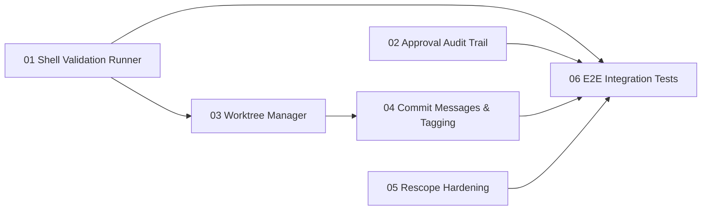

---
zeno:
  id: gate-08
  name: MVP Hardening
  sequence: 8
  type: feature
  status: pending
  hash: g08harden
  created_at: '2026-03-14'
  depends_on: [gate-07]
  phases:
    - MVP
---

# Gate 08: MVP Hardening

> Consolidates remaining delta work from original gates 08-11. Core validation (11 validators),
> approval (approve/reject/transitions), git (commit/tag/push), and replan (full engine + CLI)
> are already implemented. This gate delivers the gaps: shell-based validation runner, audit trail,
> git worktrees, requirement transfer, and E2E integration tests across all four subsystems.

**Status**: pending
**Type**: feature
**Phases**: MVP
**Created**: 2026-03-14
**Sequence**: 8 of 10
**Hash**: #g08harden

<!-- Status lifecycle:
  - pending: Gate generated at init, requirements not yet decomposed
  - in_progress: Gate started via `zeno gates start`, requirements generated
  - completed: All requirements tested, gate approved
  - archived: Gate completed and moved to archive with final artifacts
  - rejected: Gate rejected during review
  - cancelled: Gate cancelled/dropped with optional reason
  - backlog: Gate deferred to later implementation
-->

## Overview

Four subsystems — validation, approval, git integration, and rescope/replan — were substantially implemented during gates 1-7. This gate closes the remaining gaps across all four and delivers comprehensive E2E tests proving they work together as a production-ready pipeline.

**Subsystem status and remaining work:**

| Subsystem | Implemented (gates 1-7) | Remaining (this gate) |
|-----------|------------------------|-----------------------|
| **Validation** | 11 validators, conflict detector, quality thresholds, MCP `proposal_action:validate` | Shell-based tool runner (ESLint, tsc, Vitest, c8, npm audit), structured validation reports |
| **Approval** | approve/reject commands, state transitions, apply-phase validator, rejection feedback | SQLite audit trail, rejection category taxonomy |
| **Git Integration** | commit, tag, push, syncWithGit, getGitUserInfo, getGitStatus, worktree schemas | WorktreeManager (create/merge/remove/list/prune), structured commit messages, gate release tagging |
| **Rescope/Replan** | replanGates(), CLI with --from/--prd-changed/--dry-run, MCP gates_action:regenerate | Requirement transfer between gates, rescope history tracking, orphan detection |

## Objectives

### Validation Runner

- [ ] Implement ShellValidationRunner: spawn ESLint, tsc, Vitest, c8, npm audit as child processes and parse output
- [ ] Add structured validation reports (JSON + human-readable) aggregating all check results
- [ ] Wire shell runner into existing `proposal_action:validate` pipeline

### Approval Audit Trail

- [ ] Implement SQLite `approval_events` table for approval decisions (approver, timestamp, action, reason)
- [ ] Add rejection category taxonomy (quality, requirement-mismatch, scope-creep, incomplete, other)
- [ ] Expose rejection feedback via MCP for LLM iteration context

### Git Worktrees

- [ ] Implement WorktreeManager: create, remove, list, prune, merge using `simple-git` worktree APIs
- [ ] Integrate worktrees into proposal lifecycle: create on start, merge on approve, cleanup on completion
- [ ] Implement structured commit message generator using `commitFormat` from `.zeno/config.json`
- [ ] Implement gate release tagging on `gates_action:complete`
- [ ] Expose worktree operations via MCP tools and `zeno worktree` CLI commands

### Rescope Hardening

- [ ] Implement requirement transfer: `zeno req transfer <hash> <gate-id>` moves requirements between gates
- [ ] Implement rescope history tracking: SQLite `rescope_events` table with before/after snapshots
- [ ] Handle mid-gate rescope safety (warn + `--force` for in-progress gates)

### Integration Tests

- [ ] E2E test: full validation pipeline (all 11 validators + shell runner)
- [ ] E2E test: approve → complete and reject → rework → revalidate cycles
- [ ] E2E test: proposal start → worktree create → merge → cleanup
- [ ] E2E test: replan → gates regenerated → requirements transferred → history recorded

## Context

### What Was Completed Before This Gate

See subsystem status table in Overview. Key files:

- **Validators**: `src/mcp/validators/` (11 files), `src/core/conflict-detector.ts`, `src/mcp/tools/validation-tools.ts`
- **Approval**: `src/integration/proposals-registry.ts` (approve/reject), `src/core/completions.ts`, `src/core/transitions.ts`
- **Git**: `src/utils/git.ts` (commit/tag/push/sync), `src/mcp/schemas/worktree-schemas.ts` (schemas only), `src/core/archive-execution.ts`
- **Replan**: `src/core/gate-generator.ts` (replanGates), `src/cli/commands/gates.ts` (replan CLI), MCP gates_action:regenerate

### What This Gate Enables

- **Gate 09 (Documentation)**: MVP must be hardened before docs polish
- **Gate 10 (Subagent Orchestration)**: Worktrees enable parallel agent execution; validation/approval pipeline is prerequisite

### Scope Boundaries

**In Scope**:

- Shell-based validation runner (spawn + parse project tools)
- Structured validation reports
- SQLite audit trail for approval decisions
- Rejection category taxonomy
- Git worktree lifecycle (create, merge, remove, list, prune)
- Worktree expiration policy (configurable TTL, default 7 days)
- Structured commit messages with proposal hash references
- Gate release tagging
- MCP tools for worktrees and worktree CLI commands
- Requirement transfer between gates
- Rescope history tracking (SQLite table)
- Mid-gate rescope safety
- E2E integration tests for all four subsystems
- Test coverage ≥90% for all new code

**Out of Scope**:

- Dashboard or status visualization (removed — scope creep)
- Pre-commit hook installation (user's project manages hooks)
- GitHub/GitLab API integration (git-native only)
- Release notes generation, version bumps, changelog
- Automatic conflict resolution during replan
- Rollback to previous gate plan
- Rebase merge strategy (merge-only for MVP)

---

## Requirements

### Project Requirements (Attributed to This Gate)

| Hash                 | Name                                              | Type            | Priority | How This Gate Addresses It                                                       |
| -------------------- | ------------------------------------------------- | --------------- | -------- | -------------------------------------------------------------------------------- |
| #e1c0bf4e09c47b85   | Maintain 90% or higher test coverage              | non_functional  | must     | E2E integration tests for all 4 subsystems maintain ≥90% coverage                |
| #1896540582268f73   | Zero known security vulnerabilities               | non_functional  | must     | Shell runner invokes `npm audit`; WorktreeManager validates paths to prevent traversal |
| #cefa008f80de78d8   | Support requirement transfer between gates        | functional      | should   | RequirementTransferService implements cross-gate transfer preserving parent-child refs |
| #10a621a3715172ae   | Expose all operations as MCP tools                | functional      | must     | Worktree operations and audit-trail queries exposed as new MCP tools              |
| #9fc8ed09586f6ee2   | TypeScript strict mode with zero type errors      | non_functional  | must     | All new components (ShellValidationRunner, WorktreeManager, etc.) maintain strict mode |
| #4bc74e36854c4221   | Lightweight SQLite schema with no server dependency | constraint    | must     | `approval_events` and `rescope_events` tables added via migration to existing registry.db |

### Gate-Specific Requirements

**Status**: Requirements will be generated when gate is started.

### Inherited/Transferred Requirements

No inherited or transferred requirements at this time.

### Requirement-to-Task Breakdown

Individual tasks are created during proposal generation.

---

## Proposals

**Status**: Proposals will be generated when gate is started.

### Proposal Status

| Proposal                          | Hash      | Status  | Notes                               |
| --------------------------------- | --------- | ------- | ----------------------------------- |
| 01-shell-validation-runner        | pending   | pending | Generated when gate is started      |
| 02-approval-audit-trail           | pending   | pending | Generated when gate is started      |
| 03-worktree-manager               | pending   | pending | Depends on 01 (validation pipeline) |
| 04-commit-messages-and-tagging    | pending   | pending | Depends on 03 (worktree lifecycle)  |
| 05-rescope-hardening              | pending   | pending | Generated when gate is started      |
| 06-e2e-integration-tests          | pending   | pending | Depends on 01, 02, 04, 05           |

### Proposal Dependency Graph

### High-Level Delta (Gate Completion Summary)

Populated after gate completion. Will summarise all four subsystem gaps closed: ShellValidationRunner, ApprovalAuditTrail, WorktreeManager, and RescopeHistoryTracker, along with E2E test results.

---

## Architecture Diagrams

| Name                         | Type            | Order | Status  |
| ---------------------------- | --------------- | ----- | ------- |
| System Overview              | system-overview | 1     | pending |
| Data Flow Diagram            | data-flow       | 2     | pending |
| Gate Lifecycle State Machine | gate-lifecycle  | 3     | pending |
| Gate Roadmap                 | gate-roadmap    | 4     | pending |
| System Context Diagram       | context         | 5     | pending |
| Component Diagram            | component       | 6     | pending |

---

## Technical Decisions for This Gate

### 1. Shell Validation Runner with Configurable Timeouts

- **Choice**: Spawn ESLint, tsc, Vitest, c8, npm audit as child processes with configurable per-tool timeout (default 30s)
- **Alternatives Considered**: Import tools programmatically, use lint-staged integration
- **Rationale**: Shell spawning works with any tool version and any project tool configuration. No tight coupling to specific tool APIs.
- **Impact**: Works with any Node.js project; requires tools to be installed in target project
- **Trade-offs**: Gained universality; added process spawn overhead (~200ms per tool)

### 2. SQLite for Audit Trail and Rescope History

- **Choice**: Two new SQLite tables in `registry.db`: `approval_events` and `rescope_events`
- **Alternatives Considered**: File-based logs, git-based history only
- **Rationale**: SQLite provides queryable, transactional history. File-based is harder to query. Git captures file changes but not semantic intent.
- **Impact**: Queryable audit trail for both approval decisions and replan events
- **Trade-offs**: Gained queryability; slightly increased schema complexity

### 3. Git Worktree Strategy

- **Choice**: One worktree per proposal at `.local/worktrees/{proposal-hash}/`, merge on approval, cleanup after merge
- **Alternatives Considered**: Branch switching per proposal, full clones per proposal
- **Rationale**: Worktrees provide isolated filesystem without branch switching delays. Enables true parallelization. `.local/` keeps worktrees out of version control.
- **Impact**: Each proposal gets dedicated filesystem; merge coordination required
- **Trade-offs**: Gained parallel execution; added disk space overhead and merge coordination complexity

### 4. Merge-Only Strategy for MVP

- **Choice**: Always merge (no rebase) when combining worktree branches
- **Alternatives Considered**: Configurable merge vs. rebase, always rebase
- **Rationale**: Merge preserves full commit history and is safer. Rebase can be added post-MVP.
- **Impact**: Merge commits visible in history
- **Trade-offs**: Gained safety and simplicity; slightly noisier git history

### 5. Requirement Transfer as Explicit Command

- **Choice**: `zeno req transfer <hash> <gate-id>` moves a requirement to a different gate, updating all references
- **Alternatives Considered**: Automatic redistribution during replan, copy-on-transfer
- **Rationale**: Explicit transfer gives the user control. Automatic redistribution risks misplacement.
- **Impact**: Requirements can move between gates without losing history or dependency links
- **Trade-offs**: Gained flexibility; requires manual intervention during large replan operations

### 6. Mid-Gate Rescope Safety

- **Choice**: Warn and require `--force` flag when replan affects an in-progress gate; preserve existing proposals and worktrees
- **Alternatives Considered**: Automatically abort in-progress work, silently modify gate
- **Rationale**: In-progress gates may have active worktrees and proposals. Silent modification risks losing work.
- **Impact**: Safety-first approach for in-progress gates
- **Trade-offs**: Gained safety; requires user confirmation for mid-gate replan

### 7. WorktreeManager Abstracts Raw Git Fallbacks

- **Choice**: `WorktreeManager` hides whether a call uses the `simple-git` typed API or `.raw(['worktree', ...])`. The public interface (`create`, `list`, `remove`, `prune`, `merge`) never leaks this detail.
- **Alternatives Considered**: Expose a `rawMode` flag on each call
- **Rationale**: Callers should not need to know which operations are covered by the typed API vs. the raw fallback. Abstraction makes the interface stable if `simple-git` adds typed coverage later.
- **Impact**: Uniform call site regardless of underlying implementation
- **Trade-offs**: Gained stable public API; internal implementation carries the complexity

### 8. Extended `commitFormat` Token Set (`%g`, `%h`)

- **Choice**: Extend the token interpolation set with `%g` (gate ID) and `%h` (proposal hash). Default format in `.zeno/config.json` becomes `feat(%g/%h): %m`.
- **Alternatives Considered**: Unconditionally append gate/hash after the user-configured format string
- **Rationale**: Token extension lets authors choose how gate ID and proposal hash appear (scope, body, omitted). Unconditional appending would produce non-standard commit shapes without user control.
- **Impact**: `CommitMessageGenerator` interpolates `%g` and `%h` in addition to existing `%s`/`%m` tokens
- **Trade-offs**: Gained flexibility; existing `commitFormat` values with `%s` remain valid without migration

### 9. Audit Trail Records Git Identity

- **Choice**: `approval_events.approver` stores the git `user.name`; `approver_email` stores `user.email` as a secondary field.
- **Alternatives Considered**: Enum literals `"human"` / `"agent"`, LLM model string
- **Rationale**: Solo projects grow. Recording the real git identity means the audit trail stays meaningful when new contributors join, without requiring a schema migration.
- **Impact**: `ApprovalAuditTrail` reads git config for identity at record time
- **Trade-offs**: Gained future-proof identity; requires git config to be set in the working environment

### 10. Worktrees Mandatory in Solitary Mode

- **Choice**: The `solitary` flag in `proposal_action:start` no longer suppresses worktree creation from gate-08 onwards. All proposals — solitary or otherwise — follow the same worktree lifecycle.
- **Alternatives Considered**: Skip worktrees in solitary mode for speed
- **Rationale**: Consistency reduces cognitive overhead. Solitary work can also benefit from isolation, and the same approval/merge path works regardless of mode.
- **Impact**: `proposal_action:start` always calls `WorktreeManager.create()`; removes the conditional branch
- **Trade-offs**: Gained consistency; minimal extra disk use for solitary proposals

### 11. Rescope Snapshots Capture Source Files, Not the Derived DB

- **Choice**: `rescope_events` snapshots serialise `.zeno/config.json` (project-level requirements, authoritative) and each gate markdown file. `registry.db` is excluded because it is derived from those files and can be rebuilt at any time.
- **Alternatives Considered**: Full DB dump, compact hash diff
- **Rationale**: The config JSON is the authoritative source for project-level requirements and must be edited carefully. The DB is ephemeral. Capturing the true source of truth makes snapshots self-contained and portable even if the DB is wiped.
- **Impact**: `RescopeHistoryTracker` reads config JSON + gate files; snapshot stored as JSON `{config: {...}, gates: {gateId: markdownString}}`
- **Trade-offs**: Gained portability and accuracy; snapshot size proportional to number of gates

### 12. E2E Fixture Project in `tests/fixtures/fixture-project/`

- **Choice**: A minimal, static Node.js/TypeScript project is committed at `tests/fixtures/fixture-project/`. It contains the minimum files needed for ESLint, tsc, and Vitest to run (package.json, tsconfig.json, eslint.config.mjs, a source file, a test file).
- **Alternatives Considered**: Generate fixture at test time, use the Zenos-Planner repo itself
- **Rationale**: A version-controlled fixture is deterministic and fast. The main repo is too large and its state changes during development, making E2E results unpredictable.
- **Impact**: E2E tests point `ShellValidationRunner` at `tests/fixtures/fixture-project/`; fixture is maintained alongside tests
- **Trade-offs**: Gained determinism and speed; fixture must be kept in sync with tool version requirements

## Architecture Updates

### Components Modified or Created

- **ShellValidationRunner** (`src/core/shell-validation-runner.ts`)
  - Purpose: Spawn and parse ESLint, tsc, Vitest, c8, npm audit
  - Changes: New component
  - Interfaces: `runAll(projectDir): ValidationReport`, `runTool(tool, projectDir): ToolResult`

- **ValidationReporter** (`src/core/validation-reporter.ts`)
  - Purpose: Aggregate check results into structured JSON + human-readable reports
  - Changes: New component

- **ApprovalAuditTrail** (`src/core/approval-audit-trail.ts`)
  - Purpose: Record and query approval decisions in SQLite
  - Changes: New component
  - Interfaces: `record(event): void`, `list(proposalHash?): AuditEvent[]`
  - `AuditEvent` fields: `approver` (git user.name), `approver_email` (git user.email), `timestamp`, `action` (approve|reject), `reason`, `rejection_category?`

- **WorktreeManager** (`src/git/worktree-manager.ts`)
  - Purpose: Create, remove, list, prune, merge worktrees
  - Changes: New component
  - Interfaces: `create(proposalHash): WorktreePath`, `remove(path)`, `list(): WorktreeInfo[]`, `prune(): PruneResult`, `merge(path): MergeResult`

- **CommitMessageGenerator** (`src/git/commit-message-generator.ts`)
  - Purpose: Create structured commit messages using `commitFormat` from `.zeno/config.json`
  - Changes: New component

- **RequirementTransferService** (`src/core/requirement-transfer.ts`)
  - Purpose: Move requirements between gates, update all references
  - Changes: New component

- **RescopeHistoryTracker** (`src/core/rescope-history.ts`)
  - Purpose: Log replan events with before/after snapshots
  - Changes: New component

- **proposals-registry.ts** — Modified: integrate worktree creation into `proposal_start`, merge into `proposal_approve`, audit trail recording
- **gates-registry.ts** — Modified: integrate release tagging into `gates_complete`
- **gate-generator.ts** — Modified: add orphan detection, mid-gate safety, snapshot integration

### Diagram Updates

- System Overview: Add git integration layer with worktree manager
- Data Flow: Add worktree lifecycle and merge flow, validation runner flow
- Component: Add git layer components and audit trail

### Integration Points

- **Proposal lifecycle**: validate → approve → commit (shell runner feeds into approval, approval feeds into git)
- **Worktree lifecycle**: start → create worktree; approve → merge worktree; reject → optional cleanup
- **Gate lifecycle**: complete → create release tag
- **Replan**: trigger → snapshot → regenerate → transfer orphans → record history
- **MCP Server**: Worktree operations + rescope history exposed as MCP tools
- **Config**: `commitFormat` from `.zeno/config.json` drives commit message structure

## Gate-Specific Quality Considerations

### Security Considerations

- Shell runner must not execute arbitrary commands — tool list is hardcoded (ESLint, tsc, Vitest, c8, npm audit)
- Worktree paths must be validated to prevent directory traversal
- Commit messages must not interpolate unsanitized proposal content
- Git operations must not expose credentials or tokens in output
- Requirement transfer must validate target gate exists and is not completed

### Performance Requirements

- Shell validation runner: complete all 5 tools within 2 minutes for typical projects
- Worktree creation: <5 seconds
- Merge operations: <10 seconds for typical proposals
- Requirement transfer: <1 second
- `worktree list`: handle 100+ worktrees without timeout

## Dependencies

### External Dependencies (New or Updated)

- **simple-git** (existing) — Worktree operations via `git worktree add/remove/list`

### Internal Dependencies

- **Depends on Gate(s)**: Gates 01-07 (all completed)
- **Blocks Gate(s)**: Gate 09 (Documentation), Gate 10 (Subagent Orchestration)
- **Requires Modules**: Proposal storage, conflict detector, git utilities, proposals-registry, gates-registry, gate-generator, requirement registry

### Infrastructure Dependencies

- Git 2.x+ (worktree support)
- `.local/worktrees/` directory for worktree storage (auto-created)
- Existing `registry.db` SQLite database (new tables added via migration)

## Implementation Steps

1. **Define Acceptance Tests**
   - Tests for shell validation runner (mock child_process)
   - Tests for audit trail recording and querying
   - Tests for worktree CRUD operations (mock simple-git)
   - Tests for commit message generation and gate tagging
   - Tests for requirement transfer and rescope history

2. **Implement Shell Validation Runner**
   - ShellValidationRunner: spawn ESLint, tsc, Vitest, c8, npm audit
   - Parse stdout/stderr into structured ToolResult objects
   - ValidationReporter: aggregate into JSON + human-readable report
   - Wire into existing `proposal_action:validate` pipeline

3. **Implement Approval Audit Trail**
   - Create `approval_events` table migration
   - ApprovalAuditTrail: record/query approval decisions
   - Add rejection categories to rejection feedback
   - Expose via MCP for LLM context

4. **Implement WorktreeManager & Commit Generator**
   - WorktreeManager: create, remove, list, prune, merge
   - Integrate into proposal lifecycle (start/approve/reject)
   - CommitMessageGenerator: parse `commitFormat` from config
   - Gate release tagging on completion
   - MCP tools + CLI commands for worktree operations

5. **Implement Rescope Hardening**
   - RequirementTransferService: move requirements between gates
   - RescopeHistoryTracker: record replan events with snapshots
   - Mid-gate rescope safety (warn + --force)
   - Orphan detection after gate removal

6. **E2E Integration Tests**
   - Full validation pipeline test
   - Approve/reject lifecycle test
   - Worktree lifecycle test (start → create → merge → cleanup)
   - Replan lifecycle test (trigger → regenerate → transfer → history)

## Open Questions

1. **`simple-git` worktree API coverage** — `simple-git` exposes `worktree.add()` but `worktree.list()`, `worktree.remove()`, and `worktree.prune()` may require raw git calls via `.raw(['worktree', ...])`. Which operations need the raw fallback, and should `WorktreeManager` abstract that detail or expose it explicitly?
   - **[x] Resolved**: Abstract. `WorktreeManager` hides whether a given operation uses the `simple-git` typed API or falls back to `.raw(['worktree', ...])`. Callers never deal with this distinction.

2. **`commitFormat` token set** — The existing format `feat(%s): %m` uses `%s` for scope and `%m` for message. The structured commit generator needs to interpolate gate ID and proposal hash as well. Should the token set be extended (e.g., `%g` = gate ID, `%h` = proposal hash) or should the generator always append them unconditionally after the configured format?
   - **[x] Resolved**: Extend the token set. Add `%g` (gate ID) and `%h` (proposal hash) so authors can configure `feat(%g/%h): %m` or any other combination. The default `commitFormat` in `.zeno/config.json` will be updated to `feat(%g/%h): %m`.

3. **Audit trail approver identity** — In a solo/AI-agent workflow there is no separate human approver account. Should `approval_events.approver` record the git user name, the LLM model string, or always the literal `"human"` / `"agent"` enum? This affects how the audit trail is queried and displayed.
   - **[x] Resolved**: Record the git `user.name` (and `user.email` as secondary field). Solo projects may onboard additional contributors over time, so a real identity from the git stream keeps the audit trail useful and accurate for any team size.

4. **Shell runner in solitary mode** — `proposal_action:start` currently has a `solitary` flag that skips some lifecycle steps. Should `ShellValidationRunner` and worktree creation be skipped in solitary mode, or is worktree use mandatory from gate-08 onwards regardless of mode?
   - **[x] Resolved**: Worktree creation is mandatory from gate-08 regardless of solitary mode. Solitary proposals follow the same worktree lifecycle as gate proposals. The `solitary` flag no longer suppresses worktree steps.

5. **`rescope_events` snapshot fidelity** — "Before/after snapshots" could mean a full JSON dump of gates + requirements (high fidelity, potentially large) or a compact diff of changed hashes (small, but loses context if the PRD also changes). Which representation should the `rescope_events` table store?
   - **[x] Resolved**: Snapshot the source-of-truth files only — the `.zeno/config.json` (project-level requirements live here and must be edited carefully) and the gate markdown files. The `registry.db` is derived/ephemeral and can be regenerated by re-parsing gate files, so it is excluded from snapshots. Store the snapshot as a compact JSON document containing the serialised config + a map of `gateId → gateFile content`.

6. **E2E test isolation** — The E2E tests must spawn real child processes (ESLint, tsc, Vitest). Should they run against a dedicated minimal fixture project (deterministic, fast) or against the Zenos-Planner repo itself (realistic, slower, tightly coupled to repo state)? The fixture approach is preferred but needs a decision on whether the fixture lives inside `tests/fixtures/` or is generated at test time.
   - **[x] Resolved**: A minimal fixture project lives inside this repo at `tests/fixtures/fixture-project/`. It is a static, version-controlled minimal Node.js/TypeScript project with just enough files for ESLint, tsc, and Vitest to run deterministically. Generated-at-test-time fixtures are excluded.

## Risks & Mitigation

| Risk | Likelihood | Impact | Mitigation |
| ---- | ---------- | ------ | ---------- |
| `simple-git` worktree API incomplete or version-incompatible | Low | High | Pin simple-git version; add integration tests against real git repo; fall back to `execFile('git', ...)` if needed |
| Shell runner timeouts during CI (slow ESLint/tsc on large codebases) | Medium | Medium | Per-tool configurable timeout (default 30s); parallelise tool invocations; skip individual tools on timeout with warning |
| SQLite schema migration failure mid-gate (approval_events / rescope_events) | Low | High | Run migration in a transaction; roll back on failure; add migration idempotency guard |
| Merge conflicts when combining worktree branch into main | Medium | Medium | Detect conflicts before merge and surface structured error; document manual resolution path |
| Mid-gate rescope while proposals have active worktrees | Low | High | `--force` guard prevents accidental overwrites; preserved worktrees allow recovery |

## Known Issues & Limitations

- **Rebase merge not supported (MVP)**: worktree branches are always merged (not rebased). Rebase strategy is deferred to a post-MVP gate.
- **Git-native only**: no GitHub/GitLab API integration. Operations use local git commands only.
- **Shell runner requires tool installation**: ESLint, tsc, Vitest, c8, and npm must be installed in the target project. Missing tools produce a structured skip result rather than an error.
- **Automatic conflict resolution not in scope**: merge conflicts require manual intervention; Zeno detects and reports them but does not resolve them.
- **Single-threaded SQLite writes**: concurrent proposal approvals share the same registry.db. Serialisation is handled by better-sqlite3's synchronous API; true parallelism requires a future migration to WAL mode + connection pooling.

## Gate Completion Criteria

- [ ] Shell validation runner invokes all 5 tools and produces structured reports
- [ ] Approval audit trail records all decisions with approver, timestamp, and reason
- [ ] Rejection categories present and exposed via MCP
- [ ] Worktree creation, removal, listing, pruning, and merging all work correctly
- [ ] Proposal start creates worktree; proposal approve merges and cleans up
- [ ] Structured commit messages include proposal hashes per commitFormat config
- [ ] Gate completion creates annotated release tag
- [ ] Requirement transfer moves requirements between gates preserving references
- [ ] Rescope history records all replan events with before/after snapshots
- [ ] Mid-gate rescope warns user and requires --force for in-progress gates
- [ ] MCP tools and CLI commands for worktree operations work correctly
- [ ] E2E tests cover all four subsystems end-to-end
- [ ] All tests passing with TypeScript strict mode
- [ ] Test coverage ≥90% for all new code
- [ ] Zero lint errors, zero type errors

## Notes

### Implementation Notes

- This gate consolidates remaining delta work from original gates 08-11
- Most of the infrastructure is already built — this gate fills gaps and proves it works E2E
- Worktree implementation is the largest single piece of new code
- Shell validation runner and audit trail are straightforward additions
- Rescope hardening builds on the fully implemented replan engine

### Next Gate Preview

Gate 09 (Documentation & Polish) cleans up README, CLI/MCP references, and AGENTS.md.

---

**Document Version**: 1.1.0
**Last Updated**: 2026-03-15
**Versioning**: SemVer; bump on any change (minimum: PATCH).
**Owner**: Zeno
**Reviewers**: Zeno

### Change Log

| Version | Date       | Summary                                                         | Author |
| ------- | ---------- | --------------------------------------------------------------- | ------ |
| 1.1.0   | 2026-03-15 | Resolved all 6 open questions; added TDs 7-12; fixed depends_on; added AuditEvent fields | Zeno |
| 1.0.0   | 2026-03-14 | Consolidated from original gates 08-11; scoped to remaining delta | Zeno   |

**Related Documents**:

- Project PRD: `zeno/overview/PROJECT_PRD.md`
- Previous Gate: `zeno/gates/archive/` (gates 01-07)
- Next Gate: `zeno/gates/gate-09-documentation-polish.md`
- Architecture: `zeno/architecture/`
