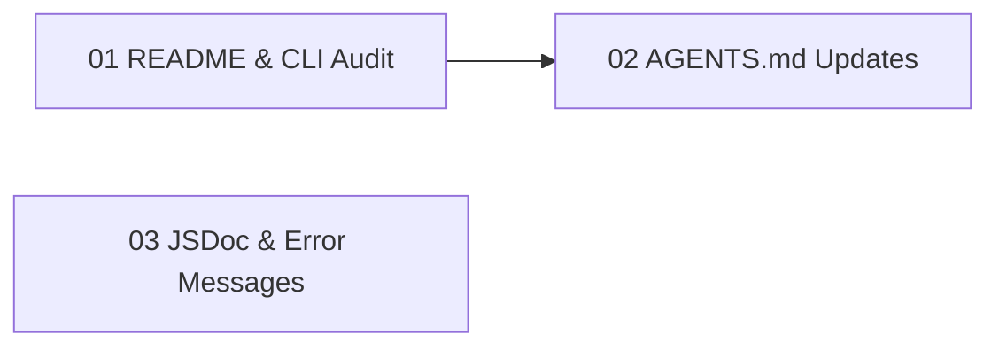

# Gate 09: Documentation & Polish

> Post-MVP documentation accuracy pass. Ensure README, CLI/MCP references, and AGENTS.md
> reflect the actual implementation. Add JSDoc to public APIs.

**Status**: in_progress
**Type**: documentation
**Created**: 2026-03-14
**Sequence**: 9 of 10
**Hash**: #g09docs

<!-- Status lifecycle:
  - pending: Gate generated at init, requirements not yet decomposed
  - in_progress: Gate started via `zeno gates start`, requirements generated
  - completed: All requirements tested, gate approved
  - archived: Gate completed and moved to archive with final artifacts
  - rejected: Gate rejected during review
  - cancelled: Gate cancelled/dropped with optional reason
  - backlog: Gate deferred to later implementation
-->

## Overview

Clean up README.md and other documentation to reflect the actual MVP implementation. Ensure CLI command reference matches implemented commands, AGENTS.md accurately describes workflows, and inline code comments are present on public APIs. No example projects, no media, no tutorials, no contribution guidelines — just accurate documentation.

## Objectives

- [ ] Update README.md to reflect actual MVP features and remove references to unimplemented features
- [ ] Audit CLI command reference and MCP tool reference against implemented code
- [ ] Update root AGENTS.md and `zeno/AGENTS.md` to reflect MVP workflows
- [ ] Add JSDoc comments to public API functions exported from `src/`
- [ ] Review CLI and MCP error messages for clarity and actionable context

## Context

### What Was Completed Before This Gate

Gates 01-08 (MVP) established:

- All core Zeno functionality: gates, requirements, proposals, validation, approval, git integration, rescope
- 45 MCP tools registered
- Full CLI command suite
- Shell validation runner, approval audit trail, worktree manager, rescope hardening

### What This Gate Enables

- **User Onboarding**: Accurate README enables new users to get started
- **Developer Experience**: JSDoc on public APIs improves IDE support
- **Maintenance**: Accurate docs reduce support burden

### Scope Boundaries

**In Scope**:

- README.md accuracy pass
- CLI/MCP command reference audit
- AGENTS.md updates (root + zeno/)
- JSDoc on public APIs
- Error message review

**Out of Scope**:

- Example projects
- Video walkthroughs, GIF animations, screenshots
- Tutorials (greenfield, existing codebase)
- Contribution guidelines (CONTRIBUTING.md)
- Glossary, FAQ, troubleshooting guide
- Performance tuning guide
- Blog posts, marketing materials

---

## Requirements

### Project Requirements (Attributed to This Gate)

| Hash                  | Name                                                             | Type       | Priority | How This Gate Addresses It                                                       |
| --------------------- | ---------------------------------------------------------------- | ---------- | -------- | -------------------------------------------------------------------------------- |
| #d4820760c1f41260    | Generate AGENTS.md files for AI context and tool usage guidance  | functional | must     | Update root and `zeno/` AGENTS.md to reflect actual MVP workflows                |
| #cb19655eee60ab38    | Provide CLI interface for all Zeno operations via Commander.js   | functional | must     | CLI command reference audited against implemented commands and corrected          |
| #10a621a3715172ae    | Expose all operations as MCP tools for LLM invocation            | functional | must     | MCP tool reference audited against registered tool schemas and corrected          |

### Gate-Specific Requirements

**Status**: Requirements will be generated when gate is started.

### Inherited/Transferred Requirements

No inherited or transferred requirements at this time.

### Requirement-to-Task Breakdown

Individual tasks are created during proposal generation.

---

## Proposals

**Status**: Proposals will be generated when gate is started.

### Proposal Status

| Proposal                  | Hash                   | Status  | Notes                               |
| ------------------------- | ---------------------- | ------- | ----------------------------------- |
| 01-readme-cli-audit       | #f3c9a1d4b8e70291     | pending | Independent; run first              |
| 02-agents-md-updates      | #7e4b2f8ca15d3096     | pending | Requires 01 (README & CLI audit)    |
| 03-jsdoc-error-messages   | #2d8f6a3e9c1b4075     | pending | Independent; can run in parallel    |

### Proposal Dependency Graph

### High-Level Delta (Gate Completion Summary)

To be populated after gate completion. Will summarise documentation accuracy improvements: README accuracy pass, CLI/MCP reference audit results, AGENTS.md updates, JSDoc additions to public APIs, and error message review outcomes.

---

## Architecture Diagrams

| Name                         | Type            | Order | Status  |
| ---------------------------- | --------------- | ----- | ------- |
| System Overview              | system-overview | 1     | pending |
| Data Flow Diagram            | data-flow       | 2     | pending |
| Gate Lifecycle State Machine | gate-lifecycle  | 3     | pending |
| Gate Roadmap                 | gate-roadmap    | 4     | pending |
| System Context Diagram       | context         | 5     | pending |

---

## Technical Decisions for This Gate

### 1. Minimal Documentation Scope

- **Choice**: Only update existing documentation for accuracy; no new documentation artifacts
- **Alternatives Considered**: Full documentation suite (tutorials, guides, FAQ), generated API docs
- **Rationale**: Post-MVP polish should be minimal. Accurate existing docs > comprehensive new docs.
- **Impact**: Users get accurate README and CLI reference; no tutorials or guides
- **Trade-offs**: Gained focus and speed; no onboarding tutorials (acceptable for post-MVP)

### 2. JSDoc Over Generated Docs

- **Choice**: Add JSDoc inline comments rather than generating documentation sites
- **Alternatives Considered**: TypeDoc site generation, Storybook for components
- **Rationale**: JSDoc provides IDE-integrated documentation without build steps or hosting. Most effective for developer experience.
- **Impact**: Public APIs documented inline; no separate documentation site
- **Trade-offs**: Gained simplicity and IDE integration; no browsable API docs site

## Architecture Updates

### Components Modified or Created

No new components. This gate modifies documentation only:

- **README.md** — Updated to reflect MVP features
- **AGENTS.md** (root) — Updated to reflect MVP gate structure
- **zeno/AGENTS.md** — Updated to reflect actual workflows
- **src/** (public exports) — JSDoc comments added to exported functions

### Diagram Updates

No diagram changes required (documentation-only gate).

### Integration Points

No integration changes (documentation-only gate).

## Gate-Specific Quality Considerations

### Security Considerations

- Ensure no credentials, tokens, or internal paths appear in documentation
- Code examples must not demonstrate insecure patterns

### Performance Requirements

No performance requirements (documentation-only gate).

## Dependencies

### External Dependencies (New or Updated)

No new external dependencies required.

### Internal Dependencies

- **Depends on Gate(s)**: Gate 08: MVP Hardening (MVP must be complete before docs polish)
- **Blocks Gate(s)**: None
- **Requires Modules**: None (documentation-only)

### Infrastructure Dependencies

No infrastructure changes required.

## Implementation Steps

1. **Define Acceptance Tests**
   - Create checklist of documentation accuracy criteria
   - Verify CLI commands documented match implemented commands

2. **Audit README.md**
   - Compare documented features against implemented code
   - Update quick start section end-to-end
   - Remove references to deferred features

3. **Audit CLI and MCP References**
   - Cross-reference CLI commands with implemented handlers
   - Cross-reference MCP tools with registered tool schemas
   - Update examples to be accurate and runnable

4. **Update AGENTS.md Files and Add JSDoc**
   - Update root and zeno/ AGENTS.md files
   - Add JSDoc to public API functions in `src/`
   - Review error messages for clarity

5. **Test Cleanup**
   - Verify all documented commands work as described
   - Ensure no references to unimplemented features remain

## Risks & Mitigation

| Risk | Likelihood | Impact | Mitigation |
| ---- | ---------- | ------ | ---------- |
| README or CLI reference diverges from implementation during gate-08 late commits | Medium | Medium | Audit performed against final gate-08 tag; re-verify any gate-08 changes merged after gate-09 starts |
| JSDoc additions cause TypeScript strict-mode errors | Low | Low | Only add comments, no type changes; run `tsc --noEmit` as part of task verification |
| AGENTS.md updates conflict with AI agent workflows in flight | Low | Medium | Review current active agent sessions before updating AGENTS.md; document migration note in change log |

## Known Issues & Limitations

- **No automated doc drift detection**: README and CLI reference accuracy is validated manually during this gate; no tooling enforces ongoing sync.
- **JSDoc coverage is best-effort**: Only public API functions exported from `src/index.ts` are in scope; internal utilities are not documented.
- **MCP tool reference is static markdown**: The MCP tool list in docs is hand-maintained; no auto-generation from registered schemas in this gate.

## Gate Completion Criteria

- [ ] README.md accurately reflects MVP features
- [ ] CLI command reference matches implemented commands
- [ ] MCP tool reference matches registered tools
- [ ] Root AGENTS.md and zeno/AGENTS.md updated for MVP
- [ ] JSDoc comments on all public API functions
- [ ] Error messages reviewed for clarity and actionable context
- [ ] No references to unimplemented features in documentation

## Notes

### Implementation Notes

- This is a documentation-only gate — no new code beyond JSDoc comments
- Originated from old gate 14, renumbered to gate 09

### Next Gate Preview

Gate 10 (Subagent Orchestration & Parallel Execution) is a deferred post-MVP gate that will be decomposed into multiple gates when ready.

---

**Document Version**: 1.0.0
**Last Updated**: 2026-03-14
**Versioning**: SemVer; bump on any change (minimum: PATCH).
**Owner**: Zeno
**Reviewers**: Zeno

### Change Log

| Version | Date       | Summary                                           | Author |
| ------- | ---------- | ------------------------------------------------- | ------ |
| 1.0.0   | 2026-03-14 | Renumbered from gate 14; scoped to docs accuracy  | Zeno   |

**Related Documents**:

- Project PRD: `zeno/overview/PROJECT_PRD.md`
- Previous Gate: `zeno/gates/gate-08-mvp-hardening.md`
- Next Gate: `zeno/gates/gate-10-subagent-orchestration-parallel-execution.md`
- Architecture: `zeno/architecture/`
