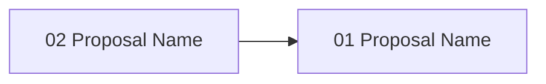

# Gate 09: Human Approval & Rejection Workflow

**Status**: pending
**Type**: feature
**Created**: 2026-02-04
**Sequence**: 9 of 14
**Hash**: #g09approval

<!-- Status lifecycle:
  - pending: Gate generated at init, requirements not yet decomposed
  - in_progress: Gate started via `zeno gates start`, requirements generated
  - completed: All requirements tested, gate approved
  - archived: Gate completed and moved to archive with final artifacts
  - rejected: Gate rejected during review
  - cancelled: Gate cancelled/dropped with optional reason
  - backlog: Gate deferred to later implementation
-->

## Overview

Implements human approval workflow for reviewing, approving, or rejecting validated proposals. This gate delivers approve/reject commands with feedback capture, approval status tracking, rejection feedback that feeds context back to LLMs for iteration, and basic audit trail. Human approval gates are quality checkpoints where humans make final go/no-go decisions before code is merged.

## Objectives

- [ ] Implement `zeno proposal approve <hash>` and `zeno proposal reject <hash>` commands
- [ ] Implement approval status tracking (pending, approved, rejected) with metadata
- [ ] Implement rejection feedback capture (free-form + predefined categories)
- [ ] Feed rejection context back to LLM via MCP tool for iteration
- [ ] Support gate-level approval (`zeno gates complete` requires all proposals approved)
- [ ] Create approval audit trail (log all decisions with context)

## Context

### What Was Completed Before This Gate

Gate 01-08 established:

- Core infrastructure and CLI framework
- Gate and requirement generation
- MCP server and proposal generation
- Automated validation framework

### What This Gate Enables

- **Gate 10 (Git Integration)**: Only approved proposals committed to git
- **Iterative improvement**: LLMs iterate on rejected proposals using feedback context

### Scope Boundaries

**In Scope**:

- `zeno proposal approve` and `zeno proposal reject` commands
- Approval status tracking (pending, approved, rejected)
- Rejection feedback capture with categories
- Approval audit trail with metadata
- Rejection context fed back to LLM via MCP
- Gate-level approval enforcement
- Comprehensive test coverage (90% minimum)

**Out of Scope**:

- Multiple reviewer/multi-level approval
- Cloud agent auto-approval
- Managed replan engine with iteration counters
- Approval notifications/email integration
- Role-based access control
- Web UI for approval
- Integration with external approval systems

## Requirements

### Project Requirements (Attributed to This Gate)

| Hash    | Name                      | Type       | Priority | How This Gate Addresses It                       |
| ------- | ------------------------- | ---------- | -------- | ------------------------------------------------ |
| #[hash] | Human Decision Authority  | functional | must     | Humans approve all proposals before code merge   |
| #[hash] | Structured Feedback       | functional | must     | Rejections include feedback for LLM iteration    |
| #[hash] | Audit Trail               | functional | must     | All approval decisions tracked with context      |
| #[hash] | Simple Workflow           | constraint | should   | Approve or reject with feedback; no replan loop  |

### Gate-Specific Requirements

**Status**: Requirements will be generated when gate is started.

### Inherited/Transferred Requirements

No inherited or transferred requirements at this time.

### Requirement-to-Task Breakdown

Individual tasks are created during proposal generation (`/zeno-proposal`).

---

## Proposals

**Status**: Proposals will be generated when gate is started.

### Proposal Status

| Proposal        | Hash    | Status  | Notes            |
| --------------- | ------- | ------- | ---------------- |
| [proposal-name] | #[hash] | pending | [Optional notes] |

### Proposal Dependency Graph

### High-Level Delta (Gate Completion Summary)

[To be populated on gate completion.]

**Key Deliverables**:

- Approve/reject CLI commands
- Rejection feedback for LLM iteration
- Approval audit trail

**Quality Metrics**: Coverage [X]%, Security [Y] issues, Lint <[Z]%

---

## Architecture Diagrams

| Name                         | Type            | Order | Status  |
| ---------------------------- | --------------- | ----- | ------- |
| System Overview              | system-overview | 1     | pending |
| Data Flow Diagram            | data-flow       | 2     | pending |
| Gate Lifecycle State Machine | gate-lifecycle  | 3     | pending |
| Gate Roadmap                 | gate-roadmap    | 4     | pending |
| System Context Diagram       | context         | 5     | pending |

---

## Technical Decisions for This Gate

### 1. Rejection Feedback as LLM Context

- **Choice**: Store rejection feedback and expose via MCP tool; LLM uses it for iteration autonomously
- **Alternatives Considered**: Managed replan engine with iteration limits, automatic retry loops
- **Rationale**: LLMs can iterate on rejection feedback without a managed subsystem. Zeno stores the feedback; the LLM decides what to do with it. Keeps Gate 09 focused on approval workflow, not execution control.
- **Impact**: Simple feedback loop; no iteration management overhead
- **Trade-offs**: Gained simplicity; no automatic retry management (acceptable for MVP)

### 2. Single Reviewer MVP

- **Choice**: Single reviewer approval
- **Alternatives Considered**: Multi-reviewer with quorum, role-based approval chains
- **Rationale**: Simplifies workflow for solo developer or small team
- **Impact**: One approval per proposal sufficient for gate completion
- **Trade-offs**: Gained simplicity; no multi-reviewer governance (acceptable for MVP)

## Architecture Updates

### Components Modified or Created

- **ApprovalManager** (`src/approval/approval-manager.ts`)
  - Purpose: Track approval status and manage approval workflow
  - Changes: New component
  - Interfaces: `approve(hash, notes)`, `reject(hash, feedback, category)`, `getStatus(hash)`

- **RejectionFeedback** (`src/approval/rejection-feedback.ts`)
  - Purpose: Capture and store rejection feedback with categories
  - Changes: New component
  - Interfaces: `captureFeedback(hash, text, category)`, `getFeedback(hash)`

- **AuditTrail** (`src/approval/audit-trail.ts`)
  - Purpose: Log all approval decisions with metadata
  - Changes: New component
  - Interfaces: `logDecision(hash, action, metadata)`, `getHistory(hash)`

### Diagram Updates

- System Overview: `zeno/architecture/system-overview.md` - Add approval workflow module
- Data Flow: `zeno/architecture/data-flow.md` - Add approval/rejection feedback flow

### Integration Points

- **MCP Server**: Rejection context exposed for LLM consumption
- **Proposal System**: Approval status gates proposal progression
- **Gate System**: Gate completion requires all proposals approved

## Gate-Specific Quality Considerations

### Security Considerations

- Approval metadata (approver identity, timestamps) must be tamper-resistant in SQLite
- Rejection feedback should be sanitized before storage

## Dependencies

### External Dependencies (New or Updated)

No new external dependencies required.

### Internal Dependencies

- **Depends on Gate(s)**: Gate 08: Automated Validation — proposals must be validated before approval
- **Blocks Gate(s)**: Gate 10: Git Integration
- **Requires Modules**: Proposal storage, Validation orchestrator, Function Registry

### Infrastructure Dependencies

- Approval audit log table in SQLite database

## Implementation Steps

1. **Define Acceptance Tests**
   - Write tests for approval/rejection commands, status tracking, and audit trail
   - Tests establish the contract before implementation begins

2. **Implement Approval Status Tracking**
   - SQLite schema for approval status and metadata
   - Status transitions: pending → approved/rejected

3. **Implement Approve/Reject Commands**
   - `zeno proposal approve <hash>` with optional notes
   - `zeno proposal reject <hash>` with feedback and category

4. **Build Rejection Feedback System**
   - Free-form text + predefined categories (quality, requirement mismatch, scope creep)
   - Expose feedback via MCP tool for LLM consumption

5. **Implement Gate-Level Approval**
   - `zeno gates complete` enforces all proposals approved
   - Create audit trail for all decisions

6. **Test Cleanup**
   - Refine tests, add edge cases, ensure coverage ≥90%

## Known Issues & Limitations

### Current Limitations

- Single reviewer only — no multi-reviewer or quorum support
- No managed replan engine; LLM handles iteration autonomously

### Technical Debt

- Multi-reviewer support may be needed for team adoption — plan for post-MVP

### Future Improvements

- Multi-level approval chains — deferred to post-MVP
- Approval notifications — deferred to post-MVP

## Risks & Mitigation

### Technical Risks

1. **Feedback Quality**
   - **Impact**: Medium
   - **Probability**: Medium
   - **Mitigation**: Predefined categories guide structured feedback; free-form allows detail
   - **Contingency**: LLM re-requests clarification via MCP tool

### Process Risks

1. **Human Bottleneck**
   - **Impact**: High
   - **Probability**: Medium
   - **Mitigation**: Clear proposal summaries reduce review time; batch approval for related proposals
   - **Contingency**: Gate 13 (post-MVP) adds auto-approval for agent-orchestrated mode

## Gate Completion Criteria

- [ ] All must-have requirements implemented and tested
- [ ] All should-have requirements implemented or explicitly deferred
- [ ] All proposals completed and approved
- [ ] All acceptance criteria met
- [ ] Architecture diagrams updated
- [ ] Gate-specific quality considerations addressed
- [ ] Stakeholder approval obtained
- [ ] `zeno proposal approve <hash>` records approval with metadata
- [ ] `zeno proposal reject <hash>` records rejection with feedback
- [ ] Approval status correctly transitions (pending → approved/rejected)
- [ ] Audit trail tracks all approval decisions
- [ ] Rejection feedback categories available
- [ ] Rejection context accessible via MCP for LLM consumption
- [ ] Gate-level approval enforced
- [ ] All tests passing with TypeScript strict mode
- [ ] Test coverage ≥90% for approval module
- [ ] Zero lint errors, zero type errors

## Notes

### Implementation Notes

- Rejection categories should be extensible — stored as strings, not an enum
- Audit trail entries should include ISO 8601 timestamps

### Proposal Summary

| Proposal Hash | Summary                                           |
| ------------- | ------------------------------------------------- |
| #[hash]       | [1-2 sentence summary of proposal work completed] |

### Next Gate Preview

Gate 10 (Git Integration & Commit Automation) will implement git worktree management, pre-commit hooks, structured commit messages, and gate release tagging.

---

**Document Version**: 1.1.0
**Last Updated**: 2026-02-27
**Versioning**: SemVer; bump on any change (minimum: PATCH).
**Owner**: Zeno
**Reviewers**: Zeno

### Change Log

| Version | Date       | Summary                           | Author |
| ------- | ---------- | --------------------------------- | ------ |
| 1.0.0   | 2026-02-04 | Initial version                   | Zeno   |
| 1.1.0   | 2026-02-27 | Aligned with gate-prd-template.md | Zeno   |

**Related Documents**:

- Project PRD: `zeno/PROJECT_PRD.md`
- Previous Gate: `zeno/gates/gate-08-automated-validation-quality-gates.md`
- Next Gate: `zeno/gates/gate-10-git-integration-commit-automation.md`
- Architecture: `zeno/architecture/`
