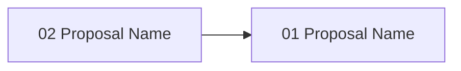

# Gate 10: Git Integration & Commit Automation

**Status**: pending
**Type**: feature
**Created**: 2026-02-04
**Sequence**: 10 of 14
**Hash**: #g10gitint

<!-- Status lifecycle:
  - pending: Gate generated at init, requirements not yet decomposed
  - in_progress: Gate started via `zeno gates start`, requirements generated
  - completed: All requirements tested, gate approved
  - archived: Gate completed and moved to archive with final artifacts
  - rejected: Gate rejected during review
  - cancelled: Gate cancelled/dropped with optional reason
  - backlog: Gate deferred to later implementation
-->

## Overview

Implements Git integration layer enabling approved proposals to be automatically committed with proper workflow coordination. This gate delivers git worktree management for isolated parallel development, structured commit message generation, and gate release tagging. Git worktrees enable multiple agents to work simultaneously on independent proposals without branch switching delays. This gate transforms Zeno from a planning tool into an executable system where proposals automatically flow to git as atomic, properly-attributed commits.

## Objectives

- [ ] Implement git worktree management (create, remove, list, prune, merge) via MCP tools
- [ ] Update proposal workflow to use worktrees (create on start, merge on approve)
- [ ] Implement worktree conflict detection and expiration policy
- [ ] Implement structured commit message generation with proposal hash references
- [ ] Implement gate release tagging on gate completion
- [ ] Build git status integration with Zeno state

## Context

### What Was Completed Before This Gate

Gate 01-09 established:

- Core infrastructure and CLI framework
- Gate and requirement generation
- MCP server and proposal generation
- Automated validation framework
- Human approval workflow
- Multi-repo support

### What This Gate Enables

- **Gate 11 (Rescope & Replan)**: Git history enables rescope impact analysis
- **Production Release**: Approved proposals committed with proper attribution and tagging
- **Audit Compliance**: All changes tracked with structured commit messages

### Scope Boundaries

**In Scope**:

- Git worktree creation, management, and cleanup
- Worktree expiration policy and auto-cleanup
- Conflict detection between concurrent proposals
- Proposal status integration with worktree (create on start, cleanup on approve)
- Structured commit message generation
- Gate release tagging
- `zeno worktree` commands (list, prune, remove)
- Git status integration with Zeno state
- File-level conflict detection between concurrent proposals across repos
- Comprehensive test coverage (90% minimum)

**Out of Scope**:

- Pre-commit hook installation (user's project manages git hooks; Husky/lint-staged is the appropriate tool)
- Rollback mechanism (git worktree remove and branch deletion handle cleanup natively; no Zeno layer needed)
- Subproject git syncing (`zeno repos sync`) — deferred post-MVP
- Git branch strategy beyond worktree-based approach
- Rebase vs. merge strategy (configurable, not enforced)
- Squash commit automation (manual user choice)
- GitHub/GitLab integration (git-native only)
- Release notes generation
- Version bump automation (semantic versioning)
- Changelog management
- Git server authentication (user's git credentials)
- Continuous integration/deployment

## Requirements

<!-- Requirements-First Workflow:
  1. Project-level requirements: PRIMARILY defined during `zeno init` at project inception (BEFORE gates).
  2. Gate generation (`/zeno-gate`): Attributes existing project-level requirements to gates.
  3. Gate start (`zeno gates start`): Generates gate-specific requirements that decompose
     project requirements and gate objectives into actionable items.
  4. Proposal generation (`/zeno-proposal`): Breaks requirements down into individual tasks.

  Workflow: Requirements (init - PRIMARY) → Gates (attribute, may update/add during rescope) → Gate Requirements (decompose) → Tasks (proposals)
-->

### Project Requirements (Attributed to This Gate)

| Hash | Name | Type | Priority | How This Gate Addresses It |
| --- | --- | --- | --- | --- |
| #[hash] | Isolated Parallel Development | functional | must | Worktrees enable agents to work on independent proposals |
| #[hash] | Atomic Commits | functional | must | Approved proposals committed as single attributed commits |
| #[hash] | Audit Trail | functional | must | Structured commit messages trace changes to proposals |

### Gate-Specific Requirements

**Status**: Requirements will be generated when gate is started.

After gate start, view detailed requirement information via: `zeno req show <hash>`

### Inherited/Transferred Requirements

No inherited or transferred requirements at this time.

### Requirement-to-Task Breakdown

Individual tasks are created during proposal generation (`/zeno-proposal`).

---

## Proposals

**Status**: Proposals will be generated when gate is started.

### Proposal Status

| Proposal | Hash | Status | Notes |
| --- | --- | --- | --- |
| [proposal-name] | #[hash] | pending | [Optional notes] |

### Proposal Dependency Graph

### High-Level Delta (Gate Completion Summary)

[To be populated on gate completion.]

**Key Deliverables**:

- Git worktree management (create, merge, prune)
- Structured commit messages and gate release tagging

**Quality Metrics**: Coverage [X]%, Security [Y] issues, Lint <[Z]%

---

## Architecture Diagrams

| Name | Type | Order | Status |
| --- | --- | --- | --- |
| System Overview | system-overview | 1 | pending |
| Data Flow Diagram | data-flow | 2 | pending |
| Gate Lifecycle State Machine | gate-lifecycle | 3 | pending |
| Gate Roadmap | gate-roadmap | 4 | pending |
| System Context Diagram | context | 5 | pending |
| Component Diagram | component | 6 | pending |

---

## Technical Decisions for This Gate

### 1. Git Worktree Strategy

- **Choice**: Create isolated worktree per proposal, merge on approval, cleanup after merge
- **Alternatives Considered**: Branch switching per proposal, single shared worktree, full clones per proposal
- **Rationale**: Worktrees provide isolated filesystem without branch switching delays. Eliminates 5-10 second overhead per switch. Enables true parallelization.
- **Impact**: Each proposal gets dedicated filesystem; merge coordination required
- **Trade-offs**: Gained parallel execution; added disk space overhead and merge coordination complexity

### 2. Conflict Detection Strategy

- **Choice**: Pre-check for file overlaps before allowing parallel execution, serialize conflicting proposals
- **Alternatives Considered**: Optimistic parallel execution with conflict resolution, manual user arbitration
- **Rationale**: Prevents merge conflicts proactively. LLMs can understand dependency chains and sequence proposals correctly.
- **Impact**: Slightly limited parallelization when proposals touch same files
- **Trade-offs**: Gained safety; reduced parallelism for overlapping proposals

### 3. Worktree Expiration

- **Choice**: Configurable expiration policy (default 7 days), auto-cleanup of expired worktrees
- **Alternatives Considered**: Manual cleanup only, never expire
- **Rationale**: Prevents disk space exhaustion from orphaned worktrees
- **Impact**: Stale worktrees automatically cleaned; configurable to prevent premature deletion
- **Trade-offs**: Gained automation; may delete in-progress work if expiration too aggressive

## Architecture Updates

### Components Modified or Created

- **WorktreeManager** (`src/git/worktree-manager.ts`)
  - Purpose: Create, remove, list, prune worktrees
  - Changes: New component
  - Interfaces: `create(hash)`, `remove(path)`, `list()`, `prune()`

- **WorktreeStatusTracker** (`src/git/worktree-status-tracker.ts`)
  - Purpose: Track worktree lifecycle and expiration
  - Changes: New component
  - Interfaces: `trackStatus(hash, status)`, `getExpired()`

- **ConflictDetector** (`src/git/conflict-detector.ts`)
  - Purpose: Identify file overlaps between proposals
  - Changes: New component (may share logic with Gate 08 shared module)
  - Interfaces: `detectOverlaps(proposals): Conflict[]`

- **CommitMessageGenerator** (`src/git/commit-message-generator.ts`)
  - Purpose: Create structured commit messages with proposal hash references
  - Changes: New component
  - Interfaces: `generate(proposal): string`, `parse(message): ProposalRef`

- **PreCommitHookManager** (`src/git/pre-commit-hook-manager.ts`)
  - Purpose: Install and manage pre-commit hooks
  - Changes: New component
  - Interfaces: `install()`, `uninstall()`, `execute(): ValidationResult`

- **MergeCoordinator** (`src/git/merge-coordinator.ts`)
  - Purpose: Manage merge ordering and conflict resolution
  - Changes: New component
  - Interfaces: `merge(worktreePath)`, `resolveConflict(strategy)`

### Diagram Updates

- System Overview: `zeno/architecture/system-overview.md` - Add git integration layer
- Data Flow: `zeno/architecture/data-flow.md` - Add worktree lifecycle and merge flow

### Integration Points

- **Proposal System**: Proposal start creates worktree; proposal approve merges and cleans up
- **Validation System**: Pre-commit hooks invoke validation orchestrator from Gate 08
- **MCP Server**: Worktree operations exposed as MCP tools
- **Gate System**: Gate completion creates release tag
- **Multi-Repo (Gate 06)**: Subproject sync pulls gate changes across repos

## Gate-Specific Quality Considerations

### Security Considerations

- Worktree paths must be sanitized to prevent directory traversal
- Pre-commit hook bypass must be logged in audit trail
- Git operations must not expose credentials or tokens

### Performance Requirements

- Worktree creation should complete within 3 seconds
- Merge operations should complete within 10 seconds for typical proposals
- Worktree pruning should handle 100+ worktrees without timeout

## Dependencies

### External Dependencies (New or Updated)

No new external dependencies. Uses git CLI commands.

### Internal Dependencies

- **Depends on Gate(s)**: Gate 08: Validation (pre-commit hooks invoke validation), Gate 09: Approval (merge on approve)
- **Blocks Gate(s)**: Gate 11: Rescope & Replan, Gate 13: Subagent Orchestration
- **Requires Modules**: Proposal storage, Validation orchestrator, Approval manager

### Infrastructure Dependencies

- Git must be installed and configured in the project
- `.local/worktrees/` directory for worktree storage

## Implementation Steps

1. **Define Acceptance Tests**
   - Write tests for worktree operations, merge logic, commit message generation
   - Tests establish the contract before implementation begins

2. **Implement Worktree Management**
   - Create, remove, list, prune operations
   - Status tracking and expiration policy

3. **Build Conflict Detection and Merge Coordination**
   - File-level overlap detection
   - Merge ordering based on dependencies

4. **Update Proposal Workflow**
   - `zeno proposal start` creates worktree
   - `zeno proposal approve` merges and cleans up

5. **Implement Pre-Commit Hooks and Commit Messages**
   - Hook installer and quality validation integration
   - Structured commit message generation with proposal references

6. **Build Gate Tagging and Rollback**
   - Gate release tagging on completion
   - Rollback mechanism for rejected proposals

7. **Implement Subproject Sync**
   - `zeno repos sync` command
   - Cross-repo gate change propagation

8. **Test Cleanup**
   - Refine tests, add edge cases, ensure coverage ≥90%

## Known Issues & Limitations

### Current Limitations

- No rebase vs. merge strategy enforcement (user choice)
- No GitHub/GitLab platform integration (git-native only)
- No squash commit automation

### Technical Debt

- Worktree cleanup may leave orphaned branches if process crashes — plan for periodic cleanup

### Future Improvements

- GitHub/GitLab PR integration — deferred to post-MVP
- Release notes generation — deferred to post-MVP
- Semantic version bumping — deferred to post-MVP

## Risks & Mitigation

### Technical Risks

1. **Merge Conflicts**
   - **Impact**: High
   - **Probability**: Medium
   - **Mitigation**: Pre-check file overlaps; serialize conflicting proposals
   - **Contingency**: Escalate to human for manual conflict resolution

2. **Orphaned Worktrees**
   - **Impact**: Medium
   - **Probability**: Medium
   - **Mitigation**: Expiration policy with auto-cleanup; `zeno worktree prune` command
   - **Contingency**: Manual cleanup via `zeno worktree remove`

3. **Cross-Repo Sync Conflicts**
   - **Impact**: Medium
   - **Probability**: Low
   - **Mitigation**: Detect conflicts before applying sync; escalate to user
   - **Contingency**: Manual merge resolution

### Process Risks

1. **Pre-Commit Hook Bypass**
   - **Impact**: Medium
   - **Probability**: Low
   - **Mitigation**: Bypass logged in audit trail; post-commit validation as safety net
   - **Contingency**: Review audit trail for bypassed commits

## Gate Completion Criteria

- [ ] All must-have requirements implemented and tested
- [ ] All should-have requirements implemented or explicitly deferred
- [ ] All proposals completed and approved
- [ ] All acceptance criteria met
- [ ] Architecture diagrams updated
- [ ] Gate-specific quality considerations addressed
- [ ] Stakeholder approval obtained
- [ ] Worktree creation creates isolated directory with proper branch setup
- [ ] `zeno proposal start` creates worktree and returns path to agent
- [ ] `zeno proposal approve` merges worktree branch and cleans up
- [ ] Conflict detection prevents concurrent proposals from modifying same files
- [ ] Merge conflicts detected and escalated (not auto-resolved)
- [ ] Pre-commit hooks execute quality checks before commit
- [ ] Commit messages include proposal hash and structured format
- [ ] Gate release tags created correctly on gate completion
- [ ] Rollback reverts proposal changes while preserving records
- [ ] Worktree expiration policy works (cleanup after configured time)
- [ ] `zeno worktree list/prune/remove` commands functional
- [ ] Git status integration shows which proposals modify which files
- [ ] `zeno repos sync` pulls gate changes from completed subprojects
- [ ] All tests passing with TypeScript strict mode
- [ ] Test coverage ≥90% for git integration module
- [ ] Zero lint errors, zero type errors

## Notes

### Implementation Notes

- Worktree paths should follow `.local/worktrees/{hash}/` convention
- Commit message format: `type(scope): subject (#proposalHash)`
- Gate tags should be sortable: `gate-XX-name` format

### Proposal Summary

| Proposal Hash | Summary |
| --- | --- |
| #[hash] | [1-2 sentence summary of proposal work completed] |

### Next Gate Preview

Gate 11 (Rescope & Replan Engine) will implement mid-project scope adjustment capabilities, including rescope detection, future gate regeneration, and requirement transfer.

---

**Document Version**: 1.1.0
**Last Updated**: 2026-02-27
**Versioning**: SemVer; bump on any change (minimum: PATCH).
**Owner**: Zeno
**Reviewers**: Zeno

### Change Log

| Version | Date | Summary | Author |
| --- | --- | --- | --- |
| 1.0.0 | 2026-02-04 | Initial version | Zeno |
| 1.1.0 | 2026-02-27 | Aligned with gate-prd-template.md | Zeno |

**Related Documents**:

- Project PRD: `zeno/PROJECT_PRD.md`
- Previous Gate: `zeno/gates/gate-09-human-approval-rejection-workflow.md`
- Next Gate: `zeno/gates/gate-11-rescope-replan-engine.md`
- Architecture: `zeno/architecture/`
