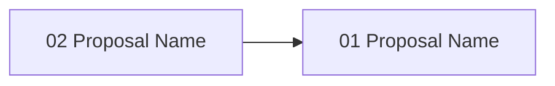

# Gate 11: Rescope & Replan Engine

**Status**: pending
**Type**: feature
**Created**: 2026-02-04
**Sequence**: 11 of 14
**Hash**: #g11rescope

<!-- Status lifecycle:
  - pending: Gate generated at init, requirements not yet decomposed
  - in_progress: Gate started via `zeno gates start`, requirements generated
  - completed: All requirements tested, gate approved
  - archived: Gate completed and moved to archive with final artifacts
  - rejected: Gate rejected during review
  - cancelled: Gate cancelled/dropped with optional reason
  - backlog: Gate deferred to later implementation
-->

## Overview

Implements rescope and replan capabilities enabling projects to adapt to changing requirements mid-development. When a user modifies PROJECT_PRD.md (the single source of truth), `zeno rescope` detects the change, creates an immutable rescope gate documenting the transition, regenerates future gates from the current position, transfers requirements to new gates, and requires human approval before applying changes. No isolated worktrees or automatic diagram regeneration — rescope operates on the main working tree and focuses on gate/requirement management.

## Objectives

- [ ] Implement rescope detection (diff current PROJECT_PRD.md against stored end-state snapshot)
- [ ] Create rescope gate generator (type: `rescope`, documents before/after state and rationale)
- [ ] Build rescope impact analysis (which future gates affected, which requirements changed)
- [ ] Implement future gate regeneration from current position (preserve completed gates)
- [ ] Implement requirement transfer and reattribution between gates
- [ ] Implement rescope approval workflow (human must approve before changes apply)
- [ ] Implement `zeno rescope` CLI command and MCP tools

## Context

### What Was Completed Before This Gate

Gates 01-10 established:

- Full planning, proposal, validation, and execution workflow
- Git integration with worktree-based parallel execution
- All core Zeno capabilities for project execution

### What This Gate Enables

- **Gate 12 (Status & Reporting)**: Rescope state surfaced in `zeno status` MCP tool
- **Late-stage adaptability**: Projects can rescope with full confidence in impact analysis and approval

### Scope Boundaries

**In Scope**:

- Rescope detection (PROJECT_PRD.md end-state change)
- Rescope gate generation (immutable documentation of scope change)
- Future gate regeneration from current position
- Gate deletion and re-sequencing
- Requirement transfer and reattribution
- Rescope approval workflow
- `zeno rescope` CLI command + MCP tools
- Rescope history tracking in SQLite
- Comprehensive test coverage (90% minimum)

**Out of Scope**:

- Isolated rescope worktree (operates on main working tree)
- Automatic architecture diagram regeneration (LLM can regenerate via Gate 05 tools)
- Automatic AGENTS.md updates (manual or LLM-driven)
- Automatic scope optimization (humans decide scope)
- Version branching (single timeline)
- Timeline re-estimation

## Requirements

### Project Requirements (Attributed to This Gate)

| Hash | Name | Type | Priority | How This Gate Addresses It |
| --- | --- | --- | --- | --- |
| #[hash] | Mid-Project Scope Adjustment | functional | must | Projects can rescope when requirements change |
| #[hash] | Clear Impact Analysis | functional | must | Humans understand what changes on rescope |
| #[hash] | Proper Documentation | functional | must | Rescope creates audit trail with before/after |
| #[hash] | Dependency Management | functional | must | Requirements transferred and reattributed |
| #[hash] | Approval & Control | functional | must | Humans approve all scope changes |

### Gate-Specific Requirements

**Status**: Requirements will be generated when gate is started.

### Inherited/Transferred Requirements

No inherited or transferred requirements at this time.

### Requirement-to-Task Breakdown

Individual tasks are created during proposal generation (`/zeno-proposal`).

---

## Proposals

**Status**: Proposals will be generated when gate is started.

### Proposal Status

| Proposal | Hash | Status | Notes |
| --- | --- | --- | --- |
| [proposal-name] | #[hash] | pending | [Optional notes] |

### Proposal Dependency Graph

### High-Level Delta (Gate Completion Summary)

[To be populated on gate completion.]

**Key Deliverables**:

- Rescope detection and impact analysis
- Future gate regeneration
- Requirement transfer system

**Quality Metrics**: Coverage [X]%, Security [Y] issues, Lint <[Z]%

---

## Architecture Diagrams

| Name | Type | Order | Status |
| --- | --- | --- | --- |
| System Overview | system-overview | 1 | pending |
| Data Flow Diagram | data-flow | 2 | pending |
| Gate Lifecycle State Machine | gate-lifecycle | 3 | pending |
| Gate Roadmap | gate-roadmap | 4 | pending |
| System Context Diagram | context | 5 | pending |

---

## Technical Decisions for This Gate

### 1. Rescope Detection Strategy

- **Choice**: Diff current PROJECT_PRD.md end-state section against stored snapshot in SQLite
- **Alternatives Considered**: File watcher, git diff-based detection, hash comparison
- **Rationale**: PROJECT_PRD.md is single source of truth. Snapshot comparison is deterministic and simple.
- **Impact**: Requires human to modify PRD explicitly (not implicit detection)
- **Trade-offs**: Gained determinism; no automatic detection of scope drift

### 2. Rescope Gate Strategy

- **Choice**: Create immutable rescope gate (type: `rescope`) documenting scope change
- **Alternatives Considered**: In-place gate modification, separate rescope log file
- **Rationale**: Preserves history and creates visible audit trail in gate sequence
- **Impact**: Adds a gate to sequence but provides clear documentation
- **Trade-offs**: Gained auditability; slightly longer gate sequence

### 3. Future Gate Regeneration

- **Choice**: Regenerate only future gates from current position (preserve completed gates)
- **Alternatives Considered**: Regenerate all gates, modify existing gates in-place
- **Rationale**: Respects completed work. Only adjusts future scope.
- **Impact**: Completed gates are immutable; only pending/backlog gates regenerated
- **Trade-offs**: Gained stability for completed work; may not optimize past decisions

## Architecture Updates

### Components Modified or Created

- **RescopeDetector** (`src/rescope/rescope-detector.ts`)
  - Purpose: Diff PROJECT_PRD.md end-state against stored snapshot
  - Changes: New component
  - Interfaces: `detect(): RescopeDiff`, `hasChanged(): boolean`

- **RescopeGateGenerator** (`src/rescope/rescope-gate-generator.ts`)
  - Purpose: Create immutable rescope gate with impact summary
  - Changes: New component
  - Interfaces: `generate(diff): Gate`

- **FutureGateRegenerator** (`src/rescope/future-gate-regenerator.ts`)
  - Purpose: Regenerate future gates, delete obsolete ones, re-sequence
  - Changes: New component
  - Interfaces: `regenerate(fromGate)`, `deleteObsolete()`, `resequence()`

- **RequirementTransferManager** (`src/rescope/requirement-transfer-manager.ts`)
  - Purpose: Move/archive requirements between gates
  - Changes: New component
  - Interfaces: `transfer(hash, targetGate)`, `archive(hash)`

### Diagram Updates

- System Overview: `zeno/architecture/system-overview.md` - Add rescope engine module
- Data Flow: `zeno/architecture/data-flow.md` - Add rescope detection and gate regeneration flow
- Gate Lifecycle: `zeno/architecture/gate-lifecycle.md` - Add rescope transitions

### Integration Points

- **Gate System**: Rescope creates new gate, regenerates future gates
- **Requirements Database**: Requirements transferred and reattributed
- **MCP Server**: Rescope tools exposed for LLM-driven rescoping
- **SQLite**: Rescope history and end-state snapshots stored

## Gate-Specific Quality Considerations

### Security Considerations

- End-state snapshots must be tamper-resistant in SQLite
- Rescope approval must be authenticated (single approver for MVP)

## Dependencies

### External Dependencies (New or Updated)

No new external dependencies required.

### Internal Dependencies

- **Depends on Gate(s)**: Gate 10: Git Integration — git history enables impact analysis
- **Blocks Gate(s)**: Gate 12: Status & Reporting
- **Requires Modules**: Gate storage, Requirements database, Function Registry

### Infrastructure Dependencies

- End-state snapshot table in SQLite database
- Rescope history table in SQLite database

## Implementation Steps

1. **Define Acceptance Tests**
   - Write tests for rescope detection, gate regeneration, requirement transfer
   - Tests establish the contract before implementation begins

2. **Implement End-State Snapshot Storage**
   - Capture at `zeno init` and after each rescope
   - SQLite table for snapshot history

3. **Build Rescope Detection and Impact Analysis**
   - Diff current PRD against snapshot
   - Identify affected gates and requirements

4. **Implement Gate Regeneration**
   - Rescope gate generator
   - Future gate regeneration and re-sequencing
   - Gate deletion for obsolete gates

5. **Implement Requirement Transfer**
   - Transfer and reattribution logic
   - Requirement archival with `won't` priority

6. **Build Rescope Workflow**
   - Approval workflow
   - `zeno rescope` CLI command
   - MCP tools (rescope_detect, rescope_apply, rescope_review, rescope_history)

7. **Test Cleanup**
   - Refine tests, add edge cases, ensure coverage ≥90%

## Known Issues & Limitations

### Current Limitations

- Operates on main working tree only (no isolated rescope worktree)
- No automatic diagram regeneration post-rescope
- No automatic AGENTS.md updates

### Technical Debt

- Gate re-sequencing may leave stale cross-references in markdown files — plan for reference updater

### Future Improvements

- Automatic architecture diagram regeneration post-rescope — deferred to post-MVP
- Version branching for parallel scope exploration — deferred to post-MVP

## Risks & Mitigation

### Technical Risks

1. **Gate Regeneration Data Loss**
   - **Impact**: High
   - **Probability**: Low
   - **Mitigation**: Backup gate files before regeneration; rescope gate documents before-state
   - **Contingency**: Restore from git history

2. **Requirement Transfer Inconsistency**
   - **Impact**: High
   - **Probability**: Medium
   - **Mitigation**: Validate all references after transfer; atomic transaction in SQLite
   - **Contingency**: Rollback transaction on failure

### Process Risks

1. **Rescope Scope Creep**
   - **Impact**: Medium
   - **Probability**: Medium
   - **Mitigation**: Impact analysis clearly shows what changes; human approval required
   - **Contingency**: Reject rescope and iterate on PRD changes

## Gate Completion Criteria

- [ ] All must-have requirements implemented and tested
- [ ] All should-have requirements implemented or explicitly deferred
- [ ] All proposals completed and approved
- [ ] All acceptance criteria met
- [ ] Architecture diagrams updated
- [ ] Gate-specific quality considerations addressed
- [ ] Stakeholder approval obtained
- [ ] Rescope detection correctly identifies PROJECT_PRD.md end-state changes
- [ ] Rescope gate generated with before/after state and impact summary
- [ ] Impact analysis correctly identifies affected gates and requirements
- [ ] Future gates regenerated properly (completed gates preserved)
- [ ] Gate re-sequencing updates all references
- [ ] Obsolete gates deleted cleanly (no orphaned references)
- [ ] Requirements transferred and reattributed with status preserved
- [ ] `zeno rescope` CLI command functional
- [ ] MCP tools (rescope_detect, rescope_apply, rescope_review, rescope_history) functional
- [ ] Rescope history tracked in SQLite with audit trail
- [ ] All tests passing with TypeScript strict mode
- [ ] Test coverage ≥90% for rescope module
- [ ] Zero lint errors, zero type errors

## Notes

### Implementation Notes

- End-state snapshot should capture the full "End State" section of PROJECT_PRD.md
- Rescope gate type field should be `rescope` to distinguish from feature/quality gates

### Proposal Summary

| Proposal Hash | Summary |
| --- | --- |
| #[hash] | [1-2 sentence summary of proposal work completed] |

### Next Gate Preview

Gate 12 (Status & Reporting) will implement project status reporting via CLI and MCP tools, providing visibility into gate progress, requirement status, and proposal tracking.

---

**Document Version**: 1.1.0
**Last Updated**: 2026-02-27
**Versioning**: SemVer; bump on any change (minimum: PATCH).
**Owner**: Zeno
**Reviewers**: Zeno

### Change Log

| Version | Date | Summary | Author |
| --- | --- | --- | --- |
| 1.0.0 | 2026-02-04 | Initial version | Zeno |
| 1.1.0 | 2026-02-27 | Aligned with gate-prd-template.md | Zeno |

**Related Documents**:

- Project PRD: `zeno/PROJECT_PRD.md`
- Previous Gate: `zeno/gates/gate-10-git-integration-commit-automation.md`
- Next Gate: `zeno/gates/gate-12-status-reporting.md`
- Architecture: `zeno/architecture/`
