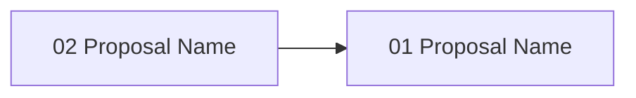

# Gate 12: Status & Reporting

**Status**: pending
**Type**: feature
**Created**: 2026-02-04
**Sequence**: 12 of 14
**Hash**: #g12status

<!-- Status lifecycle:
  - pending: Gate generated at init, requirements not yet decomposed
  - in_progress: Gate started via `zeno gates start`, requirements generated
  - completed: All requirements tested, gate approved
  - archived: Gate completed and moved to archive with final artifacts
  - rejected: Gate rejected during review
  - cancelled: Gate cancelled/dropped with optional reason
  - backlog: Gate deferred to later implementation
-->

## Overview

Implements project status reporting via `zeno status` CLI command and MCP tools. Zeno is primarily consumed as an MCP server by LLMs, so the primary interface for status is structured data returned by MCP tools. The CLI command provides a simple text summary for human verification. No TUI, no interactive dashboard, no rich terminal rendering—just queryable status data.

## Objectives

- [ ] Implement `zeno status` CLI command (text summary: project name, gate progress, active proposals, recent activity)
- [ ] Expose `project_status` MCP tool (structured project overview: gates, requirements, proposals)
- [ ] Expose `gate_summary`, `requirement_summary`, `proposal_summary` MCP tools
- [ ] Implement status data aggregation from SQLite (gate metrics, requirement distribution, proposal status)
- [ ] Compute project health indicators (blocked gates, overdue proposals, orphaned requirements)

## Context

### What Was Completed Before This Gate

Gates 01-11 established:

- Full planning, execution, rescope workflow
- All core Zeno capabilities for project management
- Git integration and commit automation
- Rescope and replan engine

### What This Gate Enables

- **MVP Completion**: Final gate for MVP release
- **LLM Visibility**: MCP tools enable LLMs to query project state and make informed decisions
- **Human Verification**: CLI command provides quick sanity check

### Scope Boundaries

**In Scope**:

- `zeno status` CLI command (plain text output)
- MCP tools for structured status queries
- SQLite-based status aggregation
- Project health indicators
- Comprehensive test coverage (90% minimum)

**Out of Scope**:

- TUI / interactive dashboard
- Rich terminal rendering (ink, blessed, or similar)
- Web-based dashboard
- Real-time updates / file watching
- Dependency graph visualization
- Keyboard navigation / search
- Performance benchmarking with large datasets
- Export functionality

## Requirements

<!-- Requirements-First Workflow:
  1. Project-level requirements: PRIMARILY defined during `zeno init` at project inception (BEFORE gates).
     These are high-level, cross-cutting requirements derived from the end state.
  2. Gate generation (`/zeno-gate`): Attributes existing project-level requirements to gates.
     Requirements are PRIMARILY mapped and attributed here, not created.
     During rebaseline/rescope: Requirements may be updated or added as part of rescoping.
  3. Gate start (`zeno gates start`): Generates gate-specific requirements that decompose
     project requirements and gate objectives into actionable items.
  4. Proposal generation (`/zeno-proposal`): Breaks requirements down into individual tasks.

  Workflow: Requirements (init - PRIMARY) → Gates (attribute, may update/add during rescope) → Gate Requirements (decompose) → Tasks (proposals)
-->

### Project Requirements (Attributed to This Gate)

| Hash | Name | Type | Priority | How This Gate Addresses It |
| --- | --- | --- | --- | --- |
| #[hash] | Project Overview | functional | must | LLMs and humans can query current project state |
| #[hash] | Gate Tracking | functional | must | Gate completion status queryable via MCP |
| #[hash] | Requirement Tracking | functional | must | Requirement status distribution queryable via MCP |
| #[hash] | Proposal Tracking | functional | should | Active proposal status queryable via MCP |

### Gate-Specific Requirements

**Status**: Requirements will be generated when gate is started.

After gate start, view detailed requirement information via: `zeno req show <hash>`

### Inherited/Transferred Requirements

No inherited or transferred requirements at this time.

### Requirement-to-Task Breakdown

Individual tasks are created during proposal generation (`/zeno-proposal`).

---

## Proposals

**Status**: Proposals will be generated when gate is started.

After gate start, view detailed proposal information via: `zeno proposal show <hash>`

### Proposal Status

| Proposal | Hash | Status | Notes |
| --- | --- | --- | --- |
| [proposal-name] | #[hash] | pending | [Optional notes] |

### Proposal Dependency Graph

<!-- Generated by /zeno-proposal when proposals are created. Shows requires relationships between proposals. -->

### High-Level Delta (Gate Completion Summary)

[To be populated on gate completion.]

**Key Deliverables**:

- Status aggregation engine
- CLI status command
- MCP status tools

**Quality Metrics**: Coverage [X]%, Security [Y] issues, Lint <[Z]%

---

## Architecture Diagrams

<!-- LLM Instructions: Populate this section with applicable architecture diagrams for this gate.
     Core diagrams (system-overview, data-flow, gate-lifecycle, gate-roadmap, context) are always included.
     For conditional diagrams, use the diagram catalogue to select additional diagrams based on this gate's scope.
     Set order numbers sequentially starting from 1 (core diagrams should come first with orders 1-5,
     then conditional diagrams with orders 6+).
-->

| Name | Type | Order | Status |
| --- | --- | --- | --- |
| System Overview | system-overview | 1 | pending |
| Data Flow Diagram | data-flow | 2 | pending |
| Gate Lifecycle State Machine | gate-lifecycle | 3 | pending |
| Gate Roadmap | gate-roadmap | 4 | pending |
| System Context Diagram | context | 5 | pending |

---

## Technical Decisions for This Gate

### 1. No TUI Framework

- **Choice**: Plain text CLI output + structured MCP responses only
- **Alternatives Considered**: Ink-based TUI, blessed terminal dashboard, web UI
- **Rationale**: Zeno is an MCP server consumed by LLMs. Interactive TUI adds complexity with no value for the primary consumer. Humans can use `zeno status` for quick checks.
- **Impact**: CLI output is simple text; all rich querying done via MCP tools
- **Trade-offs**: Gained simplicity; no visual dashboard (acceptable for MVP)

### 2. Real-Time Aggregation

- **Choice**: Direct SQLite queries, aggregated at query time
- **Alternatives Considered**: Materialized views, cached aggregation tables, event-driven updates
- **Rationale**: Project sizes are small enough that real-time aggregation is fast. No materialized views needed.
- **Impact**: Every status query hits SQLite directly; no stale data
- **Trade-offs**: Gained data freshness and simplicity; slight overhead per query (negligible for MVP scale)

## Architecture Updates

### Components Modified or Created

- **StatusAggregator** (`src/status/status-aggregator.ts`)
  - Purpose: Query SQLite for gate, requirement, proposal metrics
  - Changes: New component
  - Interfaces: `getProjectStatus()`, `getGateSummary()`, `getRequirementSummary()`, `getProposalSummary()`

- **StatusFormatter** (`src/status/status-formatter.ts`)
  - Purpose: Format aggregated data for CLI text output
  - Changes: New component
  - Interfaces: `formatProjectStatus(data): string`, `formatGateTable(gates): string`

### Diagram Updates

- System Overview: `zeno/architecture/system-overview.md` - Add status reporting module
- Data Flow: `zeno/architecture/data-flow.md` - Add status query and aggregation flow

### Integration Points

- **SQLite Database**: Direct queries for gate, requirement, and proposal metrics
- **MCP Server**: Status tools registered for LLM consumption
- **Function Registry**: Status operations registered for unified CLI + MCP access

## Gate-Specific Quality Considerations

### Performance Requirements

- Status aggregation should complete within 1 second for projects with up to 50 gates
- MCP tool responses should return within 500ms

## Dependencies

### External Dependencies (New or Updated)

No new external dependencies required.

### Internal Dependencies

- **Depends on Gate(s)**: Gate 11: Rescope & Replan — rescope state surfaced in status
- **Blocks Gate(s)**: None (final MVP gate)
- **Requires Modules**: Gate storage, Requirements database, Proposal storage

### Infrastructure Dependencies

- All existing SQLite tables (gates, requirements, proposals) must be queryable

## Implementation Steps

1. **Define Acceptance Tests**
   - Write tests for status aggregation queries and CLI output formatting
   - Tests establish the contract before implementation begins

2. **Implement StatusAggregator**
   - SQLite queries for gate completion metrics
   - Requirement status distribution per gate
   - Proposal status distribution
   - Project health indicators

3. **Implement CLI Command and Formatter**
   - `zeno status` command with plain text output
   - Gate summary table formatting

4. **Expose MCP Status Tools**
   - `project_status`, `gate_summary`, `requirement_summary`, `proposal_summary`
   - Schema validation for MCP tool responses

5. **Test Cleanup**
   - Refine tests, add edge cases, ensure coverage ≥90%
   - Validates all gate deliverables meet quality thresholds

## Known Issues & Limitations

### Current Limitations

- No real-time updates or file watching — status is queried on demand
- No export functionality (JSON, CSV, etc.)

### Technical Debt

- Large project performance (50+ gates) may need query optimization — plan for post-MVP

### Future Improvements

- Web-based dashboard — deferred to post-MVP
- Dependency graph visualization — deferred to post-MVP

## Risks & Mitigation

### Technical Risks

1. **Query Performance**
   - **Impact**: Low
   - **Probability**: Low
   - **Mitigation**: SQLite queries are fast for expected project sizes; index key columns
   - **Contingency**: Add query caching if performance degrades

### Process Risks

1. **Status Data Accuracy**
   - **Impact**: Medium
   - **Probability**: Low
   - **Mitigation**: Status derived directly from SQLite source of truth; no derived caches
   - **Contingency**: Add data consistency checks on status query

## Gate Completion Criteria

- [ ] All must-have requirements implemented and tested
- [ ] All should-have requirements implemented or explicitly deferred
- [ ] All proposals completed and approved
- [ ] All acceptance criteria met
- [ ] Architecture diagrams updated
- [ ] Gate-specific quality considerations addressed
- [ ] Stakeholder approval obtained
- [ ] `zeno status` displays project overview with gate progress table
- [ ] `project_status` MCP tool returns structured project overview
- [ ] `gate_summary` MCP tool returns gate list with status metrics
- [ ] `requirement_summary` MCP tool returns requirement distribution
- [ ] `proposal_summary` MCP tool returns active proposal status
- [ ] All aggregation queries handle edge cases (empty project, no gates, no proposals)
- [ ] All tests passing with TypeScript strict mode
- [ ] Test coverage ≥90% for status module
- [ ] Zero lint errors, zero type errors

## Notes

### Implementation Notes

- MCP tool responses should use consistent JSON schema across all status tools
- Health indicators should flag actionable issues (blocked gates, orphaned requirements)

### Proposal Summary

| Proposal Hash | Summary |
| --- | --- |
| #[hash] | [1-2 sentence summary of proposal work completed] |

### Next Gate Preview

Gate 13 (Subagent Orchestration & Parallel Execution) is a post-MVP gate that will implement multi-tier agent orchestration enabling Zeno to scale beyond single-agent constraints.

---

**Document Version**: 1.1.0
**Last Updated**: 2026-02-27
**Versioning**: SemVer; bump on any change (minimum: PATCH).
**Owner**: Zeno
**Reviewers**: Zeno

### Change Log

| Version | Date | Summary | Author |
| --- | --- | --- | --- |
| 1.0.0 | 2026-02-04 | Initial version | Zeno |
| 1.1.0 | 2026-02-27 | Aligned with gate-prd-template.md | Zeno |

**Related Documents**:

- Project PRD: `zeno/PROJECT_PRD.md`
- Previous Gate: `zeno/gates/gate-11-rescope-replan-engine.md`
- Next Gate: `zeno/gates/gate-13-subagent-orchestration-parallel-execution.md`
- Architecture: `zeno/architecture/`
