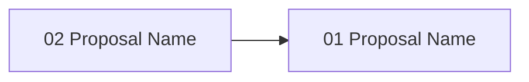

# Gate 13: Subagent Orchestration & Parallel Execution

> **POST-MVP** — This gate is deferred beyond MVP. The scope described below needs significant
> refactoring and reconsideration before implementation. It should not be worked on until
> Gates 05-12 are complete and the MVP is stable.

**Status**: deferred
**Type**: feature
**Created**: 2026-02-04
**Sequence**: post-MVP
**Hash**: #g13subagent

<!-- Status lifecycle:
  - pending: Gate generated at init, requirements not yet decomposed
  - in_progress: Gate started via `zeno gates start`, requirements generated
  - completed: All requirements tested, gate approved
  - archived: Gate completed and moved to archive with final artifacts
  - rejected: Gate rejected during review
  - cancelled: Gate cancelled/dropped with optional reason
  - backlog: Gate deferred to later implementation
-->

## Overview

Implements multi-tier agent orchestration and parallel execution enabling Zeno to scale beyond single-agent constraints. Architecture layers complexity by tier: Zeno MCP Server (planning/state), Claude/Copilot API (large-context planning decisions), CrewAI (hierarchical agent teams with inter-agent communication via Python subprocess bridge), and Ollama models (local implementation workers). This gate delivers hierarchical agent team orchestration with role-based specialization, inter-agent communication for improved parallelization, intelligent task decomposition from proposal specs, dependency-based task sequencing, worktree-per-task isolation, orchestrator-level merge coordination, file-level conflict detection, and result consolidation.

**Four-Layer Orchestration Architecture**:

1. **Zeno MCP Server** (Planning/State): Gates, proposals, requirements, templates, artifact access, agent manifest
2. **Claude/Copilot API** (Planning Phase): Reads gate PRD via MCP, generates proposal specs, validates acceptance criteria
3. **CrewAI + Python Subprocess Bridge** (Agent Orchestration): Hierarchical agent teams, inter-agent communication, task coordination, role-based specialization from agent manifest
4. **Ollama Models** (Implementation Workers): Execute tasks on isolated worktrees, use local tools (file I/O, git, commands), report results

## Dependency: Flexible Workflow Configuration (Solitary Proposal #w26021401)

Gate 13 depends on the **Flexible Workflow Configuration System** (solitary proposal #w26021401) which provides critical infrastructure:

### 1. Agent-Orchestrated Workflow Mode

- Workflow configuration defines `workflowMode: 'agent-orchestrated'` mode
- Gate 13 orchestrator operates within this mode context
- Mode-specific rules control:
  - Claude auto-approval of generated proposal specs (via `approval.autoApproveRules.byAgent`)
  - Parallel vs. sequential task execution (via `concurrency: 'parallel'`)
  - Worktree allocation per CrewAI agent (via `worktreeEnabled: true`)

### 2. Strict Validation (Non-Negotiable)

- Workflow configuration enforces **strict** validation for all modes (immutable)
- Gate 13 guarantees validation on every agent task output:
  - TypeScript strict mode: 0 errors (catches syntax errors)
  - Code coverage: ≥90% (ensures tested code)
  - Security: 0 CVEs (prevents vulnerability introduction)
  - Linting: <0.01% error rate (enforces style)
  - Tests: all passing (prevents broken builds)
- This validates against **LLM hallucinations** from both Claude (planning) and Ollama agents (implementation)
- Prevents orphaned code, incomplete tasks, or security violations

### 3. Approval Rules Drive Orchestration

- Workflow configuration defines approval strategy for agent-orchestrated mode:

  ```json
  "approval": {
    "type": "orchestrator",
    "autoApproveRules": {
      "byAgent": true,
      "priority": "must"
    }
  }
  ```

- Gate 13 orchestrator uses these rules:
  - Claude-generated proposals auto-approved (skip human approval bottleneck)
  - Only 'must' priority tasks auto-merged (safety gate for 'should'/'could')
  - Enables fast feedback loop without slowing on human approvals

### 4. Worktree Decision Logic Enables Parallelization

- Workflow configuration provides `shouldCreateWorktree()` logic:
  - Agent-orchestrated mode: `true` if `concurrency: 'parallel'`
  - Each CrewAI task gets isolated worktree (no file conflicts)
  - Multiple agents work in parallel worktrees simultaneously
  - Merge coordination sequences merges per dependency graph
- Without this: orchestrator would need custom worktree logic (duplication)

### 5. State Machine Consistency

- Workflow configuration defines proposal state machine:

  ```text
  pending → validate (STRICT) → approval → in_progress → completed
  ```

- Gate 13 follows this machine for all proposals:
  - Validation failures block orchestration (safety)
  - Approval rules determine transition timing
  - No custom state logic needed in Gate 13

### 6. Configuration-Driven Flexibility

- Same orchestrator works for all workflow modes (inherited from config):
  - Solo mode: Fast single-agent feedback (if scaled to support it)
  - Team mode: Multi-developer coordination with worktrees
  - Agent-orchestrated: CrewAI+Ollama with auto-approvals
- Gate 13 doesn't need mode-aware logic—configuration handles it

**Why This Matters for Gate 13**:
Gate 13 becomes a clean *orchestration layer* that reads configuration and doesn't need to define approval rules, validation strictness, state transitions, or worktree logic. These are standardized infrastructure from the workflow configuration proposal, enabling:

- Simpler Gate 13 implementation (no cross-cutting concerns)
- Type-safe configuration (Zod schemas from workflow config)
- Consistent behavior across all gates (config-driven)
- Better testability (state machine and validation are decoupled)
- Future modes (add new workflow modes without changing Gate 13)

## Objectives

- [ ] Expose Zeno MCP tools for Claude planning access (read_gate_prd, read_requirements, read_project_overview)
- [ ] Implement Claude/Copilot planning orchestrator for proposal spec generation
- [ ] Implement CrewAI Python service with subprocess bridge for agent orchestration
- [ ] Integrate Ollama models as implementation workers with tool-calling
- [ ] Build dependency graph analysis for parallelization detection
- [ ] Implement worktree-per-task isolation using Gate 10 MCP tools
- [ ] Implement orchestrator-level merge coordination and conflict detection
- [ ] Build result consolidation, error handling, and retry logic
- [ ] Implement configurable model delegation (Claude, Copilot, Ollama, custom endpoints)
- [ ] Implement `zeno gate <id> execute` and orchestrator status commands

## Context

### Architecture Overview

```
User Request
    ↓
Zeno MCP Server (Planning/State Management)
├─ gates_action, proposal_action, requirements
├─ read_gate_prd, read_requirements, read_project_overview
├─ read_agent_manifest (query agents by role/category)
└─ Manages project gates, proposals, state, agents
    ↓
Claude/Copilot API (Planning Phase)
├─ Reads gate PRD via Zeno MCP tools
├─ Analyzes requirements and architecture
├─ Generates proposal specs with task decomposition
└─ Validates against acceptance criteria
    ↓
TypeScript Orchestrator
├─ Generates CrewAI config from proposal spec
├─ Maps gate type → agent roles from manifest
├─ Spawns Python subprocess (crew_service.py)
└─ Collects results from Python service
    ↓
CrewAI Python Service (Subprocess)
├─ Loads agents from agents/agent-manifest.json
├─ Creates hierarchical crew with inter-agent communication
├─ Routes tasks by agent roles/specialization
├─ Manages task dependencies and blocking
├─ Enables agents to ask each other questions
└─ Returns structured results
    ↓
Ollama Models (Implementation Workers - Inside CrewAI)
├─ local mistral:7b, codestral:22b, qwen:coder
├─ Tool-calling for each task within crew
├─ Inter-agent coordination via CrewAI messaging
└─ Report: task results, blockers, questions
    ↓
TypeScript Orchestrator → Zeno MCP Server
├─ Parse CrewAI results
├─ Invoke worktree_merge via Gate 10 MCP
├─ Collect diffs and test results
└─ Finalize via proposal_action/gates_action
```

### What Was Completed Before This Gate

**MVPs (Gates 01-12)**:

- Full planning, execution, validation, approval, git integration, rescope, monitoring workflow
- Individual agent capabilities (gates, proposals, validation)
- Status reporting for visibility

**Prerequisite (Solitary Proposal #w26021401)**:

- **Flexible Workflow Configuration System**: Provides configuration-driven workflow modes (solo/team/agent-orchestrated), approval rules for orchestrator decision-making, strict validation enforcement (always), worktree decision logic, and proposal state machine infrastructure—all required for Gate 13 orchestrator implementation.

### What This Gate Enables

- **Parallel Execution at Scale**: Multiple Ollama agents work concurrently, completion time reduced 40-60% vs. serial
- **Cost Efficiency**: Expensive Claude API only for planning, cheap local Ollama for implementation
- **Agent Elasticity**: More Ollama agents = faster completion (scales linearly up to task count)
- **Intelligent Decomposition**: Claude's reasoning produces task graphs optimized for parallelization
- **Production Readiness**: Zeno scales from single-gate projects to enterprise multi-proposal gates

### Scope Boundaries

**In Scope**:

- Zeno MCP exposure of gate/requirements/architecture for Claude analysis
- Claude API planning orchestrator (proposal spec generation)
- LangGraph/CrewAI/Mastra integration and task graph management
- Ollama model initialization and local tool-calling integration
- Configurable model delegation via `/delegate` command (Claude, Copilot, Ollama, custom endpoints)
- Tier-based model routing (PhD→Opus, Expert→Sonnet, Focused→Ollama)
- Dependency graph analysis for parallelization
- Worktree allocation per task (using Gate 10 MCP tools)
- Orchestrator-level merge coordination
- File-level conflict detection and serialization
- Task status tracking and progress monitoring
- Result consolidation and validation
- Error handling, retry logic, and graceful degradation
- Model failover and fallback behavior
- `zeno gate <id> execute` command with parallelization
- Comprehensive test coverage (90% minimum)

**Out of Scope**:

- Agent auto-scaling or resource allocation
- Network-distributed agent execution (local only via Ollama)
- Custom orchestration framework (use open-source)
- Agent licensing or cost management
- Cross-project orchestration (single project scope)
- Advanced observability/tracing (logging only)

## Requirements

<!-- Requirements-First Workflow:
  1. Project-level requirements: PRIMARILY defined during `zeno init` at project inception (BEFORE gates).
     These are high-level, cross-cutting requirements derived from the end state.
  2. Gate generation (`/zeno-gate`): Attributes existing project-level requirements to gates.
     Requirements are PRIMARILY mapped and attributed here, not created.
     During rebaseline/rescope: Requirements may be updated or added as part of rescoping.
  3. Gate start (`zeno gates start`): Generates gate-specific requirements that decompose
     project requirements and gate objectives into actionable items.
  4. Proposal generation (`/zeno-proposal`): Breaks requirements down into individual tasks.

  Workflow: Requirements (init - PRIMARY) → Gates (attribute, may update/add during rescope) → Gate Requirements (decompose) → Tasks (proposals)
-->

### Project Requirements (Attributed to This Gate)

| Hash | Name | Type | Priority | How This Gate Addresses It |
| --- | --- | --- | --- | --- |
| #[hash] | Multi-Agent Planning & Execution | functional | must | Claude (planning) + Ollama agents (implementation) work in parallel |
| #[hash] | Intelligent Task Decomposition | functional | must | Claude generates task graphs optimal for parallelization |
| #[hash] | Safe Merge Coordination | functional | must | Orchestrator ensures merges don't conflict via Gate 10 MCP tools |
| #[hash] | Automatic Parallelization | functional | must | Dependency analysis identifies independent work without manual planning |
| #[hash] | Cost-Efficient Scaling | non_functional | should | Expensive Claude API for planning, cheap local Ollama for execution |
| #[hash] | Graceful Degradation | non_functional | should | Partial failures don't block gate; continue with remaining tasks |
| #[hash] | Linear Scalability | non_functional | could | Completion time scales inversely with agent count |

### Gate-Specific Requirements

**Status**: Requirements will be generated when gate is started.

After gate start, view detailed requirement information via: `zeno req show <hash>`

### Inherited/Transferred Requirements

No inherited or transferred requirements at this time.

### Requirement-to-Task Breakdown

Individual tasks are created during proposal generation (`/zeno-proposal`).

---

## Proposals

**Status**: Proposals will be generated when gate is started.

After gate start, view detailed proposal information via: `zeno proposal show <hash>`

### Proposal Status

| Proposal | Hash | Status | Notes |
| --- | --- | --- | --- |
| [proposal-name] | #[hash] | pending | [Optional notes] |

### Proposal Dependency Graph

<!-- Generated by /zeno-proposal when proposals are created. Shows requires relationships between proposals. -->



### High-Level Delta (Gate Completion Summary)

[To be populated on gate completion.]

**Key Deliverables**:

- Multi-tier agent orchestration (Zeno → Claude → CrewAI → Ollama)
- Parallel execution with dependency-based task sequencing
- Configurable model delegation

**Quality Metrics**: Coverage [X]%, Security [Y] issues, Lint <[Z]%

---

## Architecture Diagrams

<!-- LLM Instructions: Populate this section with applicable architecture diagrams for this gate.
     Core diagrams (system-overview, data-flow, gate-lifecycle, gate-roadmap, context) are always included.
     For conditional diagrams, use the diagram catalogue to select additional diagrams based on this gate's scope.
     Set order numbers sequentially starting from 1 (core diagrams should come first with orders 1-5,
     then conditional diagrams with orders 6+).
-->

| Name | Type | Order | Status |
| --- | --- | --- | --- |
| System Overview | system-overview | 1 | pending |
| Data Flow Diagram | data-flow | 2 | pending |
| Gate Lifecycle State Machine | gate-lifecycle | 3 | pending |
| Gate Roadmap | gate-roadmap | 4 | pending |
| System Context Diagram | context | 5 | pending |
| Component Diagram | component | 6 | pending |

---

## Technical Decisions for This Gate

### 1. Layered Architecture: Zeno MCP → Claude → Agent Framework → Ollama

- **Choice**: Separate concerns by tier: Zeno (state), Claude (planning), agent framework (coordination), Ollama (execution)
- **Alternatives Considered**: Single monolithic agent, MCP-all-the-way, cloud-only LLMs
- **Rationale**: Cleanest separation: expensive LLMs for complex planning decisions, local cheap models for implementation. Zeno maintains source of truth. Agent framework provides proven coordination patterns.
- **Impact**: Each tier has clear responsibility; integration complexity at tier boundaries
- **Trade-offs**: Gained modularity, cost efficiency, leverages open-source frameworks; added integration complexity

### 2. Claude/Copilot for Planning Phase

- **Choice**: Use Claude API for proposal spec generation from gate PRDs
- **Alternatives Considered**: Ollama for planning (quality risk), pure heuristic decomposition (misses insights)
- **Rationale**: Claude's large context window and reasoning excel at complex decomposition. Cost amortized per gate (not per task).
- **Impact**: Planning quality depends on Claude API availability
- **Trade-offs**: Gained planning quality; slight cost overhead (~$0.20-0.50/gate)

### 3. CrewAI for Hierarchical Agent Teams

- **Choice**: Use CrewAI for hierarchical agent orchestration with inter-agent communication
- **Alternatives Considered**: LangGraph (simpler but no agent hierarchy), custom orchestrator (build complexity)
- **Rationale**: CrewAI's agent roles, team hierarchies, and inter-agent messaging map perfectly to agent-manifest.json structure. Agents can ask each other questions to improve parallelization. Built-in task dependencies and blocking relationships.
- **Impact**: Requires Python subprocess bridge for TypeScript↔CrewAI communication
- **Trade-offs**: Gained agent communication and team dynamics; Python dependency requires subprocess bridge

### 4. Python Subprocess Bridge for CrewAI

- **Choice**: Run CrewAI in Python subprocess, communicate via JSON stdin/stdout
- **Alternatives Considered**: REST service (unnecessary overhead), direct Python integration (complex FFI)
- **Rationale**: Simple, clean separation. Python process startup cost is negligible vs. task execution time. No external services needed.
- **Impact**: JSON serialization boundary between TypeScript and Python
- **Trade-offs**: Gained simplicity; slight startup overhead (~500ms) amortized across multi-minute tasks

### 5. Ollama with Anthropic API Compatibility for Implementation

- **Choice**: Local Ollama models (1-8B) via Anthropic API endpoint, tool-calling enabled
- **Alternatives Considered**: Cloud models (cost), single monolithic model (parallelization limits)
- **Rationale**: Ollama provides cheap local execution with native tool support. Anthropic compatibility means Claude SDK reusable.
- **Impact**: Model quality lower than cloud (acceptable for focused code generation tasks)
- **Trade-offs**: Gained cost efficiency and local execution; lower model quality than cloud

### 6. Worktree-Based Isolation per Task

- **Choice**: Each Ollama agent gets dedicated worktree, orchestrator merges via MCP
- **Alternatives Considered**: Shared worktree with locking, branch-per-agent, containerized
- **Rationale**: Worktrees provide simple, fast isolation without cloning overhead. Gate 10 MCP tools already handle merges.
- **Impact**: Disk overhead proportional to parallel agent count
- **Trade-offs**: Gained simplicity; slight disk overhead for worktrees

### 7. Configuration-Driven Orchestration (via Flexible Workflow System)

- **Choice**: Orchestrator inherits approval rules, validation strategy, state machine, and worktree logic from workflow configuration (solitary proposal #w26021401)
- **Alternatives Considered**: Custom orchestration logic, hardcoded approval rules in Gate 13
- **Rationale**: Workflow configuration provides standardized, reusable infrastructure for all workflow modes. Gate 13 delegates cross-cutting concerns to config rather than reimplementing.
- **Impact**: Requires workflow config infrastructure to be implemented first
- **Trade-offs**: Gained separation of concerns, consistency across gates; requires MVP prerequisite

### 8. CrewAI Exposed via ACP Server (Unified Invocation Path)

- **Choice**: Wrap the CrewAI Python service behind an ACP-compliant server so it is invokable over the same JSON-RPC 2.0 / stdio transport already used by Gate 7's `TaskDistributorIntegration` (`copilot --acp --stdio`, `agent acp`)
- **Alternatives Considered**: Direct subprocess bridge only (JSON stdin/stdout, no ACP framing); REST service (HTTP overhead, requires port management); custom IPC protocol
- **Rationale**: Gate 7 already establishes an `ai.invocationMode: 'acp'` dispatch path in `TaskDistributorIntegration`. Adding `ai.cli: 'crewai'` as a fourth backend requires no changes to the dispatch logic — the same `initialize` → `session/new` → `session/prompt` flow is used regardless of what runs on the other end of the stdio pipe. This eliminates a bespoke subprocess bridge and gains a standard lifecycle (session management, structured message parts, run status events) for free.

  The ACP session flow for the CrewAI server mirrors the Copilot path:

  ```
  TypeScript (TaskDistributorIntegration)          Python (crew_acp_server.py)
  ── initialize ──────────────────────────────────►
  ◄── initialize result ──────────────────────────
  ── session/new ─────────────────────────────────►
  ◄── session created ────────────────────────────
  ── session/prompt  { payload: {proposals, edges} } ──►
  ◄── session/update (streaming chunks) ──────────
  ◄── session/completed { parallelSets[][] } ─────
  ```

  The Python side is a thin ACP shim (`crew_acp_server.py`) that deserializes the prompt payload, delegates to `CrewFactory`, and streams results back as ACP `session/update` notifications.

- **Config surface** — extends the existing `ai` config section in `ZenoConfigSchema`:

  | Key | Values | Default | Notes |
  |---|---|---|---|
  | `ai.cli` | `copilot \| cursor \| claude \| crewai` | `copilot` | `crewai` requires `acp` mode |
  | `ai.invocationMode` | `acp \| cli` | `acp` | `crewai` enforced to `acp`; no non-interactive print flag |
  | `ai.crewai.pythonBin` | path string | `python` | Python interpreter to use when spawning the ACP server |
  | `ai.crewai.serverScript` | path string | `agents/crew_acp_server.py` | Path to the ACP shim script |

  Settable via:
  - `zeno config set ai.cli crewai`
  - `zeno config set ai.crewai.pythonBin /usr/bin/python3`

- **Language boundary**: TypeScript spawns `python agents/crew_acp_server.py` as a child process; all communication crosses the language boundary as NDJSON over stdio — the same pattern as the existing Claude `cli` mode but with ACP framing instead of a one-shot print flag.

- **Why this matters for Gate 7 compatibility**: Gate 7's `task-distributor` agent (dependency graph → `parallelSets`) and Gate 13's full orchestration crew are different in scope but use the same transport. A project that starts with Copilot ACP for `task-distributor` can later switch to `crewai` for richer multi-step planning without any changes to `TaskDistributorIntegration` — only `config.ai.cli` changes.

- **Impact**: `ZenoConfigSchema` gains `ai.crewai` sub-object; `TaskDistributorIntegration` adds `crewai` to its CLI dispatch table; `crew_acp_server.py` is added to `agents/`; the Python subprocess bridge described in Decision 4 is unified under this ACP shim rather than maintained as a parallel communication path
- **Trade-offs**: Gained protocol consistency with Gate 7, standard lifecycle events, no bespoke IPC; added a thin Python shim file; ACP framing adds ~5ms overhead per session (negligible vs. LLM latency)

## Architecture Updates

### Components Modified or Created

- **Zeno Integration Layer**
  - `ProposalSpecValidator` (`src/orchestration/proposal-spec-validator.ts`) - Validates Claude-generated proposal specs
  - New MCP tools: `read_gate_prd`, `read_requirements`, `read_project_overview`

- **Claude Planning Layer**
  - `ClaudePlanningOrchestrator` (`src/orchestration/claude-planning-orchestrator.ts`) - Calls Zeno MCP tools, orchestrates Claude API
  - Claude system prompts for proposal spec generation

- **CrewAI Python Service Layer**
  - `crew_acp_server.py` (`agents/crew_acp_server.py`) - ACP shim: exposes CrewAI over JSON-RPC 2.0 / stdio so `TaskDistributorIntegration` can invoke it via the same `acp` dispatch path used by Copilot and Cursor; handles `initialize` → `session/new` → `session/prompt` lifecycle and streams `session/update` notifications back
  - `CrewFactory` (`agents/crew_service.py`) - Builds CrewAI crews from proposal specs (called by ACP shim)
  - `AgentManifestLoader` - Loads agents from agents/agent-manifest.json
  - `AgentRoleMapper` - Maps gate type → agent roles needed
  - `TaskHierarchyBuilder` - Creates CrewAI tasks with blocking relationships

- **TypeScript Orchestration Layer**
  - `CrewServiceBridge` (`src/orchestration/crew-service-bridge.ts`) - Spawns and communicates with Python ACP server; unified with `TaskDistributorIntegration` dispatch path via `ai.cli: 'crewai'` config
  - `MergeOrderingEngine` (`src/orchestration/merge-ordering-engine.ts`) - Determines merge sequence from dependencies
  - `ConflictDetector` (`src/orchestration/conflict-detector.ts`) - Identifies file-level conflicts from spec

- **Ollama Execution Layer**
  - `OllamaClient` (`src/orchestration/ollama-client.ts`) - Anthropic API compatibility endpoint
  - `LocalToolExecutor` (`src/orchestration/local-tool-executor.ts`) - Handles tool calls (read_file, write_file, run_command, git_commit)

- **Error Handling & Recovery**
  - `RetryPolicy` (`src/orchestration/retry-policy.ts`) - Configures retry logic per task
  - `RollbackManager` (`src/orchestration/rollback-manager.ts`) - Reverts failed tasks

### Diagram Updates

- System Overview: `zeno/architecture/system-overview.md` - Add orchestration layer with four-tier architecture
- Data Flow: `zeno/architecture/data-flow.md` - Add orchestration flow (Zeno → Claude → CrewAI → Ollama → merge)
- Component: `zeno/architecture/component-diagram.md` - Add orchestration components and Python bridge

### Integration Points

- **Gate 10 MCP Tools**: Worktree operations (worktree_list, worktree_merge, worktree_prune, worktree_remove)
- **Proposal System**: Proposal start creates worktree; proposal approve merges and cleans up
- **Validation System**: Strict validation on every agent task output
- **Agent Manifest**: Agents loaded from `agents/agent-manifest.json` for role-based assignment
- **Workflow Configuration**: Approval rules, validation strategy, state machine from `.zeno/config.json`

## Gate-Specific Quality Considerations

### Security Considerations

- Python subprocess must not execute arbitrary code from agent output
- Ollama tool-calling must be sandboxed to project directory
- Git operations must not expose credentials or tokens
- Model endpoints must use HTTPS for remote connections

### Performance Requirements

- Worktree creation should complete within 3 seconds per agent
- Python subprocess startup should complete within 1 second
- 4+ parallel agents should execute without degradation
- Merge coordination should complete within 10 seconds per task

## Dependencies

### External Dependencies (New or Updated)

- **crewai** (Python, latest) - Hierarchical agent orchestration; exposed via `crew_acp_server.py` ACP shim over stdio
- **@agentclientprotocol/sdk** (existing, from Gate 7) - ACP client transport reused by `TaskDistributorIntegration` to drive the CrewAI ACP server
- **ollama** (local install) - Local model execution
- **@anthropic-ai/sdk** (existing) - Claude API for planning phase

### Internal Dependencies

- **Depends on Gate(s)**: Gate 10: Git Integration (worktree MCP tools), Gate 08: Validation (quality gates), Gate 09: Approval (approval workflow), Gate 12: Status (progress monitoring)
- **Blocks Gate(s)**: None (post-MVP terminal gate)
- **Requires Modules**: Gate storage, Proposal storage, Validation orchestrator, Approval manager, Worktree manager
- **Requires Prerequisite**: Solitary Proposal #w26021401 (Flexible Workflow Configuration System)

### Infrastructure Dependencies

- Python 3.10+ must be installed for CrewAI subprocess
- Ollama must be installed and running for local model execution
- Agent manifest file at `agents/agent-manifest.json`

## Implementation Steps

1. **Define Acceptance Tests**
   - Write tests for orchestration flow, subprocess communication, merge ordering
   - Tests establish the contract before implementation begins

2. **Implement Zeno MCP Exposure**
   - Add `read_gate_prd`, `read_requirements`, `read_project_overview` MCP tools
   - Design and implement proposal spec JSON schema and validator

3. **Implement Claude Planning Orchestrator**
   - `ClaudePlanningOrchestrator` class calling Zeno MCP tools
   - Claude system prompts for proposal spec generation
   - Gate PRD → proposal spec pipeline with validation

4. **Build CrewAI Python Service and Bridge**
   - `crew_service.py` with agent manifest loading and crew creation
   - TypeScript `CrewServiceBridge` for subprocess communication
   - JSON serialization/deserialization and process lifecycle management

5. **Integrate Ollama and Orchestrator Core**
   - Ollama model initialization with Anthropic API compatibility
   - Orchestrator main loop (proposal → crew config → run → merge)
   - Worktree allocation, conflict detection, merge ordering

6. **Build Coordination, Error Handling, and Commands**
   - Merge coordination protocol using Gate 10 MCP tools
   - Retry logic, rollback mechanism, partial failure handling
   - `zeno gate <id> execute` and `zeno orchestrator status` commands

7. **Test Cleanup**
   - Refine tests, add edge cases, ensure coverage ≥90%
   - Integration tests with mock CrewAI and mock Ollama

## Known Issues & Limitations

### Current Limitations

- Local Ollama models have lower quality than cloud models (acceptable for focused code generation)
- Python subprocess bridge adds startup overhead (~500ms)
- No network-distributed agent execution (local only)

### Technical Debt

- CrewAI Python service may need migration if CrewAI API changes — plan for version pinning
- Subprocess communication is JSON-only; binary data not supported

### Future Improvements

- GitHub/GitLab PR integration for agent-generated code — deferred to post-MVP
- Agent auto-scaling based on system resources — deferred to post-MVP
- Advanced observability/tracing (OpenTelemetry) — deferred to post-MVP

## Risks & Mitigation

### Technical Risks

1. **CrewAI Integration Complexity**
   - **Impact**: High
   - **Probability**: Medium
   - **Mitigation**: Start with simple crew configurations; test subprocess bridge early
   - **Contingency**: Fall back to direct Ollama orchestration without CrewAI

2. **Ollama Model Quality**
   - **Impact**: Medium
   - **Probability**: Medium
   - **Mitigation**: Use larger models (codestral:22b) for complex tasks; strict validation catches errors
   - **Contingency**: Route complex tasks to Claude API as fallback

3. **Merge Conflicts from Parallel Agents**
   - **Impact**: High
   - **Probability**: Medium
   - **Mitigation**: Pre-check file overlaps; serialize conflicting tasks; dependency-based ordering
   - **Contingency**: Escalate to human for manual conflict resolution

4. **Python Subprocess Reliability**
   - **Impact**: Medium
   - **Probability**: Low
   - **Mitigation**: Health checks, timeout detection, graceful shutdown protocol
   - **Contingency**: Retry with fresh subprocess; fall back to serial execution

### Process Risks

1. **Scope Creep**
   - **Impact**: High
   - **Probability**: Medium
   - **Mitigation**: Clear scope boundaries; post-MVP designation limits expectations
   - **Contingency**: Defer additional features to future iterations

## Gate Completion Criteria

- [ ] All must-have requirements implemented and tested
- [ ] All should-have requirements implemented or explicitly deferred
- [ ] All proposals completed and approved
- [ ] All acceptance criteria met
- [ ] Architecture diagrams updated
- [ ] Gate-specific quality considerations addressed
- [ ] Stakeholder approval obtained
- [ ] `read_gate_prd` tool returns valid gate PRD JSON
- [ ] `read_requirements` tool returns gate requirements with acceptance criteria
- [ ] `read_project_overview` tool returns system architecture for Claude context
- [ ] ClaudePlanningOrchestrator generates proposal specs from gate PRDs
- [ ] Agent manifest loads successfully from agents/agent-manifest.json
- [ ] CrewAI crew configs generate with proper agent assignments
- [ ] crew_service.py starts and communicates via JSON stdin/stdout
- [ ] Ollama models connect via Anthropic API compatibility endpoint
- [ ] Non-dependent tasks execute in parallel via CrewAI
- [ ] Dependent tasks execute sequentially per dependency graph
- [ ] Worktrees merged successfully via Gate 10 MCP tools
- [ ] File overlap detection identifies conflicting tasks
- [ ] Subprocess failures caught and retried
- [ ] Partial failures don't block gate completion
- [ ] `zeno gate <id> execute` orchestrates full execution flow
- [ ] All tests passing with TypeScript strict mode
- [ ] Test coverage ≥90% for orchestration module
- [ ] Zero lint errors, zero type errors

### Prerequisites & Dependencies

#### MVP Prerequisite: Flexible Workflow Configuration System (Solitary Proposal #w26021401)

Before starting Gate 13, the following must be complete:

- [ ] Workflow configuration schema (workflowMode, validation, approval, concurrency)
- [ ] Strict validation gates (TypeScript, coverage, security, linting, tests—always enforced)
- [ ] Approval logic handlers (auto/required/orchestrator modes)
- [ ] Worktree decision logic (shouldCreateWorktree function)
- [ ] Proposal state machine (validates transitions for all modes)
- [ ] All unit and integration tests passing for workflow config

**Why**: Gate 13 orchestrator depends on configuration-driven approval rules, strict validation enforcement, state machine consistency, and worktree logic. These are not orchestration-specific—they're cross-cutting concerns needed by all gates. The workflow configuration system provides a single source of truth for all workflow behavior, reducing Gate 13 to a pure orchestration layer.

#### Gate Dependencies

- **Gate 05** (Architecture Diagrams): MCP reads architecture via `read_project_overview` tool
- **Gate 06** (Multi-Repo Detection): Orchestrator works with mono/multi-repo structures
- **Gate 07-12**: Full proposal + validation + approval + merge infrastructure

## Notes

### Implementation Notes

- Proposal spec JSON schema should be versioned for forward compatibility
- CrewAI process should be reusable across multiple gate executions (avoid repeated startup)
- Model delegation config at `.zeno/config.json` should support hot-reload

### Proposal Summary

| Proposal Hash | Summary |
| --- | --- |
| #[hash] | [1-2 sentence summary of proposal work completed] |

### Next Gate Preview

Gate 14 (Documentation Cleanup) is a post-MVP gate that will clean up README.md, CLI reference, and AGENTS.md to reflect the actual MVP implementation.

---

**Document Version**: 1.1.0
**Last Updated**: 2026-02-27
**Versioning**: SemVer; bump on any change (minimum: PATCH).
**Owner**: Zeno
**Reviewers**: Zeno

### Change Log

| Version | Date | Summary | Author |
| --- | --- | --- | --- |
| 1.0.0 | 2026-02-04 | Initial version | Zeno |
| 1.1.0 | 2026-02-27 | Aligned with gate-prd-template.md | Zeno |

**Related Documents**:

- Project PRD: `zeno/PROJECT_PRD.md`
- Previous Gate: `zeno/gates/gate-12-status-reporting.md`
- Next Gate: `zeno/gates/gate-14-documentation-polish.md`
- Architecture: `zeno/architecture/`
