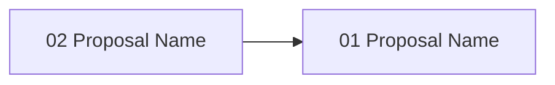

# Gate 14: Documentation Cleanup

> **POST-MVP** — This gate is a documentation polish pass after MVP is stable.
> Keep scope minimal: README cleanup, CLI reference accuracy, AGENTS.md refinement.

**Status**: deferred
**Type**: chore
**Created**: 2026-02-04
**Sequence**: post-MVP
**Hash**: #g14docs

<!-- Status lifecycle:
  - pending: Gate generated at init, requirements not yet decomposed
  - in_progress: Gate started via `zeno gates start`, requirements generated
  - completed: All requirements tested, gate approved
  - archived: Gate completed and moved to archive with final artifacts
  - rejected: Gate rejected during review
  - cancelled: Gate cancelled/dropped with optional reason
  - backlog: Gate deferred to later implementation
-->

## Overview

Clean up README.md and other documentation to reflect the actual MVP implementation. Ensure CLI command reference matches implemented commands, AGENTS.md accurately describes workflows, and inline code comments are present on public APIs. No example projects, no media, no tutorials, no contribution guidelines—just accurate documentation.

## Objectives

- [ ] Update README.md to reflect actual MVP features and remove references to unimplemented features
- [ ] Audit CLI command reference and MCP tool reference against implemented code
- [ ] Update root AGENTS.md and `zeno/AGENTS.md` to reflect MVP workflows
- [ ] Add JSDoc comments to public API functions exported from `src/`
- [ ] Review CLI and MCP error messages for clarity and actionable context

## Context

### What Was Completed Before This Gate

Gates 05-12 (MVP) established:

- All core Zeno functionality
- Gate, requirement, proposal, validation, approval, git integration, rescope, and status workflows

Gate 13 (post-MVP) may or may not be complete.

### What This Gate Enables

- **User Onboarding**: Accurate README enables new users to get started
- **Developer Experience**: JSDoc on public APIs improves IDE support
- **Maintenance**: Accurate docs reduce support burden

### Scope Boundaries

**In Scope**:

- README.md accuracy pass
- CLI/MCP command reference audit
- AGENTS.md updates
- JSDoc on public APIs
- Error message review

**Out of Scope**:

- Example projects
- Video walkthroughs, GIF animations, screenshots
- Tutorials (greenfield, existing codebase)
- Contribution guidelines (CONTRIBUTING.md)
- Glossary, FAQ, troubleshooting guide
- Performance tuning guide
- Blog posts, marketing materials

## Requirements

<!-- Requirements-First Workflow:
  1. Project-level requirements: PRIMARILY defined during `zeno init` at project inception (BEFORE gates).
     These are high-level, cross-cutting requirements derived from the end state.
  2. Gate generation (`/zeno-gate`): Attributes existing project-level requirements to gates.
     Requirements are PRIMARILY mapped and attributed here, not created.
     During rebaseline/rescope: Requirements may be updated or added as part of rescoping.
  3. Gate start (`zeno gates start`): Generates gate-specific requirements that decompose
     project requirements and gate objectives into actionable items.
  4. Proposal generation (`/zeno-proposal`): Breaks requirements down into individual tasks.

  Workflow: Requirements (init - PRIMARY) → Gates (attribute, may update/add during rescope) → Gate Requirements (decompose) → Tasks (proposals)
-->

### Project Requirements (Attributed to This Gate)

| Hash | Name | Type | Priority | How This Gate Addresses It |
| --- | --- | --- | --- | --- |
| #[hash] | Accurate Documentation | functional | must | README and CLI reference match implementation |
| #[hash] | API Discoverability | functional | should | JSDoc on public APIs improves IDE support |
| #[hash] | Clear Error Messages | non_functional | should | Error messages reviewed for clarity |

### Gate-Specific Requirements

**Status**: Requirements will be generated when gate is started.

After gate start, view detailed requirement information via: `zeno req show <hash>`

### Inherited/Transferred Requirements

No inherited or transferred requirements at this time.

### Requirement-to-Task Breakdown

Individual tasks are created during proposal generation (`/zeno-proposal`).

---

## Proposals

**Status**: Proposals will be generated when gate is started.

After gate start, view detailed proposal information via: `zeno proposal show <hash>`

### Proposal Status

| Proposal | Hash | Status | Notes |
| --- | --- | --- | --- |
| [proposal-name] | #[hash] | pending | [Optional notes] |

### Proposal Dependency Graph

<!-- Generated by /zeno-proposal when proposals are created. Shows requires relationships between proposals. -->

### High-Level Delta (Gate Completion Summary)

[To be populated on gate completion.]

**Key Deliverables**:

- Accurate README.md
- CLI/MCP reference audit
- JSDoc on public APIs

**Quality Metrics**: Coverage [X]%, Security [Y] issues, Lint <[Z]%

---

## Architecture Diagrams

<!-- LLM Instructions: Populate this section with applicable architecture diagrams for this gate.
     Core diagrams (system-overview, data-flow, gate-lifecycle, gate-roadmap, context) are always included.
     For conditional diagrams, use the diagram catalogue to select additional diagrams based on this gate's scope.
     Set order numbers sequentially starting from 1 (core diagrams should come first with orders 1-5,
     then conditional diagrams with orders 6+).
-->

| Name | Type | Order | Status |
| --- | --- | --- | --- |
| System Overview | system-overview | 1 | pending |
| Data Flow Diagram | data-flow | 2 | pending |
| Gate Lifecycle State Machine | gate-lifecycle | 3 | pending |
| Gate Roadmap | gate-roadmap | 4 | pending |
| System Context Diagram | context | 5 | pending |

---

## Technical Decisions for This Gate

### 1. Minimal Documentation Scope

- **Choice**: Only update existing documentation for accuracy; no new documentation artifacts
- **Alternatives Considered**: Full documentation suite (tutorials, guides, FAQ), generated API docs
- **Rationale**: Post-MVP polish should be minimal. Accurate existing docs > comprehensive new docs.
- **Impact**: Users get accurate README and CLI reference; no tutorials or guides
- **Trade-offs**: Gained focus and speed; no onboarding tutorials (acceptable for post-MVP)

### 2. JSDoc Over Generated Docs

- **Choice**: Add JSDoc inline comments rather than generating documentation sites
- **Alternatives Considered**: TypeDoc site generation, Storybook for components
- **Rationale**: JSDoc provides IDE-integrated documentation without build steps or hosting. Most effective for developer experience.
- **Impact**: Public APIs documented inline; no separate documentation site
- **Trade-offs**: Gained simplicity and IDE integration; no browsable API docs site

## Architecture Updates

### Components Modified or Created

No new components. This gate modifies documentation only:

- **README.md** - Updated to reflect MVP features
- **AGENTS.md** (root) - Updated to reflect MVP gate structure
- **zeno/AGENTS.md** - Updated to reflect actual workflows
- **src/** (public exports) - JSDoc comments added to exported functions

### Diagram Updates

- No diagram changes required (documentation-only gate)

### Integration Points

- No integration changes (documentation-only gate)

## Dependencies

### External Dependencies (New or Updated)

No new external dependencies required.

### Internal Dependencies

- **Depends on Gate(s)**: Gate 12: Status & Reporting (MVP must be complete before docs polish)
- **Blocks Gate(s)**: None (terminal gate)
- **Requires Modules**: None (documentation-only)

### Infrastructure Dependencies

No infrastructure changes required.

## Implementation Steps

1. **Define Acceptance Tests**
   - Create checklist of documentation accuracy criteria
   - Tests verify CLI commands documented match implemented commands

2. **Audit README.md**
   - Compare documented features against implemented code
   - Update quick start section end-to-end
   - Remove references to deferred features

3. **Audit CLI and MCP References**
   - Cross-reference CLI commands with implemented handlers
   - Cross-reference MCP tools with registered tool schemas
   - Update examples to be accurate and runnable

4. **Update AGENTS.md Files and Add JSDoc**
   - Update root and zeno/ AGENTS.md files
   - Add JSDoc to public API functions in `src/`
   - Review error messages for clarity

5. **Test Cleanup**
   - Verify all documented commands work as described
   - Ensure no references to unimplemented features remain

## Known Issues & Limitations

### Current Limitations

- No generated API documentation site
- No tutorials or example projects

### Technical Debt

- JSDoc coverage may be incomplete for internal (non-exported) functions — acceptable for post-MVP

### Future Improvements

- Generated API documentation site (TypeDoc) — deferred to future
- Tutorials and example projects — deferred to future

## Risks & Mitigation

### Technical Risks

1. **Documentation Drift**
   - **Impact**: Low
   - **Probability**: Medium
   - **Mitigation**: Documentation gate runs after MVP is stable; minimal drift window
   - **Contingency**: Re-audit after any post-docs code changes

### Process Risks

1. **Scope Creep into Tutorials**
   - **Impact**: Low
   - **Probability**: Medium
   - **Mitigation**: Strict out-of-scope list; focus only on accuracy
   - **Contingency**: Defer any tutorial requests to separate future effort

## Gate Completion Criteria

- [ ] All must-have requirements implemented and tested
- [ ] All should-have requirements implemented or explicitly deferred
- [ ] All proposals completed and approved
- [ ] All acceptance criteria met
- [ ] Architecture diagrams updated
- [ ] Gate-specific quality considerations addressed
- [ ] Stakeholder approval obtained
- [ ] README.md accurately describes MVP features
- [ ] CLI command reference matches implemented commands
- [ ] MCP tool reference matches registered tools
- [ ] AGENTS.md files reflect actual workflows
- [ ] JSDoc present on public API functions
- [ ] No references to deferred/unimplemented features in docs

## Notes

### Implementation Notes

- Run all documented CLI commands to verify they work as described
- Use `grep` to find references to deferred features (subagent, TUI, dashboard) in docs

### Proposal Summary

| Proposal Hash | Summary |
| --- | --- |
| #[hash] | [1-2 sentence summary of proposal work completed] |

### Next Gate Preview

No further gates planned. Gate 14 is the final gate in the Zeno project roadmap.

---

**Document Version**: 1.1.0
**Last Updated**: 2026-02-27
**Versioning**: SemVer; bump on any change (minimum: PATCH).
**Owner**: Zeno
**Reviewers**: Zeno

### Change Log

| Version | Date | Summary | Author |
| --- | --- | --- | --- |
| 1.0.0 | 2026-02-04 | Initial version | Zeno |
| 1.1.0 | 2026-02-27 | Aligned with gate-prd-template.md | Zeno |

**Related Documents**:

- Project PRD: `zeno/PROJECT_PRD.md`
- Previous Gate: `zeno/gates/gate-13-subagent-orchestration-parallel-execution.md`
- Architecture: `zeno/architecture/`
